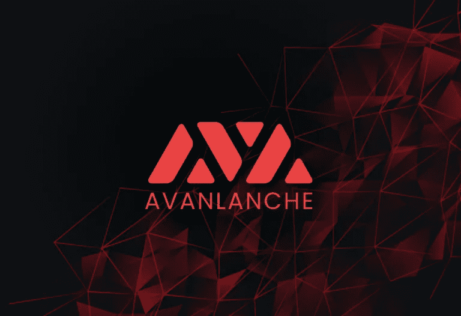
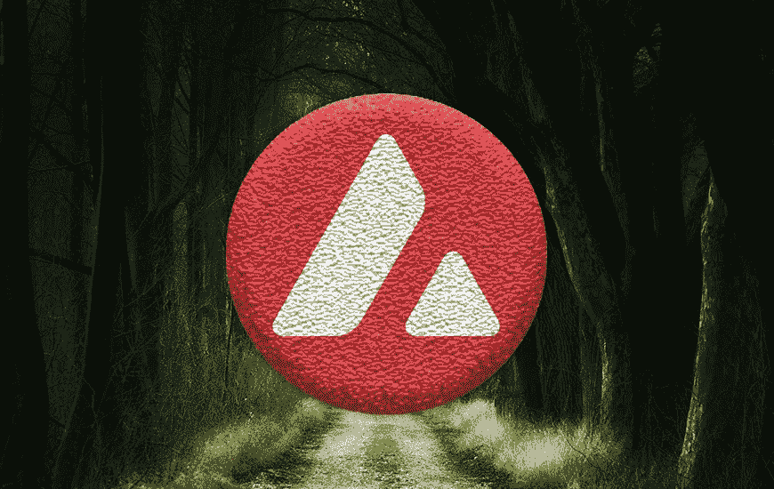
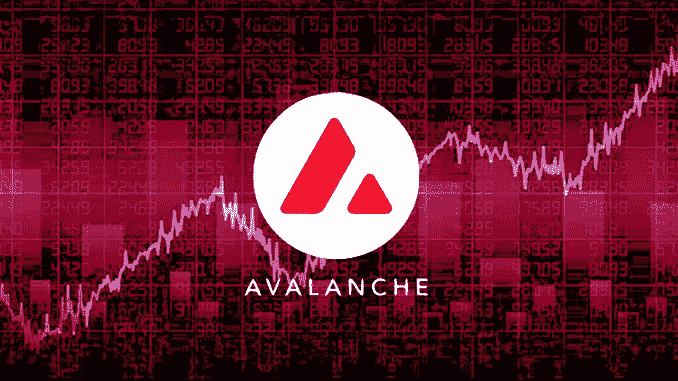

# 雪崩游戏攻略

> 原文：<https://medium.com/coinmonks/avalanche-introduction-e0b998c87483?source=collection_archive---------54----------------------->

在第 1 层的战争中，雪崩也是一种新技术，但作为一种技术非常有趣。雪崩是在 2020 年 9 月通过私人资金发起的，并且是在公开和私下出售其象征之后。

雪崩背后的技术

与其他技术相比，艾娃提供了一个稍微更复杂的结构，但从技术角度来看是令人愉快的。
艾娃主要有三个不同用途的区块链。

c 合同链，适用于希望创建智能合同的开发人员。有趣的是，它有 EVM，所以它与基于以太网的应用程序兼容。

有一个 X 链，这是一个区块链开发的创造和交易 AVAX。

最后，还有 P 链，它是负责验证器的区块链。

为了不同的目的创造了三个区块链，这使得提高速度和可扩展性成为可能，因为不是所有的事情都发生在一个区块链身上。

区块链的象征

该名称为 AVAX，在总共 395，891，290 个代币中，流通代币为 268，624，639 个(数据来自 Coinmarketcap)

对于任何想成为网络验证者的人来说，Avax 都是必不可少的。除了是区块链的主要货币之外。佣金采用 AVAX 支付。

同意方式

主要方法是基于一个系统，该系统通过实现 DAG 技术来处理所有节点。这种选择的好处之一是能够并行执行事务处理。这允许更多的 TPS。这种技术不像其他区块链那样涉及街区。

另一种共识方法是雪人，总是主要基于主要共识，但增加了以线性方式排序交易的技术。

成为一个 AVAX 验证器需要大约 2000 个 AVAX 标记。

完成一项交易不到一秒钟。一个非常重要的数据，使网络具有高度的可扩展性和易用性。

生态系统

雪崩想与最受欢迎的层或以太博物馆竞争。结果，开发商实现了在区块链创建 NFT、令牌和智能合同的能力。尽管如此，基于雪崩的区块链可以被创造出来。
如上所述，雪崩拥有自己的虚拟机，与 EVM 完全兼容。

雪崩是一个巨大的工程。一台真实世界的机器，你可以在上面构建 Dapps、智能合同等等。好像这还不够，其他区块链也可以建在它上面。这对开发者社区来说非常重要。
总之，我可以说这无疑是整个密码生态系统中最激动人心的项目之一。

> 加入 Coinmonks [电报频道](https://t.me/coincodecap)和 [Youtube 频道](https://www.youtube.com/c/coinmonks/videos)了解密码交易和投资

# 此外，请阅读

*   [BigONE 交易所点评](/coinmonks/bigone-exchange-review-64705d85a1d4) | [电网交易 Bot](https://coincodecap.com/grid-trading)
*   [氹欞侊贸易评论](https://coincodecap.com/anny-trade-review) | [CoinSpot 评论](https://coincodecap.com/coinspot-review)
*   [新加坡十大最佳加密交易所](https://coincodecap.com/crypto-exchange-in-singapore) | [购买 AXS](https://coincodecap.com/buy-axs-token)
*   [投资印度的最佳加密软件](https://coincodecap.com/best-crypto-to-invest-in-india-in-2021) | [WazirX P2P](https://coincodecap.com/wazirx-p2p)
*   [7 个最佳零费用加密交易平台](https://coincodecap.com/zero-fee-crypto-exchanges)
*   [最佳网上赌场](https://coincodecap.com/best-online-casinos) | [期货交易机器人](/coinmonks/futures-trading-bots-5a282ccee3f5)