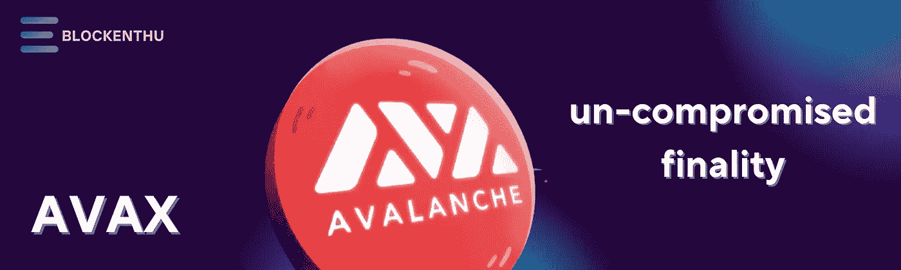
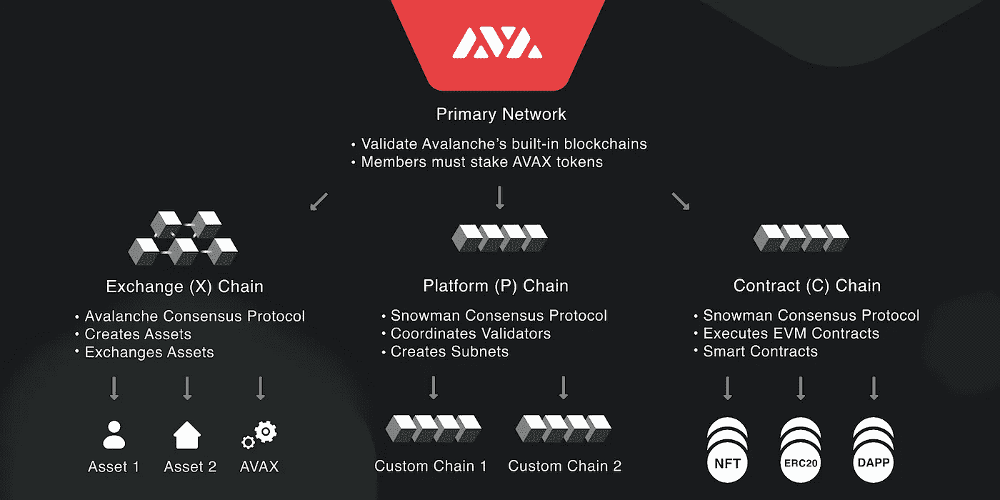
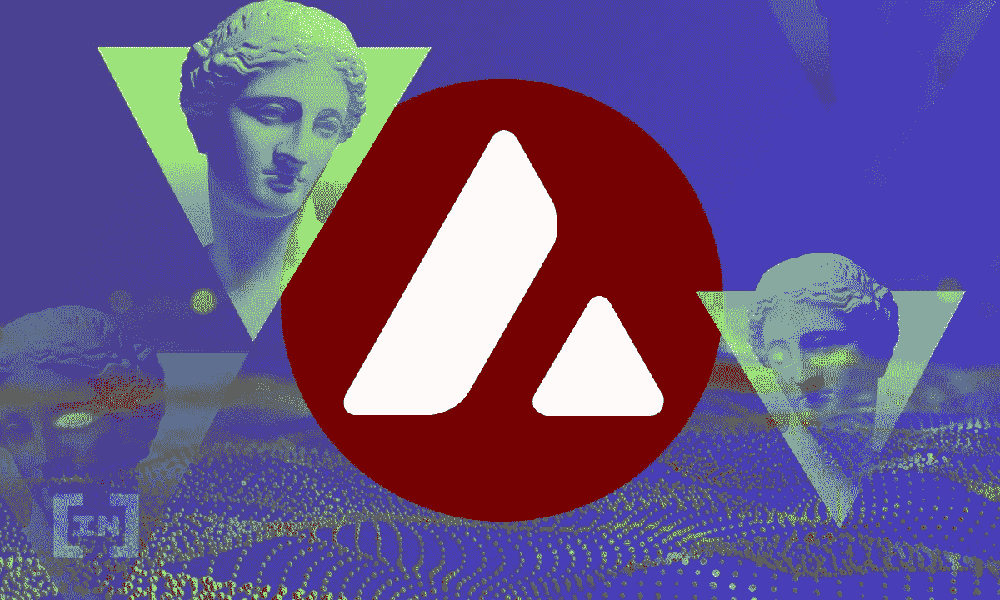
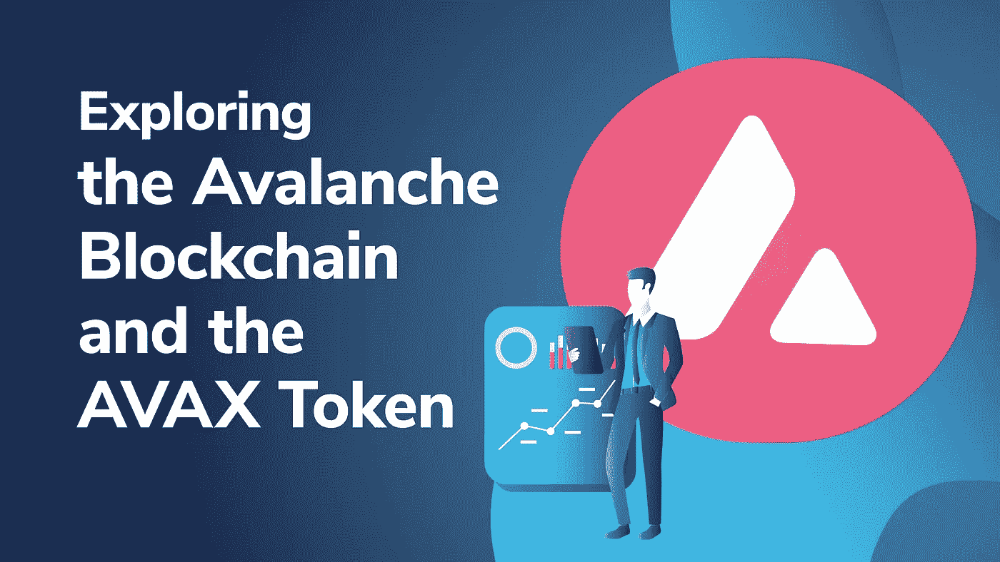

# 雪崩:不妥协的结局

> 原文：<https://medium.com/coinmonks/avalanche-un-compromised-finality-2b2e4b871d4c?source=collection_archive---------31----------------------->

# 雪崩到底是什么？

随着区块链技术时代的发展，针对老问题的解决方案如可扩展性、互操作性和可用性对于新区块链都有所提高。Avalanche 有一个古怪的密码，在它的平台上使用了三个可分离的区块链。

# 雪崩是由？

雪崩区块链由美国艾娃实验室团队于 2020 年 9 月发射。《雪崩》发展背后的三个最强者是“凯文·塞克尼奇”、“泰德·尹”和“额敏·枪赛勒”。最初的雪崩被艾娃实验室提高到 6 美元。在 24 小时的时间内，雪崩关闭了它的第一枚硬币，在这个过程中它筹集到了 4200 万美元。

x 链、C 链和 P 链这三个区块链的结合使得雪崩变得强大。三个可互操作的区块链创建和交换、创建智能合约并验证网络。

## 交换链(X 链) :

顾名思义，交换和创建本机 AVAX 令牌和其他资产。这使用雪崩共识机制。这些资产有一些规则来管理它们的行为，就像以太坊的令牌标准一样。

## 合同链(C 链) :

智能契约和分散式应用程序可以通过这个链来创建和管理。作为以太坊虚拟机，区块链拥有 Avalanche 虚拟机，允许开发人员派生 EVM 兼容的 DApps。它使用雪人共识机。

## 平台链(P 链) :

协调区块链中的网络验证器 P 链有助于验证。它使用雪人共识机制。一组验证器被称为子网。每个子网可以验证几个区块链，但是每个区块链只能验证一个子网。

计算任务的划分实现了更高的吞吐量，而不损害分散性。

## 雪崩能做什么？

由于用户越来越多、活跃度很高的区块链没能迅速产生共识。这个问题的一个很好的例子是比特币的交易非常耗时，由于网络拥塞，可能需要几个小时甚至几周的时间。雪崩使得有限的用户能够快速访问以验证网络和检查交易。它每秒可以处理 6，500 个事务，而不影响其可伸缩性。

大区块链的另一个普遍问题是他们的天然气费。相比之下，以太坊的汽油费对于简单的转账来说超过 10 美元，对于智能合约来说甚至更高。但是以太坊的受欢迎程度和缺乏替代性已经产生了高费用和高流量。

Avalanche 有助于协调多个区块链，并平衡它们。可定制性是 Avalanche 的一个独特特性。

# 雪崩共识机制

使用 DAG(有向无环图)处理和验证所有事务。不像工作证明(POW)、利害关系证明(POS)那样靠领导达成共识。DAG 允许网络事务并行处理，验证器可以通过随机二次抽样来验证新的事务。这也证明了交易不可能是假的。所有交易都可以立即确认，无需任何其他确认。这里没有块可以用传统的区块链表示，但是父事务被称为顶点。

# 雪人共识机制

雪人共识依赖于雪崩机制，但它使事务按顺序线性排序。雪崩机制和雪人机制的区别在于雪人机制是造块的。

# AVAX 令牌

供应 7.2 亿雪崩的原生令牌叫 AVAX。所有在网络上支付的费用都被作为一种通货紧缩机制烧掉了。为了提高互操作性，AVAX 充当所有子网的公共单元。交易费用以 AVAX 支付。验证者可以获得高达 11%的年收益率。

硬件要求足够低，大多数标准的笔记本电脑或台式机应该适合开始验证。

# 想包一些雪崩(AVAX)

使用印度最安全的加密交换# COINDCX。

 [## CoinDCX -加密交易所|购买、出售和交易比特币和顶级替代币

### CoinDCX 是印度最大、最安全的加密货币交易所，在这里你可以买卖比特币和其他…

coindcx.com](https://coindcx.com/) 

# 加入我们的社区

## WHATSAPP

 [## ⚡BLOCKENTHU⚡

### WhatsApp 群邀请

chat.whatsapp.com](https://chat.whatsapp.com/FTKme4XzkOU73ZDv99Oatj) 

## 电报

 [## ⚡·布洛克登胡·⚡

### 可以马上查看并加入@blockenthu。

t.me](https://t.me/blockenthu) 

## INSTAGRAM

[https://www.instagram.com/blockenthu/](https://www.instagram.com/blockenthu/)

## 商务化人际关系网

 [## Blockenthu | LinkedIn

### LinkedIn 上有 217 名粉丝。“面向大众的 Web 3.0 福利”加密和区块链| BlockEnthu 是社区…

www.linkedin.com](https://www.linkedin.com/company/blockenthu/) 

#区块链# BLOCKENTHU # CRYPTO # coincxpath breaker

> 加入 Coinmonks [电报频道](https://t.me/coincodecap)和 [Youtube 频道](https://www.youtube.com/c/coinmonks/videos)了解加密交易和投资

# 另外，阅读

*   [BigONE 交易所评论](/coinmonks/bigone-exchange-review-64705d85a1d4) | [电网交易机器人](https://coincodecap.com/grid-trading)
*   [氹欞侊贸易评论](https://coincodecap.com/anny-trade-review) | [CoinSpot 评论](https://coincodecap.com/coinspot-review)
*   [新加坡十大最佳加密交易所](https://coincodecap.com/crypto-exchange-in-singapore) | [收购 AXS](https://coincodecap.com/buy-axs-token)
*   [投资印度的最佳加密软件](https://coincodecap.com/best-crypto-to-invest-in-india-in-2021) | [WazirX P2P](https://coincodecap.com/wazirx-p2p)
*   [西班牙 5 大最佳文案交易平台](https://coincodecap.com/copy-trading-spain)
*   [Pionex 双重投资](https://coincodecap.com/pionex-dual-investment) | [AdvCash 审查](https://coincodecap.com/advcash-review) | [支持审查](https://coincodecap.com/uphold-review)