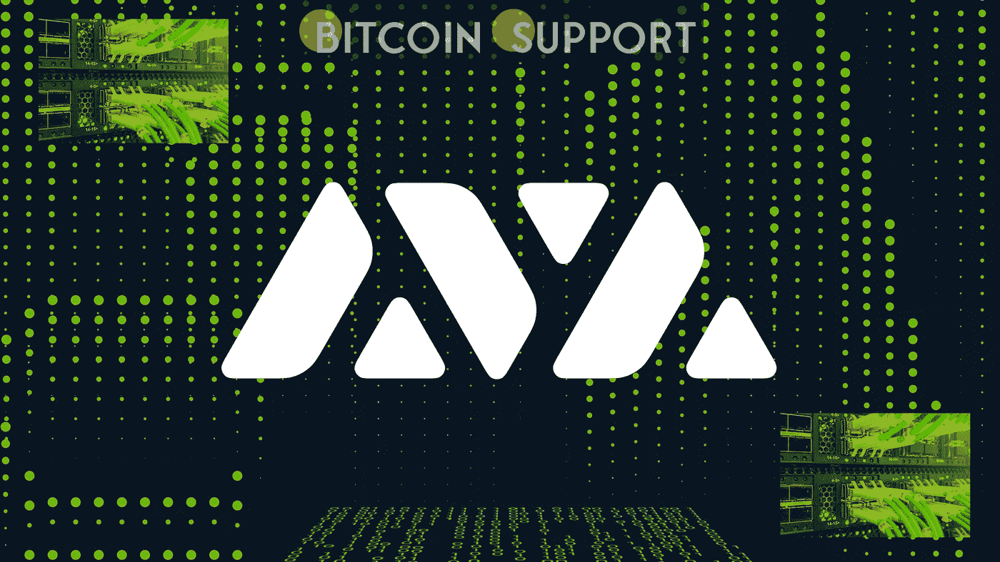
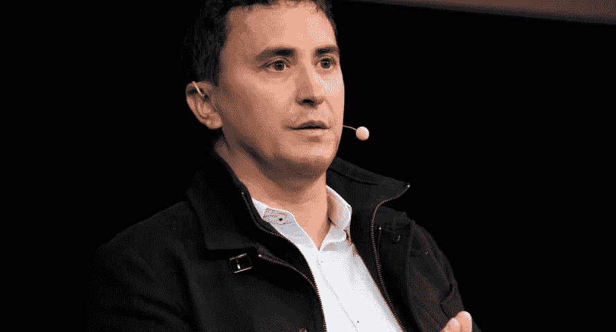

# Avalanche 的多元宇宙激励计划旨在加速子网的采用

> 原文：<https://medium.com/coinmonks/avalanches-multiverse-incentive-programme-aims-to-accelerate-subnet-adoption-76412ced2245?source=collection_archive---------69----------------------->

**Visit our website:-** [**https://bitcoinsupports.com/**](https://bitcoinsupports.com/)

雪崩基金会的负责人 Emin Gün Sirer 认为子网可能是区块链技术的下一个重大突破。

区块链网络 Avalanche 宣布推出 Avalanche Multiverse，这是一项激励计划，旨在加速子网的采用，或为特定应用量身定制的区块链生态系统。雪崩基金会负责人 Emin Gün Sirer 认为，子网是区块链的下一个大事件。根据 GünSirer 的说法，子网提供了以前只能通过“网络级控制和自由实验”才能实现的功能。此外，他表示，虽然智能合同在过去五年中促进了区块链领域的创新，但他认为子网是下一个前沿领域。

**Visit our website:-** [**https://bitcoinsupports.com/**](https://bitcoinsupports.com/)

雪崩基金会主任艾敏·贡·西勒。
价值约 2.9 亿美元的多达 400 万枚 Avalanche (AVAX)代币将被分发，用于资助区块链奥运会、分散金融(DeFi)、不可伪造代币(NFT)和机构用例。

众多著名的贡献者为雪崩多元宇宙做出了贡献，包括 DeFi 王国、Aave、金树资产管理、Wintermute、Jump Crypto、瓦尔基里和 Securitize。该项目激励总额为 1500 万美元，将带来一个 DeFi 王国专用子网。据 DeFi 王国的执行官 Frisky Fox 说，Avalanche 的子网技术“非常适合”他们的项目。“DeFi 王国的整个宇宙都被编码在智能合同中，扩展了区块链技术的可能性边界，”Fox 解释道。

Avalanche 的主要开发者艾娃实验室也将与其他贡献者合作，构建一个集成的区块链，具有针对机构定义优化的本地“了解您的客户”( KYC)功能。

瓦尔基里投资公司 DeFi 董事总经理 Wes Cowan 表示:“Avalanche 与 KYC 基础设施的网络将是机构采用的重要一步，我们很乐意支持其实施。”

与此同时，FTX 加密货币交易所推出了一项基金，旨在推动“可大规模扩展”的举措，并为人类提供长期解决方案。FTX 未来基金打算投资高达 20 亿美元的项目，从人工智能到生物风险缓解和高效慈善事业。

**访问我们的网站:-**[**https://bitcoinsupports.com/**](https://bitcoinsupports.com/)

**免责声明:以上为作者观点，不应视为投资建议。读者应该自己做研究。**