# $AVAX |即使是最大的雪崩也是由小事引发的..！

> 原文：<https://medium.com/coinmonks/avax-even-the-largest-avalanche-is-triggered-by-small-things-3ea5a94b7525?source=collection_archive---------9----------------------->

今天，我们将对雪崩网络和作为加密资产的 [AVAX](https://coinmarketcap.com/it/currencies/avalanche/) 进行深入分析。本白皮书全面介绍了目前市场上的 Avalanche 和 AVAX 产品。

# **简介**

雪崩是一种利用*“雪崩共识机制”的[赌注证明](https://www.investopedia.com/terms/p/proof-stake-pos.asp)加密货币。*它是一个交易吞吐量为每秒**4500**笔交易( **TPS** )的区块链网络，拥有全球首个能够在不到一秒钟内确认交易的**智能合约**平台。

[Avalanche](https://www.avax.network) 是一款**高性能**、**可扩展**、**可配置**和安全的区块链平台，旨在开发特定应用的区块链、可扩展的分散式应用和复杂的数字智能资产。事实上，雪崩协议提供了各种更新的、以智能合同为重点的项目，其目标是通过使用快速技术来加速区块链技术的采用。

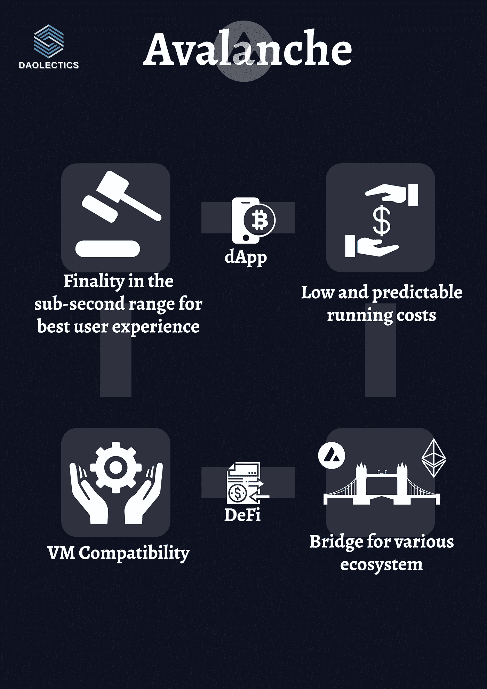

该项目由艾娃实验室于 2018 年由土耳其裔美国计算机科学家、康奈尔大学副教授 [Emim Gun Sirer](https://www.linkedin.com/in/emin-gun-sirer-0a921a4/) 创立。这家公司的总部设在纽约市和迈阿密，是由 Andreessen Horowitz、Polychain Capital、Initialized Capital 和 AngelList 的 Balaji Srinvasan 和 Naval Ravikant 等天使投资人出资成立的。该项目已于 2020 年启动。

最近的举措包括雪崩基金会的 1.8 亿美元的激励计划，以吸引分散金融(DeFi)资产和应用程序到网络中。两个领先的 DeFi 协议 Aave 和 Curve 将与雪崩式本地流动性协议 BENQI 一起，成为首批加入这一努力的协议。

# 组

艾娃实验室目前拥有 110 多名员工，其中一半以上专门从事技术研发。据 AVA 实验室的创始人兼首席执行官 Emin Gun Sirer 称，他的团队中几乎每个人都有 ETH 背景。其他关于团队的最新信息可以直接从他们的[媒介](/avalancheavax/meeting-ava-labs-the-team-behind-the-scenes-340300842301)中找到。

# 技术

雪崩网络由许多区块链组成，其中每个链都是一台独立的虚拟机，支持各种定制虚拟机，如 EVM 和 WASM。这要归功于 gRPC 服务器，它支持多种语言的使用。

因此，每个链可以包括特定于情况的功能。每台虚拟计算机都链接到一个子网，并有自己的一套验证器激励机制；这是一个定制的区块链网络，由“*”组成，是一个合作创造共识的动态验证团体。*“因此，Avalanche 可以被视为一个*“平台的平台”*，由数千个子网组成，这些子网协作创建一个可互操作的网络。

Avalanche 预先配置了三个区块链:**交换链** (X 链)**平台链** (P 链)**契约链** (C 链)。

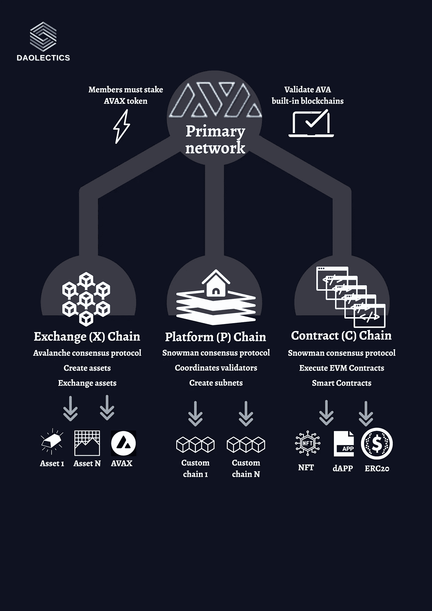

所有 3 个区块链都由主网络进行验证和保护。

**主网络**是一个专用子网，它确认了 Avalanche 的内置区块链:所有子网都是它的一部分。

成员。为了加入主网络，个人必须投入一些雪崩代币。因此，所有区块链的所有验证器都需要验证 Avalanche 的内置区块链，并具有标记的 Avalanche 令牌(主网络中至少有 2，000 个 AVAX)

不同的雪崩链可以分类如下:

*   **C 链**是以太坊虚拟机的雪崩驱动实例。通过使用 C-API，Chain 的用户可以建立智能合同，并完成以太坊上可能完成的任何其他任务。
*   默认子网是 Avalanche 平台上唯一没有权限的子网。通过在 **P 链**上注册，您可以在 Avalanche 平台上构建自己的许可子网。
*   NFT 直接集成到 **X 链**交易结构中。它的架构真的更类似于 EIP-1155(可收藏的 NFTs)而不是 ERC 721。EIP-1155 在任何情况下都是 ERC721 的设计概括。

> 详细解释—共识机制

雪崩共识协议是四个进程的集合，这四个进程是**雪泥、雪花、雪球和雪崩**，它们相互依赖，随着时间的推移变得更加安全。

简而言之，雪崩共识过程是一种基于 ***重复随机子采样的独一无二的投票协议:v*** 验证器节点以随机的方式询问其他验证器，直到网络找到共识并选择是接受还是拒绝传入的事务。从这个意义上说，该共识是受 [**流言算法**](https://en.wikipedia.org/wiki/Gossip_protocol) 的启发，并通过利用一个亚稳态过程来保证其安全性。

与传统的线性“链”相反，雪崩共识协议利用**有向无环图(Dag)**来给出事务的相对排序。

线性区块链在技术上是一个有向无环图(DAG ),其中每个块都是一个顶点，有一个**祖先**,它之前的块，和一个**后代**,它之后的块。

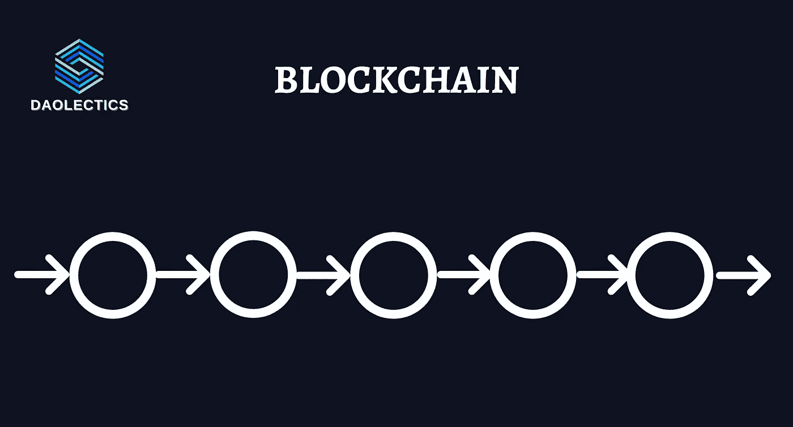

Avalanche 的 DAG 更加通用，并且允许顶点存在**多个祖先和后代**。由于块生成可以并行化，因此速度更快，并且还消除了事务竞争进入下一个块和挖掘器竞争定位下一个块的需求。

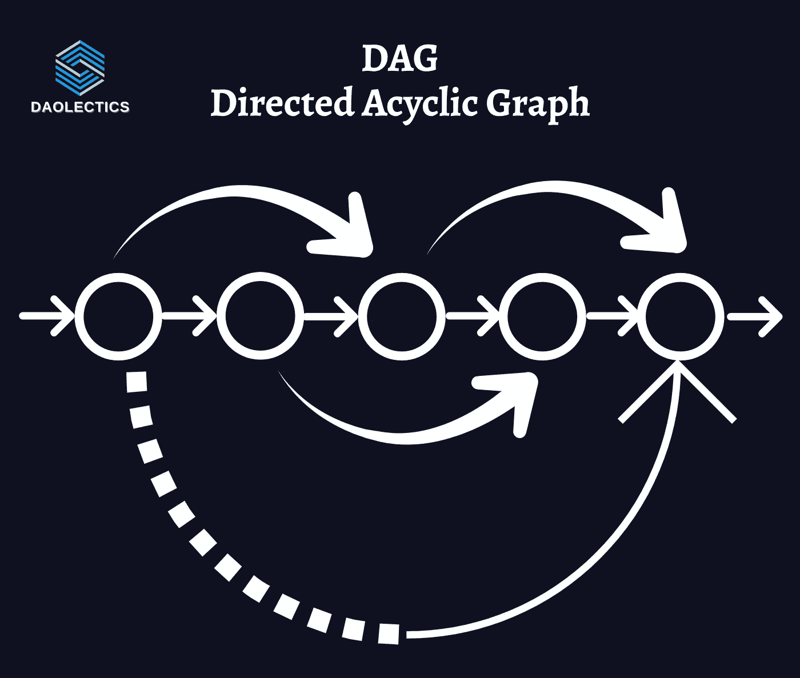

给定“层”上的多个有效块能够实现更快的确认时间，因为在产生另一个块之前确保一个块被连接没有性能限制。此外，在块传播过程中几乎没有浪费。

共识算法基于**滚雪球法**，该方法利用了:

*   **k** 的*样本量*
*   **α** 的*法定人数*
*   一个*决定阈值*的 **β**

在询问网络上的 **k** 节点之后，节点可以使用滚雪球方法来调整其偏好:如果它在对查询的响应中再次遇到某个语句或短语 **α** 或**，它将改变其对该语句的偏好。**

为了决定语句或事务，在连续查询网络上的 **k** 个节点 **β** 次后，该节点需要听到该语句至少 **α** 次，得到该语句的 **β** 连续多数计数。

> 此外，滚雪球方法是可伸缩的，因为节点一次只查询 k 个节点。不管网络中有多少个节点，每个查询都是与一定数量的节点的交互。

一个节点只向 **k** 个节点查询一次给定的交易，如果它收到对该交易的 **α** 多数批准，它就给它一个 **chit** 。

***chit*** 只是一个布尔值(或 0 或 1 ),表示节点是否获得了事务的多数。如果事务接收到一个 *chit* ，它必须增加其先行者的信心和连续成功计数器。

事务的置信度等于其 ***后代的*** 加上其 ***当前的 chit 的总和。*** 再者 ***、*** 一个事务连续成功的次数等于它或它的后代获得一个成功的多数问题答案的次数。

为了简单起见，我们将把每个事务视为 DAG 中自己的节点:如果一个事务被请求，但没有获得所需的票数，它就不会收到一个 *chit:* 任何没有被接受的祖先的成功计数都将归零。

另一方面，置信度保持不变，因为该事务的附加后代可能仍然具有便签。如果没有 chit，事务本质上相当于在祖先的后代 chit 总数上加 0。当连续成功计数达到 **β时，交易被“接受”。**

鉴于事务建立在彼此之上的事实，您不需要在做出判断之前对每个事务查询至少 **β** 次。交易的每个“孩子”都提供了进一步的证据，证明它是真实的，这就是信任和成功传播的方式。

投票时，节点**对冲突集合中任何事务最有信心的事务*投*** **是**票，对信心不足的事务投**否**票。

> 雪崩共识协议的主要优势是它的速度和最终确定性。Nakamoto Consensus networks 依赖于时间的流逝和额外块的生成来增加您的交易不会因分叉而被撤销的信心，与 Nakamoto Consensus networks 不同，雪崩接受应该只需要几秒钟，并且是不可逆的。

安全性(确保两个诚实的节点就事务状态达成一致)是概率性的，并由网络参数控制:节点必须标记本机令牌 AVAX，以便作为验证者参与共识机制，节点标记越多，就越有可能被查询。

为了对雪崩共识如何运作有一个适当的可视化和简化，我们推荐你看一下这个视频**，它能帮助你进一步理解。(鸣谢@don_wonton)**

**[https://www.youtube.com/watch?v=3TAgLJHTYRg](https://www.youtube.com/watch?v=3TAgLJHTYRg)**

# **令牌分发**

**令牌分布如下所示。第一批 3.6 亿 AVAX 在推出时发行，其余 3.6 亿在几十年内分发。创造的代币的归属期限从 1 年到 10 年不等。**

**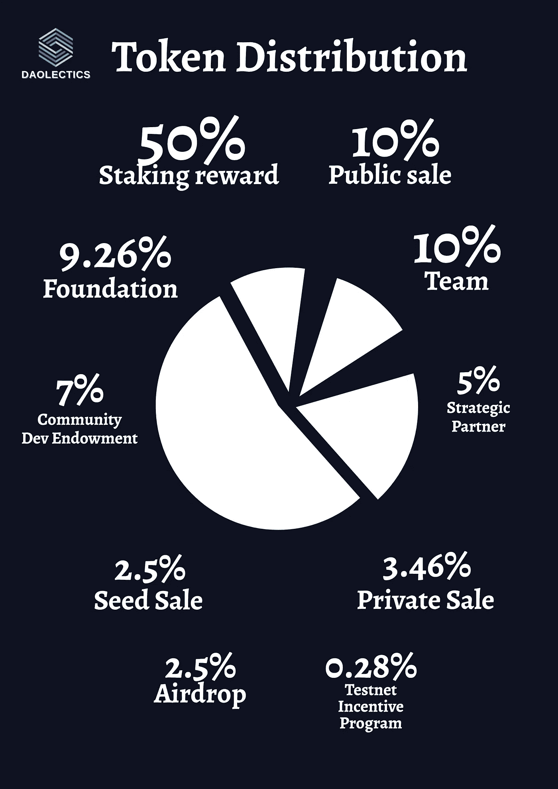**

****赌注奖励** —50%的代币已作为赌注奖励发放给验证者。**

****团队** — 10%的代币分发给 AVA 实验室的创始人和非创始人。包括创始人在内的团队成员在发布前授予代币，将自愿重新锁定所有代币四年。**

****种子销售** —分配了 2.5 %的代币。象征性价格为 0.33 美元，在 mainnet 首次亮相时，授予计划为 10%，然后每年每 3 个月 22.5%。**

****私人销售** — 3.5%的代币面向私人销售参与者。每枚代币的价格为 0.5 美元，在 mainnet 首次亮相时，授予计划为 10%，然后每年每 3 个月 22.5%。**

****公开销售****

*   **选项 A1-1%的代币是给选项 A1 的参与者的。每个代币的价格是 0.5 美元，每个用户只能获得 25k 个代币。代币有一个 1 年的授予时间表，10%在 mainnet 启动时发行，22.5%在一年内每 3 个月分发一次。**
*   **选项 A2–8.3%的代币面向公开销售选项 A2 参与者。每个令牌的价格为 0.5 美元，每个用户的最高限额为 250 万美元。代币的授权期限为 1.5 年，10%在 mainnet 发布时发行，15%在 18 个月内每 3 个月分发一次。**
*   **选项 B——0.67%的代币是给选项 B 的参与者的。代币每枚 0.85 美元，没有授予时间。**

****基金会** — 9.26%的代币归基金会所有。这些代币用于营销、奖金、激励计划等。它们是 10 年期股票。**

**社区和发展捐赠基金 — 7%的代币归该基金所有。这些代币将授予致力于 Avalanche 核心工具和基础设施以及市场营销和社区推广的个人和组织。雪崩中心、雪崩大使、雪崩 X 获奖者等。给予的赠款有一年的归属期。**

**测试网激励计划 — 0.27%。在 Avalanche 的激励测试网项目中通过验证的参与者可以获得这些代币。参与者通过完成任务可以获得高达 2000 AVAX 的奖励。这些代币是有年份限制的。**

****战略合作伙伴** —战略合作伙伴获得 5%的代币。这些代币被授予使用雪崩技术和网络来发展业务的团体、组织和公司。旨在基于 Avalanche 发展业务的企业家或试图通过自己的子网在 Avalanche 上标记资产的金融机构可能就是例子。可行权期限为 4 年。**

****空投** — 2.5%这些代币被分配给不同的群体，以增加雪崩群体。比如空投到加密组，Reddit 社区，开发者论坛，甚至 exchange 用户。**

# **令牌实用程序**

**雪崩令牌( **AVAX** )对于**网络安全**、支付**网络运营**以及促进原子**资产交换**(子网之间)至关重要。AVAX 的功能与 Ethereum 的“gas”类似，但具有额外的有用性，如治理方面。**

**事实上，除了纯粹的赌注，雪崩验证器还受益于过多的价值流。**治理**将决定**铸造率**(铸造多少硬币，铸造速度有多快，但不是总数，设定为 7.2 亿)和**赌注率。****

**AVAX 希望成为**通用记账单位**，理想情况下，成为一种全球认可的货币，这使得它很有价值；尽管如此，建立在 Avalanche 基础上的 dApps 可能有自己的代币，这些代币将以其原始货币向 Avalanche 验证者支付费用。**

****AVAX 交易费用被烧掉，因此增加了 AVAX 的稀缺性**。但是，奖励计算将考虑当前的循环供应量，并保证永远不会超过硬限制。在任何情况下，由于交易费用在网络上燃烧，这不断减少了总的流通供应，允许增加赌注奖励而不超过限制。**

# **生态系统**

**自从首次亮相并宣布成为以太坊兼容的区块链以来，Avalanche 已经极大地发展了它的生态系统。以前，Avalanche 和其他第 1 层区块链面临的最大问题是缺乏基础设施、工具和与其他区块链的互操作性，这成为平台和广泛开发人员采用之间的障碍。Avalanche 通过其桥接解决方案实现了跨链互操作性功效，从而解决了这一问题。**

****Avalanche Bridge** 允许用户在以太坊和 Avalanche 的 C 链之间转移 ERC 20 代币，由于其与 EVM(以太坊虚拟机)的兼容性，已经获得了 DeFi 社区的极大兴趣。许多基于以太坊的应用程序，包括 Sushiswap、TrueUSD、Reef 和 bZx，随后都与雪崩区块链连接起来。**

> ****DeFi****

**锁定的总价值(TVL)指标对 DeFi 增长至关重要，因为它显示了这些协议的价值。**

**[DefiLlama](https://defillama.com/chain/Avalanche) 数据显示，仅在一年内，AVAX 生态系统中锁定的总价值就从 910 万美元增至 107.7 亿美元，增幅达 118.3%。雪崩生态系统现在支持 156 个 DeFi 协议。**

**然而，它仍然比 2021 年 12 月 137.9 亿美元的历史高点低 20%，如下所示:**

**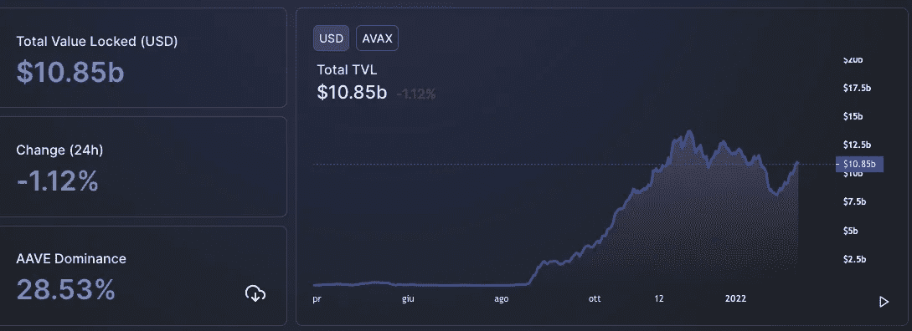**

**五大 AVAX DeFi 协议(Aave、Trader Joe、本齐、Curve 和 Multichain)占 AVAX TVL 的 71%。**

**虽然 108.5 亿美元可能看起来是一大笔钱，但与其他区块链相比，这确实是很少的:事实上，在编写本报告时，TVL 所有区块链的总市值为 2085.7 亿美元。因此，AVAX 的 TVL 排名第四，约占总 TVL 的 5%。**

**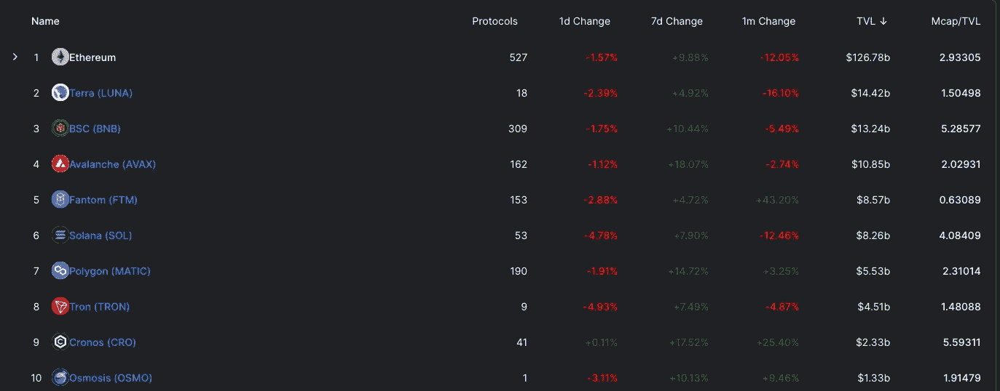**

**根据 CoinMarketCap 的数据，AVAX 的市值为 222 亿美元，比 2021 年 11 月底的 144.85 美元的高点仍低 37%。**

**下面我们决定介绍一些在雪崩生态系统中开发的最有趣的项目:**

**[**Aave**](https://aave.com/) 是一种非托管协议，允许用户赚取存款利息和借用数字资产。它是开源的，可以免费使用。该公司在英国的法人实体 Aave Limited 于 2020 年 7 月获得电子货币机构牌照。Stani Kulechov 是 Aave 的创始人。**

**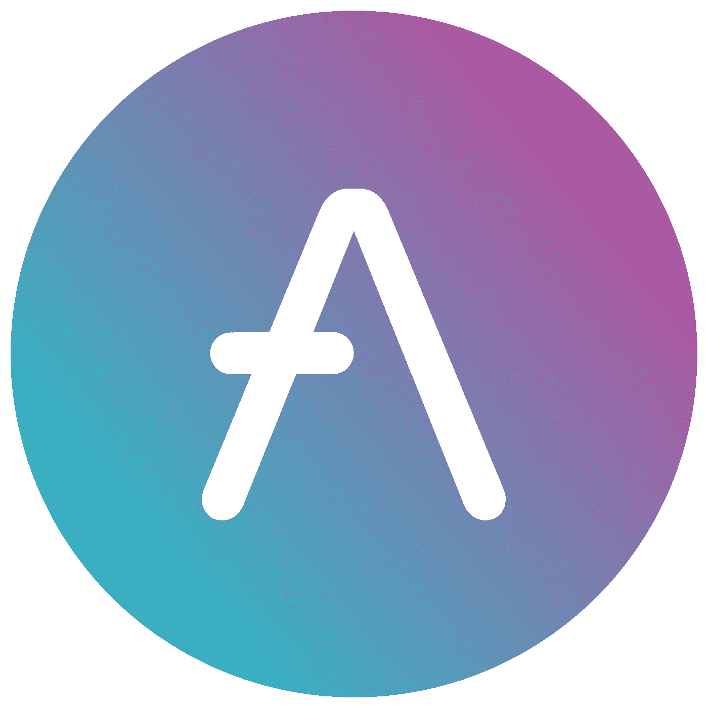**

**[**Aspen Protocol**](https://docs.aspenprotocol.org/)是一个分散的协议，它使用预言和激励平台来创建反映传统资产价格的合成资产。**

**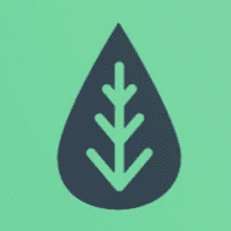**

**[**体格健壮。金融**](https://www.beefy.finance/) 是一个收益率农业优化器，允许用户通过使用各种策略对其持有的加密货币产生复利。为了避免与人工优化相关的费用，该协议在算法上产生产出可能性。这消除了用户从事主动耕作的需要。**

****

**[**BENQI**](https://benqi.fi/) 是一种算法流动性市场协议，使用户能够为雪崩资产提供借贷市场。除了 Avalanche 之外，Ascensive Asset、蜻蜓资本、Mechanism Capital 和 Avalanche 都是他们名单上的战略投资者。**

**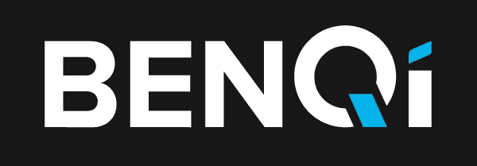**

**[**曲线**](https://curve.fi/) 是一个流动的交换流动性池，能够以很小的风险、最小的滑动和最小的费用结构实现互换。这是一种吸引人的交易方式，对于交易稳定货币的用户和从向客户收取的交易费和利率中获取收入的流动性提供者来说都是如此。**

**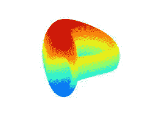**

**[**穿山甲交易所**](https://pangolin.exchange/) 是以太坊和 Avalanche 资产的分散式交易所，构建于 Avalanche 之上，采用与 Uniswap 相同的自动化市场模型(AMM)。它提供了快速的结算、低廉的交易成本，以及在安全的环境中民主地分配资金。**

**[**Reef**](https://reef.finance/) 是一个 EVM 兼容链，它通过集成以太坊、波尔卡多特、雪崩、宇宙和币安智能链的 Defi，以及其他加密货币和区块链来鼓励互操作性。它是高效的、可扩展的，并且不需要任何浪费的挖掘。它还有一个使用波尔卡基板开发的提名利害关系证明共识，这使它更加安全。**

**[**SushiSwap**](https://sushi.com/) 是构建在以太坊区块链上的分散式交易所和自动化做市商(amm)。它是由成立于 2011 年的 Uniswap exchange 拆分而来的。**

****

**[**Trader Joe**](https://www.traderjoexyz.com/#/home) 是 Avalanche 区块链上的一个分散式交易平台和自动做市商(amm ),方便两个代币之间的交易。通过将 DEX services 与 DeFi financing 合并，该平台能够提供杠杆交易。**

**Trader Joe 的运营方式类似于基于 Avalanche 的 Uniswap，是一个一站式交易平台。Trader Joe 将 DEX 功能与 DeFi 贷款选项相结合，提供了一套全面的产品，利用类似的 AMM 技术作为化合物和奶油，为 Avalanche DeFi 客户提供耕作、标桩、代币互换和杠杆贷款机会。**

**Trader Joe 已经为试图实现资产价值最大化的 AVAX 持有者建立了声誉，并刚刚超过穿山甲成为 Avalanche 上最大的 DEX:它打算吸引所有 DeFi 用户的注意，并通过生态系统的发展和添加可与复合和奶油金融相媲美的久经考验的技术，将自己确立为 Avalanche 上最大的货币市场协议。**

**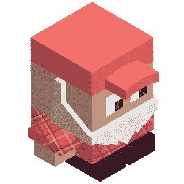**

# **下一步是什么？**

**整个区块链和加密领域对 2022 年有很多期望:从这个意义上说，雪崩已经受到了其基金会暴雪基金的积极影响，该基金已承诺[2 亿美元](/avalancheavax/avalanche-foundation-launches-fund-worth-over-200m-dedicated-to-supporting-ecosystem-development-799b34304f0e)用于网络开发、扩张和创新。该基金于 2021 年 11 月初推出，包括艾娃实验室、Polychain Capital、三箭资本和蜻蜓资本等投资者。**

**也许支持任何第 1 层的最有说服力的论据是它能够结合现实世界的用例以获得社会和经济优势。**

**Avalanche 的运行历史很短，还需要长时间的验证。2020 年 9 月下旬，该网络部署了 genesis 块。尽管进行了广泛的研究，加密网络仍在不断发展，并做出重要的设计、功能和治理选择。**

# **放弃**

**这不是任何情况下的财务建议，我研究的目标将永远是深入项目并从不同角度研究它，我确实包括基于我最近研究的类似项目的经验的个人意见。**

**我现在和将来都愿意接受讨论。**

****在推特上关注我们:****

****@道辛****

**在投资任何东西之前，请务必做好自己的研究。**

> **加入 Coinmonks [电报频道](https://t.me/coincodecap)和 [Youtube 频道](https://www.youtube.com/c/coinmonks/videos)了解加密交易和投资**

# **另外，阅读**

*   **[本地比特币审核](/coinmonks/localbitcoins-review-6cc001c6ed56) | [加密货币储蓄账户](https://coincodecap.com/cryptocurrency-savings-accounts)**
*   **[什么是融资融券交易](https://coincodecap.com/margin-trading) | [美元成本平均法](https://coincodecap.com/dca)**
*   **[拥护卡审核](https://coincodecap.com/uphold-card-review) | [信任钱包 vs MetaMask](https://coincodecap.com/trust-wallet-vs-metamask)**
*   **[Exness 评测](https://coincodecap.com/exness-review)|[moon xbt Vs bit get Vs Bingbon](https://coincodecap.com/bingbon-vs-bitget-vs-moonxbt)**
*   **[如何开始通过加密贷款赚取被动收入](https://coincodecap.com/passive-income-crypto-lending)**
*   **[BigONE 交易所评论](/coinmonks/bigone-exchange-review-64705d85a1d4) | [电网交易机器人](https://coincodecap.com/grid-trading)**