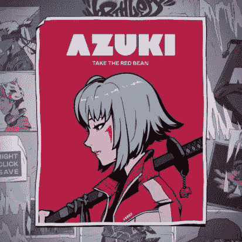

# 志那都红豆 Nft —您需要知道的一切

> 原文：<https://medium.com/coinmonks/azuki-nft-everything-you-need-to-know-ef198feb336f?source=collection_archive---------26----------------------->

志那都红豆 nft 已经获得了许多积极的先令，许多 nfts 收藏家看到它推翻无聊猿游艇俱乐部 Nfts 的流行，不会太久；志那都红豆 Nfts 的销售额高达 5 亿美元，这是在他们推出 Nfts 几个月后实现的。

第一批志那都红豆 NFT 在 2022 年 1 月 12 日发布后的三分钟内就被买走了。每幅 NFT 作品的价格为 3400 美元，最终成交价为 2900 万美元。因此，令人惊讶的是，用户现在可以志那都红豆 NFTs 访问一个名为“花园”的元宇宙，这可以使他们接收有限的商品，如 Nfts 下降，现场活动，以及更多的知识。

根据[bitcoin.com](https://news.bitcoin.com/nft-sales-increased-by-34-this-week-azuki-takes-top-sales-nft-interest-remains-low/)；据说

*“志那都红豆在本周的 NFT 收藏中占据了 NFT 销量第一的位置。在 735 名买家和 1，115 笔交易中，志那都红豆本周的销售额增长了 94.68%，至 9，500 万美元。本周 NFT 销量第二的作品来自 NFT 的“某物”系列，它在过去的七天里卖出了 5100 万美元。*

然而，这篇文章包含了关于志那都红豆 Nfts 的重要信息，以及在哪里可以买到它们，请在你阅读的时候喝杯酒，坐下来。

# 什么是志那都红豆 NFTs？

[志那都红豆](https://www.azuki.com/)是一个由 10000 个虚拟角色组成的集合，它给用户提供进入花园的会员权限。它始于独家街头服饰 collabs，NFT 下降，现场活动，以及更多将随着时间的推移而揭示。在志那都红豆，社区所有制催生了一种新的媒体类型，这是世界尚未探索的。

这个花园是互联网的一个角落，艺术、社区和文化在这里融合，创造奇迹。现实世界和数字世界之间的界限正在变得模糊，规则正在被改写。

志那都红豆是以太网上的一个个人资料图片项目。它是由洛杉矶的四个人创建的，他们自称是藏羚羊实验室。

每个志那都红豆化身有 12 个不同的可定制的功能，包括类型，头发，脸，脖子，眼睛，耳朵，嘴，头饰，特殊，衣服，副手，和环境。

志那都红豆的灵感来自 NFT 收藏的巨大崛起，如无聊猿游艇俱乐部和加密朋克。然而，它也给 NFT 工业带来了创新，这可能是它迅速成功的原因。

与此同时，NFT 系列采用 ERC721A 令牌标准铸造，这是标准 ERC721 令牌的变体。令牌标准由 Chiru Labs 创建，允许用户在一次交易中铸造多个 NFT，这大大减少了所需的汽油费，并缩短了铸造周期。超过 27 个项目正在使用这个令牌标准来创建 NFT。

# 志那都红豆 Nft 开放海域

志那都红豆 nft 目前在 opensea 上；这是 nft 市场志那都红豆 nft 正在交易。与此同时，它在 opensea marketplace 上是一个经过验证的收藏，有 10000 件商品，55000 个所有者，底价为 26.25 以太坊，价值 84000 多美元，交易量为 176500 万美元，价值 5650 亿美元，截至撰写本文时仍在统计中。

然而，用户可以通过 Eth 从 Opensea 购买志那都红豆 Nfts，也可以通过 Eth 出售，很多人目前正在交易这个项目并从中获利。

**亦读；** [利物浦 NFTs——你需要知道的一切](https://bulliscoming.com/liverpool-nfts/)

# 结论

之前最高销量志那都红豆的记录是 204 ETH，大约 56 万美元，是在两个月前售出的。志那都红豆#9605 的稀有性是由冷灰色的背景、眼睛和嘴巴决定的。

本文仅供教育目的传递信息，不作任何投资建议。

> 加入 Coinmonks [电报频道](https://t.me/coincodecap)和 [Youtube 频道](https://www.youtube.com/c/coinmonks/videos)了解加密交易和投资

# 另外，阅读

*   [3 商业评论](/coinmonks/3commas-review-an-excellent-crypto-trading-bot-2020-1313a58bec92) | [Pionex 评论](https://coincodecap.com/pionex-review-exchange-with-crypto-trading-bot) | [Coinrule 评论](/coinmonks/coinrule-review-2021-a-beginner-friendly-crypto-trading-bot-daf0504848ba)
*   [莱杰 vs n rave](/coinmonks/ledger-vs-ngrave-zero-7e40f0c1d694)|[莱杰 nano s vs x](/coinmonks/ledger-nano-s-vs-x-battery-hardware-price-storage-59a6663fe3b0) | [币安评论](/coinmonks/binance-review-ee10d3bf3b6e)
*   [Bybit Exchange 评论](/coinmonks/bybit-exchange-review-dbd570019b71) | [Bityard 评论](https://coincodecap.com/bityard-reivew) | [Jet-Bot 评论](https://coincodecap.com/jet-bot-review)
*   [3 commas vs crypto hopper](/coinmonks/3commas-vs-pionex-vs-cryptohopper-best-crypto-bot-6a98d2baa203)|[赚取秘密利息](/coinmonks/earn-crypto-interest-b10b810fdda3)
*   最好的比特币[硬件钱包](/coinmonks/hardware-wallets-dfa1211730c6) | [BitBox02 回顾](/coinmonks/bitbox02-review-your-swiss-bitcoin-hardware-wallet-c36c88fff29)