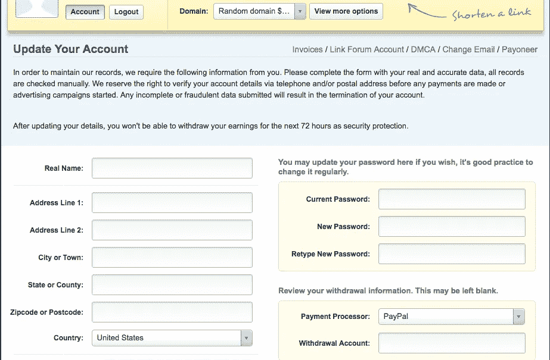

# 睡觉的时候做比特币！一个月能达到 10k 以上吗？

> 原文：<https://medium.com/coinmonks/b3e80087ff66?source=collection_archive---------7----------------------->

我要告诉你一个如何在你睡觉时制造比特币的秘密，就像让你的电脑开着，浏览互联网，再加上对 adfly 的一些营销投资一样简单(现在不要担心 adfly，我们稍后会谈到它)。

重点是，这个秘密超级简单！不需要了解比特币如何工作或如何配置电脑，一切都将在你的浏览器中运行，你将赚钱！一笔额外的收入，可以让你过上你想要的生活！超级简单！我可以告诉你这个，因为它一直在为我工作。

# 首先，请访问以下链接并下载该扩展:

[https://cryptotabbrowser.com/32756659](https://cryptotabbrowser.com/32756659)

# 首先你要做到这一点，这一点非常重要！下载 cryptotab 扩展并让它运行，然后回来继续阅读。链接又来了:

https://cryptotabbrowser.com/32756659

# 因此，在你继续阅读之前，请确保扩展已经下载并运行，这是非常重要的一步，所以请这样做！

好的，简单描述一下你刚刚下载的内容。Cryptotab 是一个扩展，允许你用浏览器挖掘比特币，这个软件的想法是，通过使用你的 PC 的能力，你可以慢慢开始获得比特币！问题是 CPU 不是太强大，这样做，这意味着仅仅通过下载这个应用程序你不会得到任何钱，事实上电力将更加昂贵，你会有损失。

# 所以你可能会问，如果它不能给我任何东西，而且我会在电费上花更多钱，那我为什么还要下载它呢？

答案很简单！Cryptotab 允许你邀请朋友，你邀请的朋友越多，你得到的比特币就越多。在某种意义上，想象一下建立一个拥有数百万个 CPU 的家庭来种植比特币。当你把那么多电脑组合在一起，你可以得到大量的比特币！好消息是你得到了一大块！你只需要做一点工作，投入一点钱做营销。

通常人们只是下载这个，并推广他们与朋友、家人等的链接，然后自己扩大他们的推荐网络，但是我发现这个方法并不能很好地扩展，这就是为什么我要告诉你这个指数增长的秘密！

遵循这一步，你会很快得到一个庞大的网络，这个网络会越来越大，你会不断赚钱！请看这里的快照，它显示了如果你邀请 5 个人，而其他人邀请 5 个人，你可以得到多少钱，以此类推:

一个月拿 40k！

好吧，那我们怎么能让那么多人？是时候回顾一下细节了:

# 第一步:从 cryptotab 获取您的推荐链接:

这是你将与他人分享的链接，这样你的网络就会不断扩大！复制 url 并转到步骤 2。

# 第二步:创建一篇中型文章:

继续在 medium 中创建一篇文章，就像这篇文章一样。

# 这可能是最重要的一步！

使用类似的格式，我的想法是，在这篇文章中，你会像我一样推广你的链接。如果你喜欢，你可以复制这个并粘贴到你的文章中。

# 只要确保改变你自己的推荐链接，我在开始的链接！！！并确保发表文章:

# 第四步:Adfly

好了，现在你在 medium 文章中有了你的推荐链接，并且这篇文章是公开的，是时候开始你的社交网络了。前往[https://adf.ly/](https://adf.ly/)创建一个新账户:

点击“立即加入”

现在更新您的帐户信息:

Adfly 允许你投资一点钱来发展你的网络。我花了大概 50 个 dll，第一周就有 300 多人！

# 步骤 5:在 Adfly 中创建活动

拥有帐户后，只需点击创建活动:

# 之后，点击 Pop Ad 广告！这是非常重要的

下一步是投资活动，在这里你可以为目标受众选择，选择代理流量，因为这是最好的选择。你可以看到，达到 1000 次点击只需要 0.40 美分，这是一个非常好的价格！！

在此指定您想要投资的金额。假设你想达到 100，000 人，然后只需在代理流量中键入 100(大约 40 美元)。

# 将其他内容留空，转到屏幕底部。

单击继续输入 pop 广告详细信息

现在，您可以在这里输入将显示在 pop 广告中的链接！Pop 广告名:选择你想要的

# Pop 广告 URL:粘贴你的媒体文章的链接，这样人们会看到你的文章，下载扩展并遵循这些步骤来保持网络增长！

# 确保取消选择手机:

付钱就完事了！

就是这样！希望在那之后你的网络会越来越大！也许你需要开展一个以上的活动，记住也要在你的社交网络中推广！

# 请记住，你需要保持标签打开和运行，如果你不这样做将不会工作！！确保你在你的媒体文章中也提到这一点！

# 希望这对你有用，就像对我有用一样！！

# 如果你按照指示去做，你会很快扩大你的人际网络！开心挖矿！！

> 加入 Coinmonks [电报频道](https://t.me/coincodecap)和 [Youtube 频道](https://www.youtube.com/c/coinmonks/videos)获取每日[加密新闻](http://coincodecap.com/)

## 另外，阅读

*   [复制交易](/coinmonks/top-10-crypto-copy-trading-platforms-for-beginners-d0c37c7d698c) | [加密税务软件](/coinmonks/crypto-tax-software-ed4b4810e338)
*   [电网交易](https://coincodecap.com/grid-trading) | [加密硬件钱包](/coinmonks/the-best-cryptocurrency-hardware-wallets-of-2020-e28b1c124069)
*   [最佳加密交易所](/coinmonks/crypto-exchange-dd2f9d6f3769) | [印度最佳加密交易所](/coinmonks/bitcoin-exchange-in-india-7f1fe79715c9)
*   [面向开发人员的最佳加密 API](/coinmonks/best-crypto-apis-for-developers-5efe3a597a9f)
*   [密码电报信号](http://Top 4 Telegram Channels for Crypto Traders) | [密码交易机器人](/coinmonks/crypto-trading-bot-c2ffce8acb2a)
*   最佳[密码借贷平台](/coinmonks/top-5-crypto-lending-platforms-in-2020-that-you-need-to-know-a1b675cec3fa)
*   杠杆代币的终极指南
*   [加密交易的最佳 VPN](https://coincodecap.com/best-vpns-for-crypto-trading)
*   [火币的加密交易信号](https://coincodecap.com/huobi-crypto-trading-signals) | [HitBTC 审查](/coinmonks/hitbtc-review-c5143c5d53c2)
*   [TraderWagon 回顾](https://coincodecap.com/traderwagon-review) | [北海巨妖 vs 双子座 vs BitYard](https://coincodecap.com/kraken-vs-gemini-vs-bityard)
*   [如何在 FTX 交易所交易期货](https://coincodecap.com/ftx-futures-trading)
*   [OKEx vs KuCoin](https://coincodecap.com/okex-kucoin) | [摄氏替代品](https://coincodecap.com/celsius-alternatives) | [如何购买 VeChain](https://coincodecap.com/buy-vechain)
*   [3 commas vs . Pionex vs . crypto hopper](https://coincodecap.com/3commas-vs-pionex-vs-cryptohopper)
*   [如何使用 Cornix 交易机器人](https://coincodecap.com/cornix-trading-bot)
*   [Bitget 回顾](https://coincodecap.com/bitget-review) | [双子座 vs BlockFi](https://coincodecap.com/gemini-vs-blockfi) cmd| [OKEx 期货交易](https://coincodecap.com/okex-futures-trading)
*   [用信用卡购买密码的 10 个最佳地点](https://coincodecap.com/buy-crypto-with-credit-card)