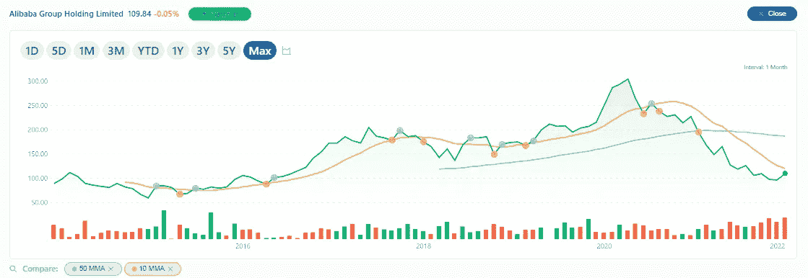

# 巴巴:阿里巴巴是一个好的投资吗？

> 原文：<https://medium.com/coinmonks/baba-is-alibaba-a-good-investment-370f7e601a5?source=collection_archive---------37----------------------->

Source photo [BABA 109.84 -0.05999 -0.05% : Alibaba Group Holding Limited — MSN Money](https://www.msn.com/en-us/money/stockdetails/fi-a1o4mw?ocid=ansMSNMoney11&duration=Max)

在这份榜单上，阿里巴巴集团控股有限公司(NYSE:BABA)是唯一上榜的中国全球 IT 公司。除了软件和硬件之外，该公司还拥有许多技术公司和广泛的技术资产。

此外，阿里巴巴集团控股有限公司在软件方面提供云计算、网上冲浪、网站托管和支付处理解决方案，在…