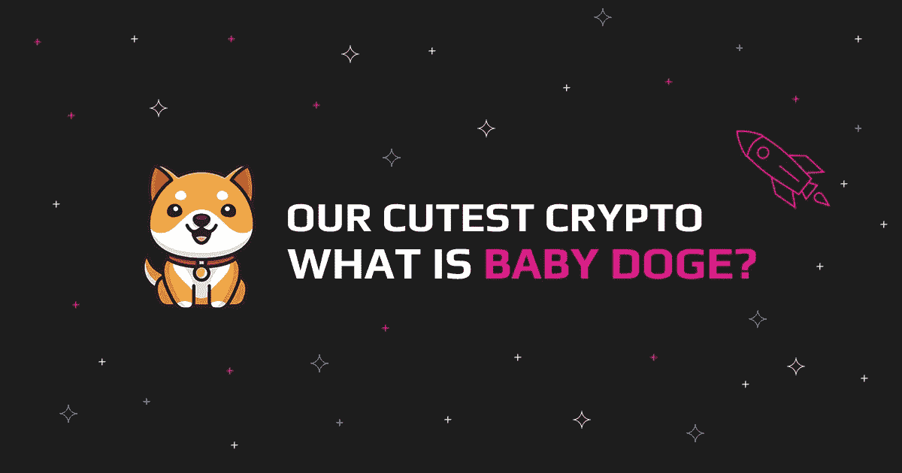
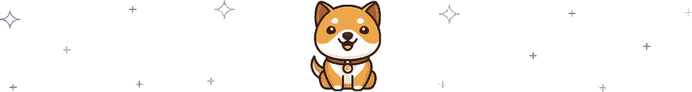
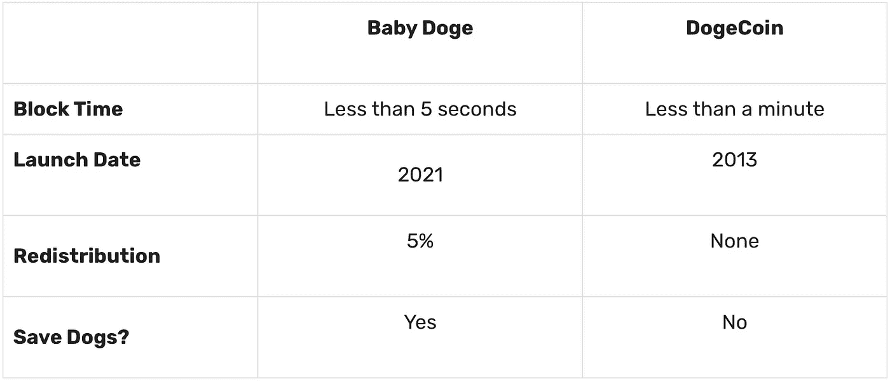
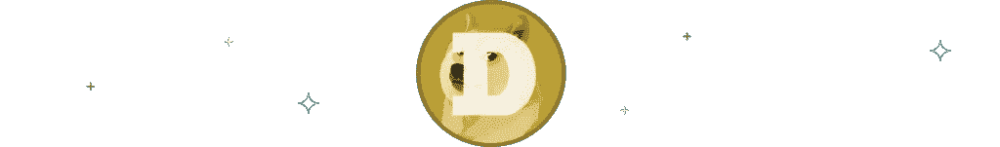
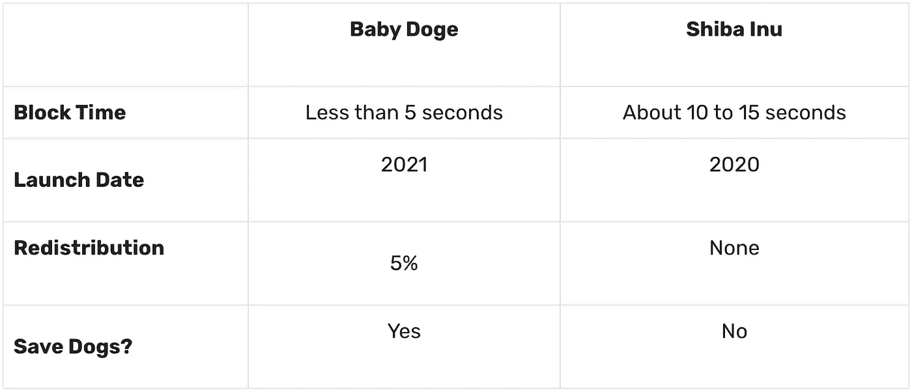
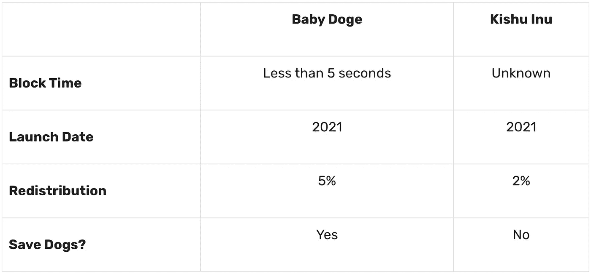
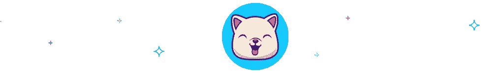

# 小狗狗庆祝一岁了！让我们看看它有什么特别之处

> 原文：<https://medium.com/coinmonks/baby-doge-celebrated-1-year-lets-see-what-s-so-special-about-it-227a8237c89b?source=collection_archive---------10----------------------->

[宝贝 Doge 币](https://babydogecoin.com/)于 2021 年 6 月 1 日推出，在[加密货币](https://swapzone.io/currencies)的世界里，它的确是一个“宝贝”。到目前为止，小狗硬币已经和[小狗硬币](https://swapzone.io/currencies/dogecoin)联系了很多。根据 Doge 宝贝硬币官方网站，Doge 宝贝是 Dogecoin 的合法“孩子”, Dogecoin 寻求提供 Doge Coin 无法提供的新的和改进的交易速度。他们通过陈述说[小狗狗](https://swapzone.io/currencies/baby-doge-coin)已经从他的迷因父亲和前任狗狗身上获得了经验和技巧来表达这一点。话虽如此，让我们深入探究一下这个代币，揭示什么是 BabyDoge，它与当今流通的其他著名迷因币的区别，当然，让我们看看你如何能够立即进行 BabyDoge 交换，而没有隐藏的费用。

# 什么是 BabyDoge？

BabyDoge 是一个迷因密码，旨在改进其前身 Dogecoin 的缺点。它通过提高交易速度和增加更多奖励硬币用户的通缩功能来实现这一点。对于发生的每一笔交易，用户都会从每笔交易中获得一定比例的奖励，这些奖励会自动发送到现有的每个 BabyDoge 钱包中。

它鼓励更多的用户持有硬币而不是花掉它。因此，使其成为“超通缩”的加密货币。这是因为随着时间的推移，越来越多的人持有它，它将变得更加珍贵和稀缺。BabyDoge 的独特之处在于，它专注于为用户增加价值，同时将部分资金捐赠给救助狗。例如，6 月 24 日，BabyDoge 宣布向一家名为 PawsWithCause 的非营利组织捐赠了 75，000 美元。

# 世界上最好的社区硬币

BabyDoge 被称为“*世界上最好的社区硬币*”，因为它是由 Dogecoin 社区的粉丝和成员创建的。不到一年的时间，这种加密货币已经迅速获得了全世界粉丝的大力支持。BabyDoge 的一个主要支持者是特斯拉的首席执行官 Elon Musk。由于他的推文，BabyDoge 的价格在发布后两周上涨了 1000%以上。到第三周的时候，它已经积累了 2 亿美元的市值。到第四周，它已经积累了超过 160，000 名持有人。

# BabyDoge 的主要特征

既然我们已经回答了“婴儿是什么？”，让我们来看看宝贝 Doge Coin 的一些关键特性，包括:

*   **奖励:**如前所述，小总督硬币是一种通货紧缩的象征。因此，随着时间的推移，它会变得越来越稀缺。所有 BabyDoge 持有人只要持有 BabyDoge，他们的钱包就会收到更多的 BabyDoge 代币。所有持有者自动从网络上的每笔交易中获得 5%的费用。
*   **自动&手动烧毁:**超过 29%的小总督硬币被烧毁。这意味着在网络中重新分配的 5%中，有 29%被分配到了死去的钱包中。因此，每笔交易都会烧掉硬币。
*   **慈善钱包:【Doge 宝宝有一个指定的慈善钱包，接受再分配，用来支持他们的慈善伙伴。一个完美的例子是 PawsWithCause。**
*   小总督硬币加密卡:一个即将到来的项目，社区正急切地等待着。购买，发送，交换加密和文本 BabyDoge 给任何人使用 TextBit 技术！

# 狗社区硬币的区别

# 小狗大战小狗

虽然 BabyDoge 和 Dogecoin 有一个共同的名字，但当谈到相似之处时，那只是它。不同之处包括:

1.  Dogecoin 在自己的区块链运营，而 BabyDoge 的交易在币安进行。
2.  小狗的供应量是无限的，而小狗的供应量是有限的。
3.  Dogecoin 是通货膨胀，而 Baby Doge Coin 是通货紧缩。

# BabyDoge vs 柴犬

特斯拉首席执行官埃隆·马斯克在推特上宣传了婴儿狗和柴犬。由于他的推广，这两种硬币在加密社区获得了一定的知名度，并经历了大幅涨价。狗宝宝和柴犬的一些区别包括:

1.  柴犬在区块链[以太坊](https://swapzone.io/currencies/ethereum)运作，而小狗交易在币安进行。
2.  鉴于柴犬显示出未来增长的积极迹象，它有一种投机用途。婴儿用品没有任何实际用途。由于价格上涨得益于埃隆·马斯克的推文，很难预测 BabyDoge 的表现。
3.  柴犬不捐赠或给慈善机构。BabyDoge 已经拿出钱来支持帮助拯救狗的生命的慈善机构。

# Doge 宝宝 vs Kishu Inu

Doge 宝宝和 Kishu Inu 都是 meme 令牌，几乎没有用例或价值。两者都只值 10 美分。两者之间的一些显著差异包括:

1.  与 Kishu Inu 不同，BabyDoge 致力于帮助拯救狗的生命。虽然 Kishu Inu 确实支持慈善机构，但它并不特别支持狗慈善机构。
2.  BabyDoge 有一个 5%的再分配奖励系统，而 Kishu Inu 有一个 2%的再分配奖励系统。

# 如何以最佳速度执行婴儿数据交换？

你可以用一些加密货币获得 BABYDOGE，包括比特币和以太坊。以下是在 Swapzone 上以最佳汇率将比特币转换为婴儿币的步骤。

1.  前往 [Swapzone.io](https://swapzone.io/) 开始工作。
2.  在**发送**部分选择 ETH。
3.  指定您要转帐的总金额。
4.  在**到达**部分选择婴儿。
5.  查看屏幕上的婴儿换购优惠，并选择顶部列出的最佳价格。你也可以看到你需要多少分钟来完成交换。
6.  点击**交换**按钮，继续您选择的 [ETH to BabyDoge](https://swapzone.io/exchange/eth/babydoge) 交换提议。
7.  输入钱包地址以接收 KISHU。
8.  使用生成的 ETH 地址发送您的 ETH 存款。
9.  等待 exchange 服务处理存款，并等待 BabyDoge 交换完成。
10.  不要忘记对交换合作伙伴进行评级并留下评论，这样我们可以为未来的用户收集更多关于交换的信息。

**进一步阅读:** [**步父亲后尘？宝贝狗狗价格预测**](https://swapzone.io/blog/baby-doge-price-prediction)

> 加入 Coinmonks [电报频道](https://t.me/coincodecap)和 [Youtube 频道](https://www.youtube.com/c/coinmonks/videos)了解加密交易和投资

# 另外，阅读

*   [3 商业评论](/coinmonks/3commas-review-an-excellent-crypto-trading-bot-2020-1313a58bec92) | [Pionex 评论](https://coincodecap.com/pionex-review-exchange-with-crypto-trading-bot) | [Coinrule 评论](/coinmonks/coinrule-review-2021-a-beginner-friendly-crypto-trading-bot-daf0504848ba)
*   [莱杰 vs Ngrave](/coinmonks/ledger-vs-ngrave-zero-7e40f0c1d694) | [莱杰 nano s vs x](/coinmonks/ledger-nano-s-vs-x-battery-hardware-price-storage-59a6663fe3b0) | [币安评论](/coinmonks/binance-review-ee10d3bf3b6e)
*   [Bybit Exchange 评论](/coinmonks/bybit-exchange-review-dbd570019b71) | [Bityard 评论](https://coincodecap.com/bityard-reivew) | [Jet-Bot 评论](https://coincodecap.com/jet-bot-review)
*   [3 commas vs crypto hopper](/coinmonks/3commas-vs-pionex-vs-cryptohopper-best-crypto-bot-6a98d2baa203)|[赚取加密利息](/coinmonks/earn-crypto-interest-b10b810fdda3)
*   最好的比特币[硬件钱包](/coinmonks/hardware-wallets-dfa1211730c6) | [BitBox02 回顾](/coinmonks/bitbox02-review-your-swiss-bitcoin-hardware-wallet-c36c88fff29)
*   [BlockFi vs 摄氏](/coinmonks/blockfi-vs-celsius-vs-hodlnaut-8a1cc8c26630) | [Hodlnaut 点评](/coinmonks/hodlnaut-review-best-way-to-hodl-is-to-earn-interest-on-your-bitcoin-6658a8c19edf) | [KuCoin 点评](https://coincodecap.com/kucoin-review)