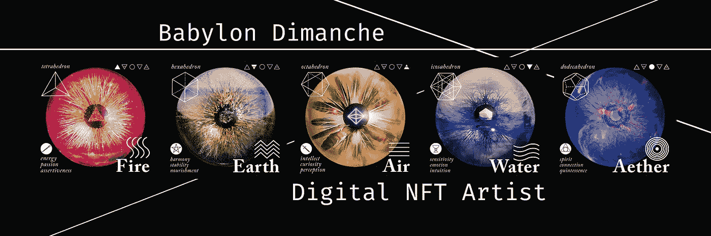
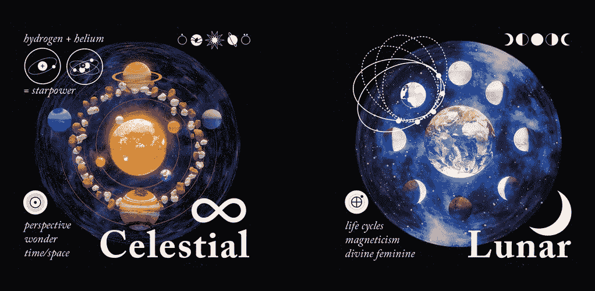

# 巴比伦周日:采访一个新兴的 NFT 艺术家

> 原文：<https://medium.com/coinmonks/babylon-dimanche-interview-with-an-emerging-nft-artist-5865eac67c04?source=collection_archive---------30----------------------->

unifty 正在打造一个支持艺术家的品牌，为创意人员创造新的财务机会，并与有才华的个人建立持久的合作伙伴关系。我们很荣幸巴比伦成为画廊的首批艺术家之一。

NFT 在数字艺术的发展中创造了令人兴奋的新途径。艺术家能够在一个分散的市场上出售他们的艺术作品，买家和卖家可以在数字信托提供的相对安全的空间中会面、探索和交易。然而，如果一个艺术家从未进行过加密交易或拥有加密钱包，进入市场可能会势不可挡。

弥合差距；Lunifty 从想加入 NFT 空间的艺术家那里购买。没有 NDA，所以艺术家可以自由地与我们分享我们支付的费用和他们的经验。每个合作伙伴都是不同的，并迎合艺术家的需求，无论他们是想进入 NFT 空间，还是想以固定价格出售他们的艺术作品，我们都可以适应。

当我们看到 Babylons 的作品时，我们知道它非常适合第一季。自从 Lunifty 画廊还在纸上的时候，我们就已经从 90 年代的太空歌剧[第五元素](https://www.imdb.com/title/tt0119116/)中汲取灵感。巴比伦的五行系列太好了，不能错过。

we even commissioned two more

这个团队相信 NFT 收藏家和 NFT 背后的艺术家之间的联系。你不仅仅获得了一笔投资和一件艺术品，你还在帮助别人继续用他们的才华让世界变得更凉爽。

本着与 NFT 背后的艺术家建立有意义的联系的精神；以下是我们对 Babylon 的采访，他是一位正在 NFT 崭露头角的不可思议的数字艺术家:

**你在什么形式的媒体工作过，你最喜欢在哪个媒体工作？**

我来自美术背景，所以我尝试了所有的东西，但这让我选择了平面设计和数字艺术，这是我的心之所在。我发现在灯光和阴影方面专注于创作比让一切都精确更容易，所以去年我一直在 Blender 工作。我花了大约十年时间使用 Photoshop 和 Illustrator，最终自学了 3D 建模。除此之外，我最喜欢的美术媒体是彩色铅笔、拼贴和物体上的混合媒体。我也做视频剪辑，我在 2015 年 MOCA 的 Videodrome 有一个实验性的作品。我也喜欢制作视频，所以我开始为他们制作我自己的音乐，我正在制作一个。

有哪些事情激发了你的创作灵感？

在我的作品中，你会发现最常见的主题是二元性——两种对立力量的概念。事实上，要获得两者的好处，一个人需要达到平衡——这是我在自己的生活中一直努力追求的。另外，我深受超现实主义、塔罗牌和神秘学的启发。

你希望人们从你创造的图像中获得什么？

老实说，我希望人们从我的创作中得到的是，与众不同，以不同的方式思考，创造让你开心的东西。我的大部分艺术都与黑暗和在黑暗中寻找光明有关，探索与心理健康和内心斗争有关的主题——这是每个人都可能涉及的事情。

**您是什么时候听说 NFTs 的？**

几年前我听说过 NFTs。朋友和其他人一直来找我，告诉我应该如何进入这个行业，因为他们觉得我的艺术会在一个以数字艺术为中心的基于互联网的市场上表现良好。

**你最喜欢的艺术家是谁？**

这听起来很老套，但我永远最喜欢的艺术家是萨尔瓦多·达利。我觉得看他的作品就像看青春期前的作品一样,《向前看》帮助我以一种不同的方式看待艺术和创作。总有一些东西需要观察和思考，他将物体和想法联系起来的方式一直让我感兴趣。

如果你可以通过艺术获得任何东西，你的最终目标是什么？

我通过艺术的最终目标是筹集足够的资金，为那些与心理健康作斗争的人开设一个艺术治疗工作室。我知道它帮助我度过了最黑暗的时光，我想尽我所能帮助别人，用我最了解的方式。

**你为什么要创作五行系列？**

对于 5 元素系列，我想花时间把每个元素作为一个整体来关注。把它带回到基础。我们经常发现自己被信息淹没，与自然脱节。就属性和联系而言，我们可以从每个元素中学到一些东西。

当事情让人不知所措时，我们被告知要一步一步来。我想从几个方面分别看看每个元素:属性、柏拉图立体、象征和意象。柏拉图立体遍布自然界，从水晶到人类 DNA，它展示了所有物质之间潜在的数学联系，我对此很感兴趣。我还没有破解代码，但我想分享一些我觉得有趣的方面，希望它们可以为其他人形成新的联系或新的想法，就像它们对我一样。

**读者如何找到更多你的作品？**

Instagram 是现在找到我的最好方式， [**@babsdimanche**](https://www.instagram.com/babsdimanche/) ，你可以看到我从美术到现在所做的一切！

你可以在 [**Opensea 这里**](https://opensea.io/Lunifty)
找到出售的巴比伦元素 NFT，这位艺术家获得所有销售额的 30%以及创建他们自己的 NFT 的帮助。

想知道虚拟画廊是如何运作的，或者如何让你的作品展出？

我们可以通过以下方式提供参观、教育和反馈:

[**不和**](https://discord.gg/e9pvb8A85f)
[**推特**](https://mobile.twitter.com/lunifty)
[**insta gram**](https://www.instagram.com/luniftyart/)