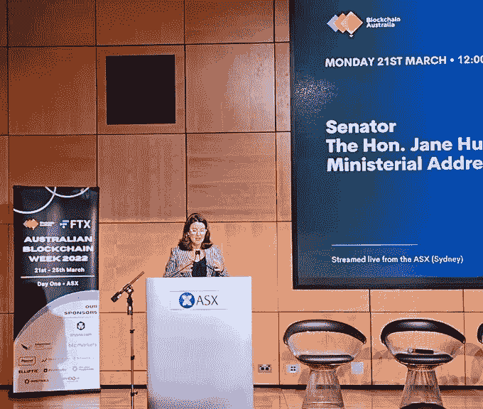

# 澳大利亚密码交易所的“批准徽章”

> 原文：<https://medium.com/coinmonks/badge-of-approval-for-crypto-exchanges-in-australia-12e9c81ceea3?source=collection_archive---------80----------------------->

**Visit our website:-** [**https://bitcoinsupports.com/**](https://bitcoinsupports.com/)

**澳大利亚通过在投资者和加密货币交易所之间建立“信任”基础来监管加密货币行业。**

**澳大利亚独有的**

澳大利亚正通过全面的监管框架拥抱加密货币资产，该框架始于可信赖的加密货币交易所，使客户能够安全可靠地进行交易。数字经济部长简·休姆(Jane Hume)参议员在议会讲话中表示，这些政府批准的加密交易所将获得“健康心脏认证”，这是一种独特的澳大利亚优秀标志。

部长在“2022 年澳大利亚区块链周”上向人群发表讲话，表明政府欢迎加密货币行业参与者的开放态度。正如她所说:

***‘密码产业及其在 DeFi 中的应用，是我所见过的最激动人心的前沿领域之一。因此，我要告诉在座的各位:如果你们想成为创新虚拟前沿的先锋，澳大利亚对商业是开放的。作为数字经济部长和金融服务部长，我支持你。参议员 Hume 在她的讲话中强调了通过加密交易所监管加密货币业务的重要性。此外，她还通过颁布监管法来解决加密资产的监管安排问题。***

**Visit our website:-** [**https://bitcoinsupports.com/**](https://bitcoinsupports.com/)

**提议的监管方法**

Hume 概述了澳大利亚政府对加密货币业务等新兴技术的方法。她公开反对政府为了打击诈骗和保护消费者而强加繁琐的繁文缛节和不必要的限制。参议员休姆概述了政府对加密货币监管的总体策略。她说:

***‘政府正在对加密资产采取立场。这是一种前瞻性的立场。“我们正在向前倾斜，”***

数字经济在莫里森政府下价值 21 亿澳元。参议员休姆乐观地认为，随着适当监管框架的到位，这一数字到 2030 年可能达到 684 亿澳元。跨国咨询和审计公司 EY 的区块链技术全球主管 Paul R.Brody 对澳大利亚政府的立场表示赞赏。

**Visit our website:-** [**https://bitcoinsupports.com/**](https://bitcoinsupports.com/)

莫里森政府已经制定了一个令人放心的战略，重申其对一个可预测的、最低限度的、一致的和简单明了的法律框架的承诺。政府的责任是支持增长和创新，这正是本届政府正在做的事情。

**访问我们的网站:-**[**【https://bitcoinsupports.com/】**](https://bitcoinsupports.com/)

**免责声明:以上为作者观点，不应视为投资建议。读者应该自己做研究。**

> 加入 Coinmonks [电报频道](https://t.me/coincodecap)和 [Youtube 频道](https://www.youtube.com/c/coinmonks/videos)了解加密交易和投资

# 另外，阅读

*   [加拿大最佳加密交易机器人](https://coincodecap.com/5-best-crypto-trading-bots-in-canada) | [库币评论](https://coincodecap.com/kucoin-review)
*   [火币加密交易信号](https://coincodecap.com/huobi-crypto-trading-signals) | [HitBTC 审查](/coinmonks/hitbtc-review-c5143c5d53c2)
*   [如何在 FTX 交易所交易期货](https://coincodecap.com/ftx-futures-trading) | [OKEx vs 币安](https://coincodecap.com/okex-vs-binance)
*   [OKEx vs KuCoin](https://coincodecap.com/okex-kucoin) | [摄氏替代品](https://coincodecap.com/celsius-alternatives) | [如何购买 VeChain](https://coincodecap.com/buy-vechain)
*   [ProfitFarmers 回顾](https://coincodecap.com/profitfarmers-review) | [如何使用 Cornix Trading Bot](https://coincodecap.com/cornix-trading-bot)