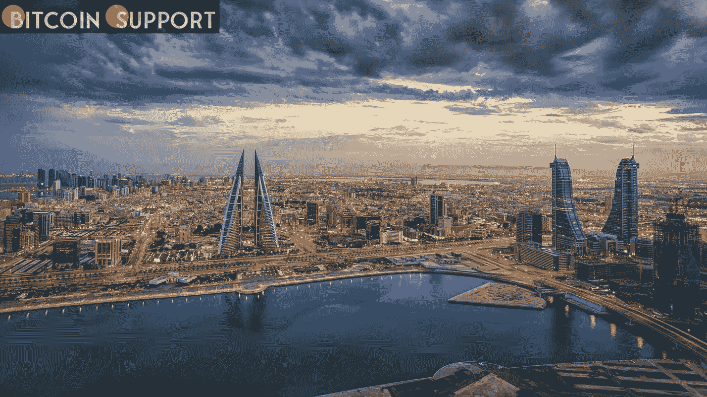

# 币安向巴林颁发了运营加密货币服务提供商的牌照

> 原文：<https://medium.com/coinmonks/bahrain-has-been-granted-a-licence-by-binance-to-operate-as-a-cryptocurrency-service-provider-8d94cc27209?source=collection_archive---------104----------------------->

**Visit our website:-** [**https://bitcoinsupports.com/**](https://bitcoinsupports.com/)

巴林国民现在可以使用世界上最大的加密交易所提供的各种受监管的加密服务。得益于巴林中央银行颁发的许可证，加密货币交易所币安将向其在中东的第一个国家提供全面监管的服务。

海湾阿拉伯国家合作委员会能够向巴林发放许可证。3 月 14 日，全球最大交易所的首席执行官赵昌鹏透露了加密资产服务提供商的牌照。

[https://twitter.com/cz_binance/status/1503459273413697540](https://twitter.com/cz_binance/status/1503459273413697540)

币安的新牌照允许其向中东最小经济体的客户提供加密服务，包括交易、托管和投资组合管理。去年 12 月，币安原则上获得了在巴林运营的授权。该许可现已升级为正式许可。巴林(CBB)中央银行行长何·拉希德·阿勒·马拉杰称，该行正在“制定符合全球趋势的法律”，以“允许创新和最佳实践”得益于该许可，币安将能够在遵守当地法律的同时继续其全球扩张雄心。CZ 上周表示，他希望币安“发现并投资”全球各个经济领域的传统企业，以便将它们与加密货币联系起来。

巴林一直是中东地区对加密最友好的国家之一，尽管与该地区的其他国家相比，它的面积很小，或许正因为如此。今年 1 月，CBB 成功测试了摩根大通的 Onyx 加密支付系统。据省长 Al Maraj 称，CBB 将能够通过采用基于加密的支付方法来解决“目前传统跨境支付业务中的低效率问题”。毫无疑问，获得每个地区的经营许可证将有助于币安实现这方面的目标。主要媒体出版商福布斯是该公司最近引人注目的收购，上个月以 2 亿美元的天价收购。CBB 的举动也使该国领先于迪拜，成为该地区的加密中心。巴林的金融加密立法远远领先于迪拜，迪拜仍然禁止加密交易所向当地人提供服务。尽管中央银行现在有了更先进的加密法律，但总部位于巴林的加密交易所 CoinMENA 的首席执行官塔拉勒·塔巴(Talal Tabbaa)今年 2 月告诉美国有线电视新闻网，“如果银行业得到整顿，那么迪拜可能是加密的首选目的地，”迪拜的银行业危机可能会在今年得到解决，这要归功于阿联酋总理谢赫·穆罕默德·本·拉希德·阿勒马克图姆在该市建立的加密货币法律框架。根据总理的说法，该框架将保护投资者，并为加密行业治理创造“急需的国际规范”。

**访问我们的网站:-**[**https://bitcoinsupports.com/**](https://bitcoinsupports.com/)

**免责声明:以上为作者观点，不应视为投资建议。读者应该自己做研究。**

> 加入 Coinmonks [电报频道](https://t.me/coincodecap)和 [Youtube 频道](https://www.youtube.com/c/coinmonks/videos)了解加密交易和投资

# 另外，阅读

*   [SmithBot 评论](https://coincodecap.com/smithbot-review) | [4 款最佳免费开源交易机器人](https://coincodecap.com/free-open-source-trading-bots)
*   [比特币基地僵尸程序](/coinmonks/coinbase-bots-ac6359e897f3) | [AscendEX 审查](/coinmonks/ascendex-review-53e829cf75fa) | [OKEx 交易僵尸程序](/coinmonks/okex-trading-bots-234920f61e60)
*   [如何在印度购买比特币？](/coinmonks/buy-bitcoin-in-india-feb50ddfef94) | [瓦济克斯审查](/coinmonks/wazirx-review-5c811b074f5b)
*   [隐翅虫替代品](/coinmonks/cryptohopper-alternatives-d67287b16d27) | [HitBTC 审查](/coinmonks/hitbtc-review-c5143c5d53c2)
*   [CBET 评论](https://coincodecap.com/cbet-casino-review) | [库科恩 vs 比特币基地](https://coincodecap.com/kucoin-vs-coinbase)
*   [折叠 App 审核](https://coincodecap.com/fold-app-review) | [Kucoin 交易机器人](/coinmonks/kucoin-trading-bot-automate-your-trades-8cf0ca2138e0) | [Probit 审核](https://coincodecap.com/probit-review)