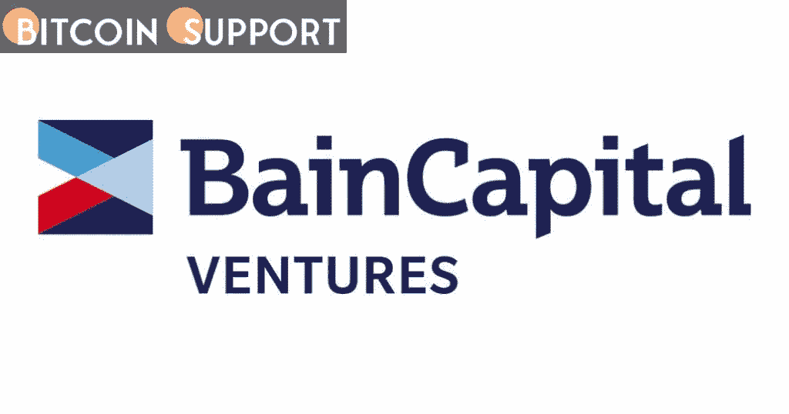
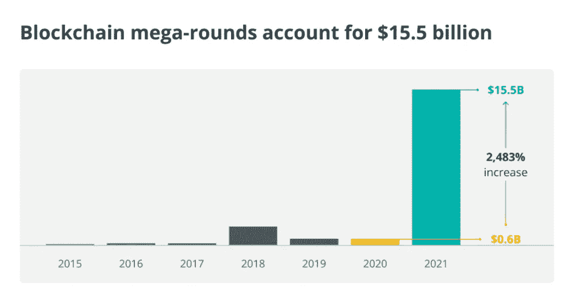

# 贝恩资本风险投资公司为加密货币项目设立了 5 亿美元的基金

> 原文：<https://medium.com/coinmonks/bain-capital-ventures-establishes-a-500-million-fund-for-cryptocurrency-projects-5cb82fbf120d?source=collection_archive---------73----------------------->

**Visit our website:-** [**https://bitcoinsupports.com/**](https://bitcoinsupports.com/)

2021 年，加密货币风投的风险投资将超过 250 亿美元，超过之前十年的总和。

管理着 51 亿美元资产的全球顶级风险投资公司之一贝恩资本(Bain Capital Ventures)宣布推出一只新的 5.6 亿美元的加密货币基金。据 3 月 8 日《彭博》报道，该基金于 11 月份关闭，并已向 12 个未披露的项目投资了 1 亿美元。

贝恩资本风险投资公司(Bain Capital Ventures)在加密货币和区块链领域有着良好的投资记录，此前曾支持 BlockFi、Compound 和数字货币集团。贝恩资本风险投资(Bain Capital Ventures)的最新基金 BCV 基金 I 是首只此类基金，专门专注于加密货币领域。

**Visit our website:-** [**https://bitcoinsupports.com/**](https://bitcoinsupports.com/)

当前的发展紧随 2021 年风险资本对 crypto 的兴趣激增而来。根据 Pitchbook 的数据，去年加密货币风险投资的风险投资达到了创纪录的 250 亿美元，这是有史以来最大的一笔投资。尽管加密资产价格在 2022 年仍然非常不稳定，但风险投资公司继续在该领域进行大量投资。美国风险投资公司红杉资本(Sequoia Capital)今年 2 月宣布成立 6 亿美元的加密货币基金。Polygon 在由几家区块链行业领先的风险投资公司牵头的一轮融资中筹集了 4.5 亿美元。

比特币市场目前处于熊市。比特币(BTC)价格自 11 月初的历史高点以来下跌了约 40%，原因是人们越来越担心美联储为应对不断增长的成本和地缘政治紧张局势而采取的货币措施。

**访问我们的网站:-**[**https://bitcoinsupports.com/**](https://bitcoinsupports.com/)

**免责声明:以上为作者观点，不应视为投资建议。读者应该自己做研究。**