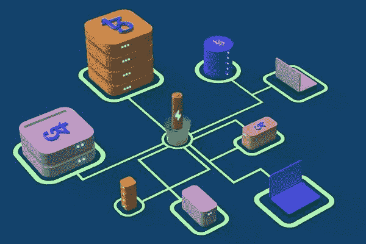
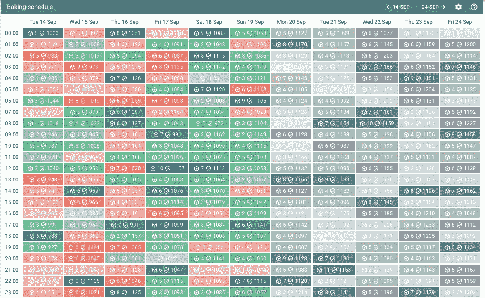
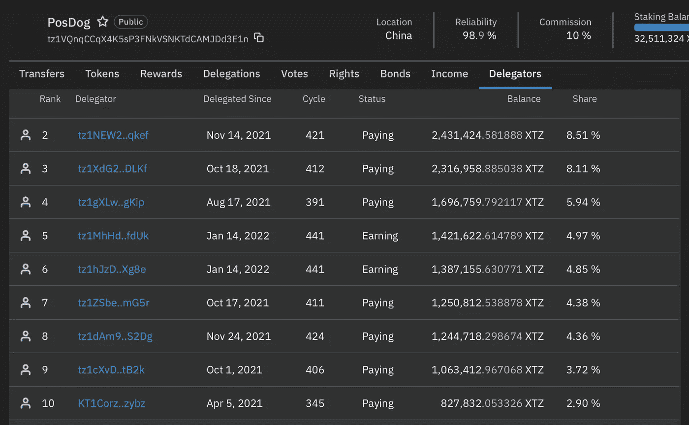

# Tezos 上的烘焙:从推出一个节点到首次盈利

> 原文：<https://medium.com/coinmonks/baking-on-tezos-from-launching-a-node-to-the-first-profit-129476d77ff5?source=collection_archive---------4----------------------->

在自己的节点上赚钱是很贵的。一个 20 个 whats miner M30S+ASIC 的比特币矿场要花 20 万美元，32 ETH 才能成为以太坊 2.0 中的验证器——8.2 万美元。

在 Tezos 上下注需要更少的投资:运行一个节点需要 6000 XTZ(发表时为 18000 美元)，而授权者可以贡献高达 90%的金额。

在本教程中，我将解释 Tezos staking 是如何工作的以及为什么它被称为烘焙，烘焙师赚多少钱以及如何在你的计算机上运行一个节点来赚取并为网络的去中心化做出贡献。

# 什么是烘焙🤔

## ✔️烘焙和代表团

烘焙是 Tezos 网络上赌注的名称，暗示了该项目的起源。区块链的创始人是法国人，按照老一套，他们烤法棍面包。

面包师确保 Tezos 区块链的运作:他们确认交易，签署区块，并保护网络。他们获得两种奖励:开采区块(烘焙)和确认其他烘焙师开采的区块(背书)。用户可以将其资金委托给公共节点所有者，并获得一部分奖励。

要开始烘焙，你需要至少存 6000 XTZ 到你的节点地址。同时，面包师只能拥有部分股权，并从委托人那里获得剩余的资金。

面包师的利润取决于他地址中 XTZ 的数量。为了增加它，面包师可以通过授权筹集额外的资金。

委派硬币保留在用户地址。在计算开采或确认区块的机会时，网络会将它们考虑在内，但面包师无法处理这些 XTZ。

Tezos 网络从面包师的自有资金中冻结保证金:每 68 小时周期开始时 10%的股份。如果面包师试图双重签名并领取奖励，协议将收取保证金。同时，在 Tezos 中没有对不活动的惩罚。网络在 5 个周期(14 天)后解冻保证金。

如果面包师没有足够的资金来支付下一个周期的保证金，他和他的代表跳过他们的回合并损失利润。

面包师的任务是在自己的资金低于节点总余额的 10%时，防止过度委托。

## ✔️它是如何工作的

Tezos 运行于流动性风险证明(LPoS)算法之上。流动或流动资金意味着委托资金不会被冻结，用户可以随时提取。

每个协议周期为活动的烘焙者创建一个时间表。它指定了谁对块进行签名和验证。

An example of a baker’s schedule by the hour. Green cells — the baker created and signed the blocks, red ones — skipped the queue. The blue cell means actions for the current hour, the gray ones are future tasks. Source: [TzKT.io](https://tzkt.io/tz1fJHFn6sWEd3NnBPngACuw2dggTv6nQZ7g/schedule)

面包师每 30 秒制作一个积木。开采区块的奖励为 40 XTZ，分为两部分:

▪️高达 20 XTZ，用于创建区块；
▪️每确认 0.002857 xtz 多达 7000 名面包师可以确认一个街区，他们总共可以获得 20 XTZ。

Tezos 协议会随机生成一个循环时间表，但面包师参与创建块的机会不同。获得奖励的概率取决于掷骰数。由于这种机制，所有面包师都获得了大致相同的收益——大约每年 6%。

面包师从用户授权者的利润中抽取佣金。我们计算了烘焙坏面包师的平均佣金——是 8%。在这样的条件下，代表们每年赚 5.68%。另一方面，面包师每年获得 6.66%的收益:烘焙基本利润的 6.17%，委托资金的 0.49%。

## ✔️什么更有利可图

烘焙的入门门槛很高:6000 XTZ(本文发表时为 18000 美元)。似乎只有那些没有能力运行自己的节点的用户才被委托给面包师。但情况并非总是如此。

据 TzStats 报道，250 名用户向 PosDog baker 委托了超过 6000 XTZ。其他公立面包店也有类似情况。

TOP 10 PosDog baker delegates. In total, users delegated 26.9 million XTZ to him. PosDog own balance is 4 million XTZ. Data: [Tzstats](https://tzstats.com/tz1VQnqCCqX4K5sP3FNkVSNKTdCAMJDd3E1n#delegators).

最有可能的是，委托人不希望成为支持者，因为他们害怕在启动和设置节点时遇到困难。如果你按照说明做，真的很容易。

要运行节点，您需要:

6000XTZ
单独的电脑，最好是带工作电池的笔记本电脑；
Ledger Nano X 或 Nano S 钱包，用于安全存储 XTZ。
电脑需求:

100 GB 的可用磁盘空间。Required — SSD，否则节点将没有时间组装和签署块；
8 GB 内存。4 GB 时，操作系统运行缓慢。
Node 可以在 Windows、Linux 或 macOS 上运行。最好使用 Linux 或 macOS，因为它们可以快速安全地从源代码构建节点。要在 Windows 上运行 node，您需要使用 Linux 的 Windows 子系统(WSL)或 Docker 容器管理器。

安装和配置 Tezos 节点大约需要两个小时:在终端中输入命令需要 15 分钟，下载组件和编译源代码需要一个半小时。

## 泰佐斯的✔️未来

伊萨卡更新改变了共识算法和烘焙机制。第一个实现了事务的加速完成，第二个增加了块的数量—从 256 个增加到 7000 个。

此外，转到伊萨卡岛后，面包师会收到活动奖励。因此，开发商鼓励他们稳定工作，使用功能强大的计算机和快速互联网。

下一次更新——雅加达——不会影响烘焙。该协议的开发人员计划在 Optimistic Rollups 的帮助下提高 Tezos 的吞吐量，这是一种用于处理侧链交易的 L2 解决方案。

如果 Tezos 实现乐观上滚，网络上将出现一种新的节点类型——上滚算子。这样的节点会因为工作而获得奖励，这意味着 Tezos 用户又多了一种挣钱的方式。

📰 ***订阅*** [***斐波那契***](/@unclefibonacci) ***我来保持最新***

> 加入 Coinmonks [电报频道](https://t.me/coincodecap)和 [Youtube 频道](https://www.youtube.com/c/coinmonks/videos)了解加密交易和投资

# 另外，阅读

*   [3 商业评论](/coinmonks/3commas-review-an-excellent-crypto-trading-bot-2020-1313a58bec92) | [Pionex 评论](https://coincodecap.com/pionex-review-exchange-with-crypto-trading-bot) | [Coinrule 评论](/coinmonks/coinrule-review-2021-a-beginner-friendly-crypto-trading-bot-daf0504848ba)
*   [莱杰 vs n rave](/coinmonks/ledger-vs-ngrave-zero-7e40f0c1d694)|[莱杰 nano s vs x](/coinmonks/ledger-nano-s-vs-x-battery-hardware-price-storage-59a6663fe3b0) | [币安评论](/coinmonks/binance-review-ee10d3bf3b6e)
*   [Bybit Exchange 审查](/coinmonks/bybit-exchange-review-dbd570019b71) | [Bityard 审查](https://coincodecap.com/bityard-reivew) | [Jet-Bot 审查](https://coincodecap.com/jet-bot-review)
*   [3 commas vs crypto hopper](/coinmonks/3commas-vs-pionex-vs-cryptohopper-best-crypto-bot-6a98d2baa203)|[赚取加密利息](/coinmonks/earn-crypto-interest-b10b810fdda3)
*   最好的比特币[硬件钱包](/coinmonks/hardware-wallets-dfa1211730c6) | [BitBox02 回顾](/coinmonks/bitbox02-review-your-swiss-bitcoin-hardware-wallet-c36c88fff29)
*   [block fi vs Celsius](/coinmonks/blockfi-vs-celsius-vs-hodlnaut-8a1cc8c26630)|[Hodlnaut 审核](/coinmonks/hodlnaut-review-best-way-to-hodl-is-to-earn-interest-on-your-bitcoin-6658a8c19edf) | [KuCoin 审核](https://coincodecap.com/kucoin-review)