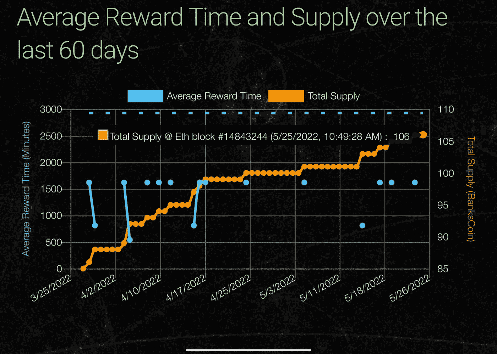

# 银行 2022 年更新

> 原文：<https://medium.com/coinmonks/bankscoin-2022-update-180a0addee01?source=collection_archive---------55----------------------->

Current total float 106 BKC

2022 年上半年对 BanksCoin mining 来说是个好年头。今年年初有 66 个 BKC 铸造，今天写这篇文章的时候有 106 个 BKC 铸造。2022 年的通货膨胀率为 60.6%，我怀疑到年底会超过 100%。现在的目标是继续开采 BKC，并每天增加总浮存金，为大宗商品类别奠定基础。在 30 汽油时，每个薄荷约为 5 美元，因此要生产 1000 个 BKC 薄荷，需要(1000–106)* 5 美元= 4，470 美元的 ETH，费率约为 1，950 美元/ ETH。假设在这段时间内平均每两天解决一个问题，那么需要 4.9 年才能解决；随着难度的增加，它会比给定更多的哈希表更快。ETH 天然气费损害了生态系统中的许多项目，因为它使区块链变得非常昂贵。继续发行 BKC 债券的成本并不昂贵，因为其设计是每两天发行一次。如果一个区块的成本为 5 美元，那么每天的费用是 2.50 美元。由 ETH 担保使 BanksCoin 能够以很小的成本获得高水平的安全性，即使要支付天文数字的汽油费。BanksCoin 依赖于 ETH 的安全性、地狱般的祝酒词代码、FPGAs 的高水平计算能力和低浮动的经济模型。将所有这些放在一起，BanksCoin 利用了“数字黄金”的理论，并将其放入智能合同中。