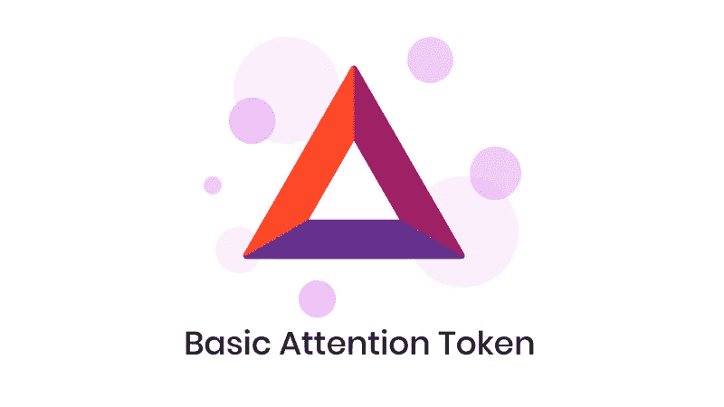
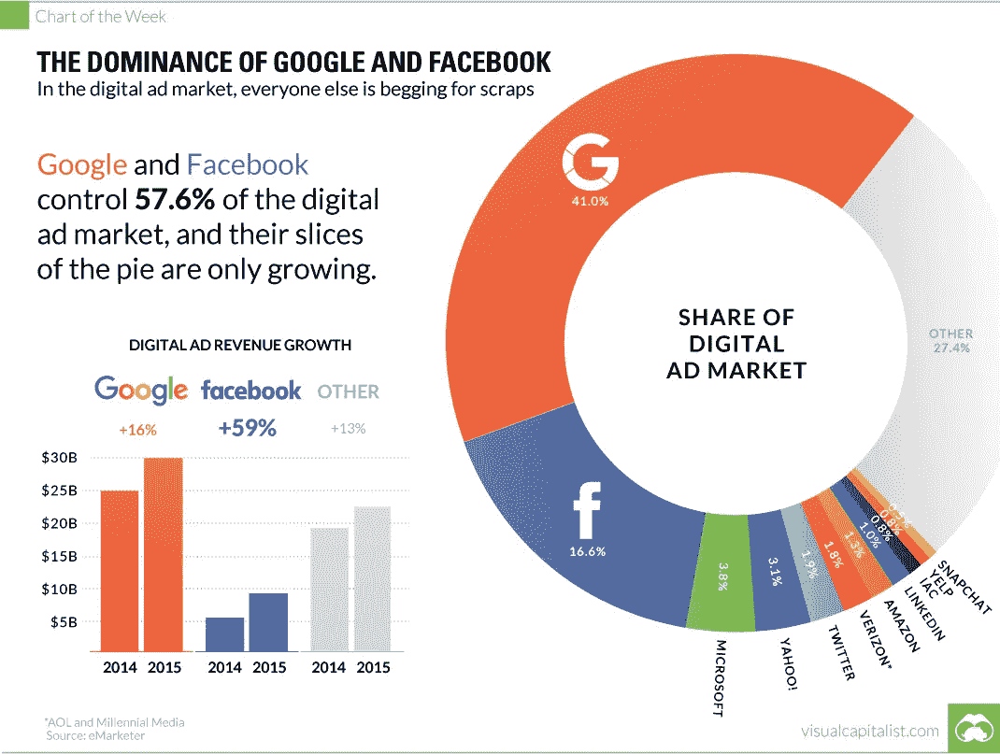
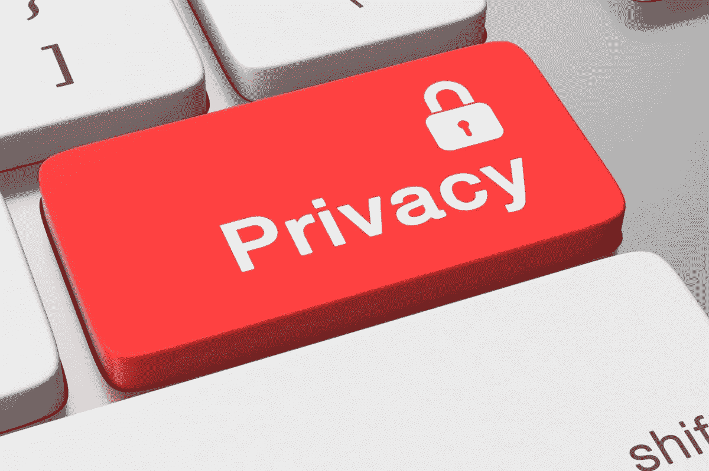
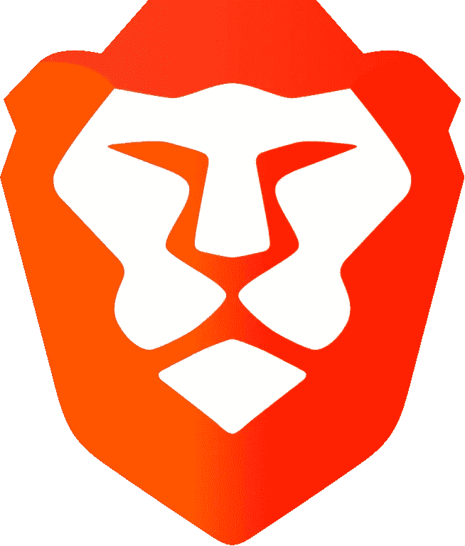

# 基本关注令牌:免费的钱？

> 原文：<https://medium.com/coinmonks/basic-attention-token-free-money-aa784a929081?source=collection_archive---------16----------------------->

## **寡头垄断**

自互联网诞生以来，谷歌和脸书一直主导着数字广告行业。如果你看看这些数字，你会发现他们在这个众所周知的馅饼中所占的份额大得惊人。 [EMarketer](https://www.emarketer.com/content/google-facebook-amazon-account-over-70-of-us-digital-ad-spending) 报道称，2021 年，这两大巨头共吸走了 **64%的数字广告支出！**

这些公司实际上拥有互联网，并在这个过程中赚了一大笔钱。对于那些在 Google AdWords 上为你的业务购买了点击付费服务的企业家来说，你会明白在几分钟内花光你的全部预算是多么容易。其实挺吓人的。

## **隐私**

2018 年的剑桥 Anyltica 丑闻对许多人来说是一个灯泡时刻。这真的显示了我们的在线隐私权在我们不知情的情况下被侵蚀了多少。作为使用互联网的一个副作用，我们的最终用户获得了我们的数据。然后，我们的数据被提炼为可消化的信息，营销团队利用这些信息为我们量身定制完美的广告。这一切都是为了把我们辛苦赚来的钱分掉。

## **现状**

我们的麻烦得到了什么？什么都没有，什么都没有。广告商、出版商和所有的中介都在赚钱，而我们这些消费者却在赚钱。这似乎是一种相当不公平的动态，但没有人敢质疑。我是说这就是商业运作的方式。我们消费者可能会在寻找合适产品的过程中浏览成百上千的广告，并在这个过程中花费大量的时间和精力。

在此之前，消费者从未要求或期望从他们的广告参与中获得补偿，但值得注意的是，在此之前，消费者的数据还没有被如此程度地用于反对他们。广告从未如此有针对性和有效。互联网和大数据的实施让企业能够榨取消费者的每一滴利润。我们为公司提供无价的数据，而他们为此付出了大量的金钱，那么为什么我们什么也得不到呢？

## **输入球棒**

现在想象一个世界，消费者因其在零售/广告生态系统中扮演的角色而获得报酬。基本注意力令牌是一个基于以太坊的系统，用于在广告商、读者和出版商之间有效地分配广告资金。基本注意力令牌是由 Brave Software 创建的。Brave Software 也是 Brave Browser 的创造者，Brave Browser 是一款以隐私为中心的桌面浏览器，专注于保护用户数据。

## **勇敢的浏览器**

如果你想看一些疯狂的东西，下载勇敢的浏览器，然后去 YouTube。起初，有些东西会感觉不一样，你可能无法准确地说出它是什么，但最终你会意识到你正在观看的是没有广告的 YouTube 内容！我自己都不敢相信，脸书也是如此。勇敢给你选择观看广告。如果你想看，Brave 会通过基本注意力令牌(BAT)补偿你的麻烦。球棒存放在与你的账户相连的钱包里。

Brave Logo

## **为什么是蝙蝠**

数字广告的后端是一团乱麻，在广告和最终用户之间有太多的中介。BAT 旨在清洗生态系统，优化三个核心组成部分的关系；用户、出版商和广告商。

出版商的利润被每一个中介机构削减，而用户目前却没有从他们所扮演的角色中获得任何报酬。用户可能不知道这一点，但广告实际上花了他们很多钱。据估计，一半的用户移动数据专门用于下载广告。想想看，你每月花在电话账单上的钱，有一半是用来购买浏览公司产品或服务的特权的，这太不像话了！

## **车队**

如果你正在寻找一个有可靠团队支持的项目，那么 BAT 正适合你。创始人布伦丹·艾希(Brendan Eich)创建了 JavaScript，并与他人共同创建了 Mozilla，令人印象深刻吧？

## **结论**

我喜欢这个项目和它的概念，在一个互联网用户看到他们的权利被削弱的时代，Brave 正在把价值和权力还给消费者。随着所有关于加密货币的高尚言论和它在世界上的所有好处，我觉得 BAT 是一个真正能够产生积极影响的项目。Brave browser 为该项目提供了一个健壮且实用的基础设施来使用 BAT 令牌。

在撰写本文时，BAT 的市值不到 20 亿美元，交易价格为 1.30 美元，因此它绝不是一个小盘股，然而，数字广告市场正在以惊人的速度增长，预计到 2027 年将达到 1 万亿美元。这种由 BAT 和 Theta 等公司开创的新模式可能会在未来获得更多用户的关注，并可能成为新的现状。如果这被证明是真的，那么现在投资这些项目可能相当于在 90 年代初投资谷歌。

> 加入 Coinmonks [电报频道](https://t.me/coincodecap)和 [Youtube 频道](https://www.youtube.com/c/coinmonks/videos)了解加密交易和投资

## 另外，阅读

*   [CoinDCX 评论](/coinmonks/coindcx-review-8444db3621a2) | [加密保证金交易交易所](https://blog.coincodecap.com/crypto-margin-trading-exchanges)
*   [Bookmap 点评](https://blog.coincodecap.com/bookmap-review-2021-best-trading-software) | [美国 5 大最佳加密交易所](https://blog.coincodecap.com/crypto-exchange-usa)
*   [如何在 FTX 交易所交易期货](https://blog.coincodecap.com/ftx-futures-trading) | [OKEx vs 币安](https://blog.coincodecap.com/okex-vs-binance)
*   [CoinLoan 审查](https://blog.coincodecap.com/coinloan-review) | [YouHodler 审查](/coinmonks/youhodler-4-easy-ways-to-make-money-98969b9689f2) | [BlockFi 审查](https://blog.coincodecap.com/blockfi-review)
*   [CoinFLEX 评论](https://blog.coincodecap.com/coinflex-review) | [AEX 交易所评论](https://blog.coincodecap.com/aex-exchange-review) | [UPbit 评论](https://blog.coincodecap.com/upbit-review)
*   [AscendEx 保证金交易](https://blog.coincodecap.com/ascendex-margin-trading) | [Bitfinex 赌注](https://blog.coincodecap.com/bitfinex-staking)
*   [最好的卡达诺钱包](https://blog.coincodecap.com/best-cardano-wallets) | [冰棒副本交易](https://blog.coincodecap.com/bingbon-copy-trading)
*   [印度最佳 P2P 加密交易所](https://blog.coincodecap.com/p2p-crypto-exchanges-in-india) | [柴犬钱包](https://blog.coincodecap.com/baby-shiba-inu-wallets)
*   [8 大加密附属计划](https://blog.coincodecap.com/crypto-affiliate-programs) | [eToro vs 比特币基地](https://blog.coincodecap.com/etoro-vs-coinbase)
*   [最佳以太坊钱包](https://blog.coincodecap.com/best-ethereum-wallets) | [电报上的加密货币机器人](https://blog.coincodecap.com/telegram-crypto-bots)
*   [交易杠杆代币的最佳交易所](https://blog.coincodecap.com/leveraged-token-exchanges)