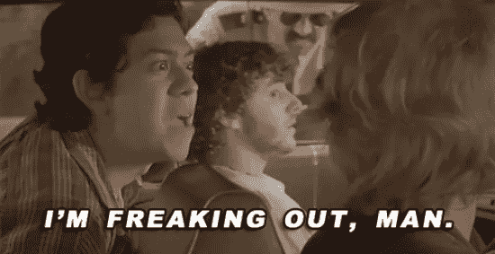
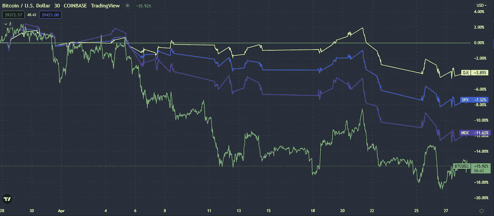
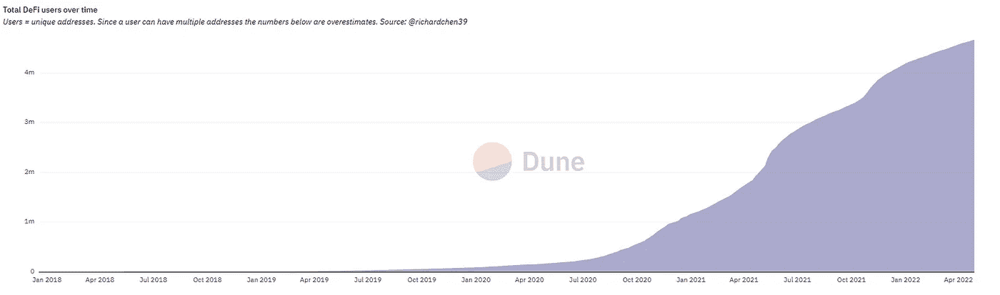
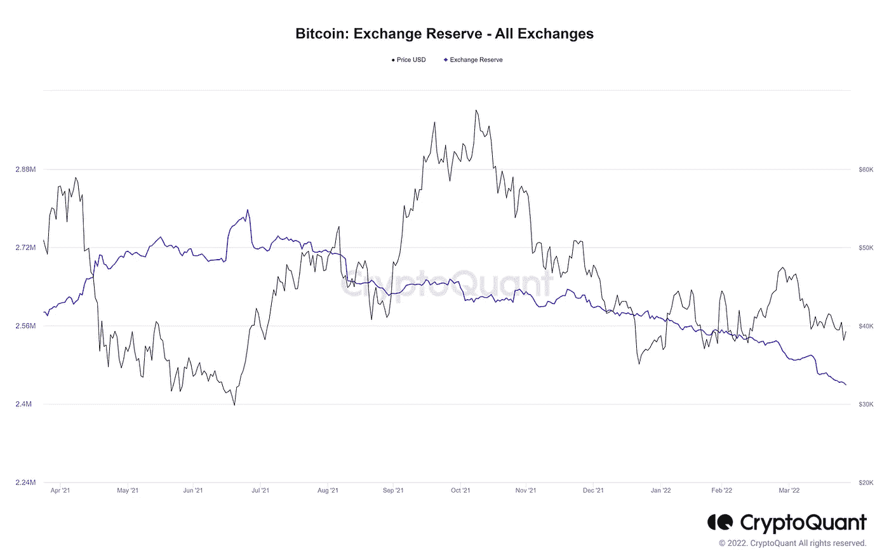
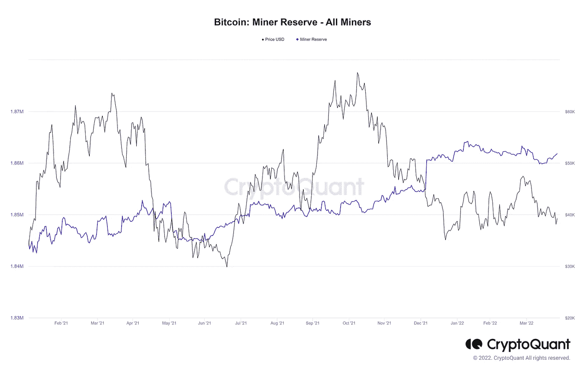

# 降低血压的基本市场洞察

> 原文：<https://medium.com/coinmonks/basic-market-insights-to-lower-your-bp-8428a2b84f68?source=collection_archive---------72----------------------->

# 使用简单的数据分析来了解当前的市场状况

众所周知，crypto 度过了艰难的一个月，对于像我这样全职工作并大量投资于市场的人来说，很容易对这种情况感到失望。

然而，也有很多数据显示了该行业的潜在实力，与传统的全球市场相比，我对 BTC 美元的价格走势相当满意。由于各种原因，整个全球经济都在下滑。很明显，大多数问题与俄罗斯-乌克兰冲突有关，但其他问题如 COVID 和政府政策也起着重要作用。

虽然看到加密作为针对传统市场的坚实对冲爆发会更好，但我们已经看到相对波动性下降，在我看来这是一个好迹象。

同样重要的是，我绝不是数据专家。请随意使用我的见解作为你自己研究的起点，但不要用它们来做投资决定。

另外，如果我做错了什么，请打电话给我，让我知道。我一直在寻求学习！

## DeFi 用户总数

虽然我们知道市场处于平静期，但你可以看到 DeFi 空间仍在增长，在我看来，DeFi 和 web3 用户采用率是未来加密的一些最重要的指标。为了达到下一个真正的牛市，就像我们在 2021 年初看到的那样，我们需要在这些地区以及元宇宙搭载更多用户。

随着时间的推移，看到稳定的增长给了我很多长期的安慰。

## $BTC 外汇储备

无论我们中的一些人多么希望它改变，比特币仍然是 crypto 的主要市场驱动力，老实说，它甚至没有接近。

知道了这一点，我总是努力留意 BTC 外汇储备的数据。CryptoQuant 在这一指标和许多其他指标上做得很好。

这张图表显示了目前交易所持有的比特币数量，因此没有放在冰冷的钱包里。虽然这个指标，像所有其他指标一样，并不完美，但它确实让我们了解了市场上的抛售压力有多大，尤其是在鲸鱼中。

一般来说，交易所的硬币越多，意味着抛售压力越大，因为这表明投资者的流动性越强，可能会计划很快抛售。较低的外汇储备表明，更多的硬币正被转移到冷钱包和其他场外交易场所。这通常表明对市场更有信心。

正如你在图表上看到的，外汇储备在过去 8 个月左右的时间里持续稳步下降。这是加密投资者实力的良好迹象。

## $BTC 矿工储备

美元 BTC 矿工储备类似于外汇储备，但在我看来同样重要。

它显示了一段时间内矿工持有的比特币数量。换句话说，矿商储备的价值表明了矿商尚未出售的数量，而且，由于矿商总是被拨入市场，因此关注他们的行为是明智的。

例如，如果你注意到储备下降，并看到其他信号显示矿商已经开始出售，这可能是一个很好的时机来获取一些利润，因为价格可能很快就会下降。

## “数据永远不会说谎”

再说一次，我远不是数据分析专家，但我相信从宏观角度理解基础知识很重要。

正如他们所说，“数据从不说谎。”如果没有对数据的基本理解，你很容易发现自己被情绪、影响者、营销人员等左右，这可能是一个巨大的问题。

我的建议是:永远不要停止学习，当涉及到市场预测时，总是阅读正面和负面的文章，DYOR，只做你能承受未来几年的决定！

**参考文献:**

https://dune.com/rchen8/defi-users-over-time

 [## CryptoQuant |可操作的链上市场情报和...

### 我们提供链上和市场分析工具与顶级分析师的可操作的见解，以帮助您分析加密…

cryptoquant.com](https://cryptoquant.com) 

> 加入 Coinmonks [电报频道](https://t.me/coincodecap)和 [Youtube 频道](https://www.youtube.com/c/coinmonks/videos)了解加密交易和投资

# 另外，阅读

*   [5 款最佳加密交易终端](https://coincodecap.com/crypto-trading-terminals) | [最佳 DeFi 应用](https://coincodecap.com/best-defi-apps)
*   [比特币基地 vs 瓦济克斯](https://coincodecap.com/coinbase-vs-wazirx) | [比特鲁点评](https://coincodecap.com/bitrue-review) | [波洛涅克斯 vs 比特鲁](https://coincodecap.com/poloniex-vs-bittrex)
*   [德国最佳加密交易所](https://coincodecap.com/crypto-exchanges-in-germany) | [Arbitrum:第二层解决方案](https://coincodecap.com/arbitrum)
*   [币安交易机器人](/coinmonks/binance-trading-bots-d0d57bb62c4c) | [OKEx 评论](/coinmonks/okex-review-6b369304110f) | [阿塔尼评论](https://coincodecap.com/atani-review)
*   [最佳加密交易信号电报](/coinmonks/best-crypto-signals-telegram-5785cdbc4b2b) | [MoonXBT 评论](/coinmonks/moonxbt-review-6e4ab26d037)