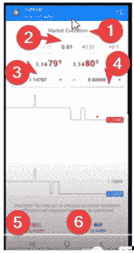

# Android MT4 的基本交易管理

> 原文：<https://medium.com/coinmonks/basic-trade-management-with-android-mt4-1cf68f360c5a?source=collection_archive---------36----------------------->

Android MT4 应用程序帮助许多交易者在离开电脑时监控市场。

就我个人而言，我喜欢通过电脑分析市场。但我更喜欢通过 MT4 Android 应用程序监控实时交易。

因此，在 mt4 上学习交易比在 Pc 上掌握交易同样有帮助。

你成为一个多才多艺的交易者。有了安卓手机，你可以去任何你想去的地方。还可以有效地监控和管理您的交易。

# 贸易或订单类型

除了市场执行，点击按钮可以访问更多订单类型:

## 这些包括:

*   购买限额
*   卖出限额
*   卖出止损
*   购买上衣

# 在 MT4 Android 应用程序上开始交易

我们将使用下面的 MT4 屏幕图像。我已经用数字 1 到 6 标记了它，以帮助我们完成这些步骤。

## 按钮 1:交易执行类型

默认情况下，Android MT4 设置为市场执行。换句话说，你以当前价格进入市场。

## 按钮 2:调整批量

默认批量从 0.01 开始。实际上经纪人允许大批量。我见过一个最多能容纳 100 人的。这个要看你账户里有多少资金了。

## 按钮 3:调整止损位置

使用此选项卡调整您的止损或 SL 头寸的价格

## 按钮 4:调整止盈位置

使用这个标签调整价格到你的获利位置

## 按钮 5:开始卖出交易

或者在市场执行下做空。进场价格低于当前价格或定价。

## 按钮 6:开启买入反对

或通过市场执行的多头头寸。进场价格高于当前价格或定价

> 交易新手？试试[加密交易机器人](/coinmonks/crypto-trading-bot-c2ffce8acb2a)或者[复制交易](/coinmonks/top-10-crypto-copy-trading-platforms-for-beginners-d0c37c7d698c)

# 管理交易

在 Android MT4 的公开交易中，点击交易。如上图所示，它打开了信息。

箭头一指向止损位。在上面的交易中，没有 SL 数字集。

将两品脱箭头指向止盈位置

箭头三是订单号

箭头 4 显示的是掉期费率

# 在 MT4 Android 应用程序上退出交易

通过 MT4 平仓交易有 3 种形式。

第一种是当交易到达止损位置时。交易自动关闭，损失一分钟。

第二，当价格到达获利位置时，自动交易系统关闭。

第三种是手动关闭。在上图中，点击标有“止损”的矩形区域，交易终止。

# 包扎

给你。有了安卓手机，你可以在有限的使用电脑的情况下自由交易。

正如你所看到的，一个交易者能够在充分了解 Android 上的 MT4 的情况下有效地打开、调整和关闭交易。