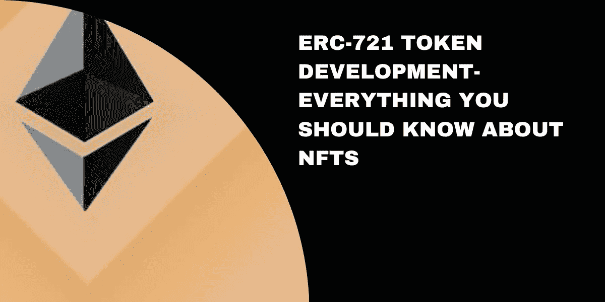
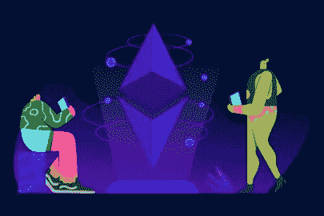
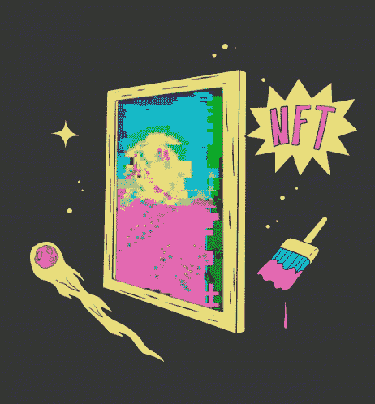

# 你需要知道的关于 ERC-721 令牌开发的基础知识-适合初学者

> 原文：<https://medium.com/coinmonks/basics-you-need-to-know-about-erc-721-token-development-for-beginners-d70cd2fe5c9c?source=collection_archive---------21----------------------->

今天，锁链正主宰着世界，它正走向每一个行业。人们认为区块链只是为了金融去中心化。但区块链也在艺术领域展现了自己的存在。你可能会熟悉不可替代的代币或 NFT。说的再技术点，就是 [**ERC-721 令牌开发**](https://www.appdupe.com/non-fungible-token-development?utm_source=google&utm_medium=blog&utm_campaign=monika) 。这是什么？为什么名人要开发自己的 NFT 系列？为什么任何流派的艺术家都应该了解 NFTs？下面是你需要知道的关于著名的 NFTs 的所有细节。

freepik

## **区块链中的令牌是什么？**

不可替换令牌、加密令牌、ERC-721 令牌；所有东西看起来都像字母汤？下面简单解释一下，让你明白。区块链是一个数字账本，以块的形式存储交易信息和其他数据。几个区块对网络中的交易进行复制，使得任何人都无法更改区块链上的任何数据。这使得它成为一个不可攻击、不可修改的网络，没有一个集中的权威。

说回来，代币是什么？加密令牌是代表区块链上的资产的东西。它们是记录在区块链网络块中的数据。这些令牌是在区块链上铸造的，没有任何中央权威机构；这些代币储存了一定的价值。我们在区块链上有像比特币这样的加密货币，它们持有价值，本质上是可替代的。也就是说，它们可以交易或兑换成等值的其他货币。

freepik

另一方面，我们有不可替换的令牌，它们存储不能与其他 NFT 交换的唯一资产，因为它们永远不会相等。它类似于记录在区块链上的数字证书。它证明了区块链中资产的所有权。

在区块链中如何区分 NFT 和加密货币或者其他代币？他们通过铸造过程做到这一点。它们的铸造标准各不相同。NFT 是根据 ERC-721 或 ERC-1155 标准铸造的，而加密硬币是根据以太坊区块链上的 ERC-20 标准铸造的。也可以在其他具有类似标准代码的区块链上铸造 NFT。

 [## 如何通过 IDO Token Launchpad 开发进入区块链潮流？

### 世界现在正在慢慢适应新常态货币——加密货币。区块链正在接管一切可能的…

medium.com](/security-token-offering/how-to-enter-the-blockchain-trend-with-ido-token-launchpad-development-382b4156075) 

## **ERC-721 令牌开发**

以太坊是目前最受 NFT 青睐的区块链，世界上几乎 95%的 NFT 都是在其中铸造的。ERC 主张以太坊请求评论。ERC-721 令牌开发只不过是铸造一个不可替代的令牌。

今天，任何资产都可以成为 NFT，无论是数字资产还是实物资产。最初，它是为数字艺术朋克开发的，现在他们正在尝试房地产和实物资产，如绘画，文物，稀有收藏品等。

不可替换的令牌不仅仅是通过 ERC-721 标准铸造的；在 ERC-1155 上铸造的代币也是 NFT。这两种令牌标准的区别在于，ERC-721 不提供通过单个事务发送一批 NFT 的选项，而 ERC-1155 提供。尽管这是基本的区别，但这两个标准在总体上还是有很多不同之处。

## 为什么 ERC-721 代币是最受欢迎的？

说到制造非功能性测试，ERC-721 和 ERC-1155 都是 NFT 标准，但 ERC-721 标准仍然很受欢迎。这是因为该标准具有以下优点。

💡对于每个令牌 ID，ERC-721 标准仅支持直接存储在智能合约上的静态元数据。

💡ERC-721 需要为每个令牌建立一个新的智能合约，从而使其比 ERC-1155 更独特、更有价值。

💡它实行较低的交易和汇率，从而降低了中介成本。

## **面向艺术家的 NFTs】**

现在你已经对区块链和 NFT 有了基本的了解，现在你可能会问为什么这些 NFT 在名人和艺术家中受到关注。像帕丽斯·希尔顿、林赛·罗韩和凯蒂·佩里这样的名人。肖恩·蒙德兹、阿姆和更多的人在过去的两年里启动了他们自己的 NFT 项目。

NFTs 扩展了它们的应用，可以包装艺术、音乐、照片、迷因、视频、gif 甚至 tweets 的数字文件。这为那些努力通过工作赚钱的独立艺术家创造了机会。

NFT 现在得到了数字内容创作者和艺术家的热烈响应。这仅次于数字艺术家皮普尔，他以 6900 万美元的价格出售了他的作品《每天-前 5000 天》。这不仅给了艺术家们希望，也给了其他人推出他们的 NFT 系列的希望。

有许多像 OpenSea 这样的 NFT 市场，可以帮助你在平台上创建自己的 NFT，而不必编写智能合约。这使得进入这种 NFT 热更加舒适。一些非功能性翻译开始出现在不同的流派中。其中一些包括

💡时装设计

💡建筑设计

💡体育交易卡

💡涂漆

💡照片

💡模因

💡小鸟叫声

💡博客等。

社交媒体是人们提供独特数字内容的地方。许多有市场影响力的人发布内容来宣传品牌和企业。虽然他们提供独特的内容，但他们在金钱上的认知度较低。为了支持这种新的营销趋势，许多平台正在兴起。

你知道马克·扎克伯格宣布 Instagram 上很快将会有一个 NFT 市场吗？这将给社交媒体和 NFTs 世界带来一场新的革命。

## 【NFTs 是未来吗？

从长远来看，是的！NFTs 正在将它们的翅膀延伸到每一个可能的行业，它们甚至可以应用于供应链管理、物流、活动票务、房地产、医疗记录、文档、身份识别等。

除此之外，NFT 还在元宇宙展示了他们的优势，这是一项新兴技术，将很快带来一个新的虚拟数字世界。因此，非功能性技术是一项不可动摇的技术，它将在未来大有作为，因此非功能性技术永远不会失去价值。

## **外卖**

这几分钟的阅读应该让您对区块链技术和加密令牌以及 NFTs 有了基本的了解。对 NFTs 有一个清晰的印象肯定会对你的 [ERC-721 令牌开发](https://www.appdupe.com/non-fungible-token-development?utm_source=google&utm_medium=blog&utm_campaign=monika)有所帮助。尽管 NFT 市场可能会随时间波动，但它将是区块链中一项不可战胜的资产，在未来几年内会增值。

> 加入 Coinmonks [电报频道](https://t.me/coincodecap)和 [Youtube 频道](https://www.youtube.com/c/coinmonks/videos)了解加密交易和投资

# 另外，阅读

*   [加拿大最佳加密交易机器人](https://coincodecap.com/5-best-crypto-trading-bots-in-canada) | [库币评论](https://coincodecap.com/kucoin-review)
*   [火币加密交易信号](https://coincodecap.com/huobi-crypto-trading-signals) | [HitBTC 审核](/coinmonks/hitbtc-review-c5143c5d53c2)
*   [TraderWagon 回顾](https://coincodecap.com/traderwagon-review) | [北海巨妖 vs 双子 vs 比特亚德](https://coincodecap.com/kraken-vs-gemini-vs-bityard)
*   [如何在 FTX 交易所交易期货](https://coincodecap.com/ftx-futures-trading) | [OKEx vs 币安](https://coincodecap.com/okex-vs-binance)
*   [OKEx vs KuCoin](https://coincodecap.com/okex-kucoin) | [摄氏替代品](https://coincodecap.com/celsius-alternatives) | [如何购买 VeChain](https://coincodecap.com/buy-vechain)