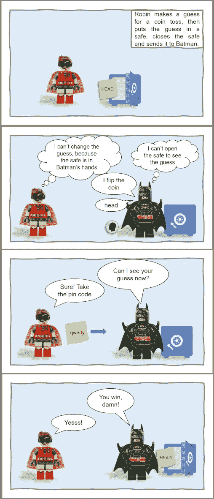
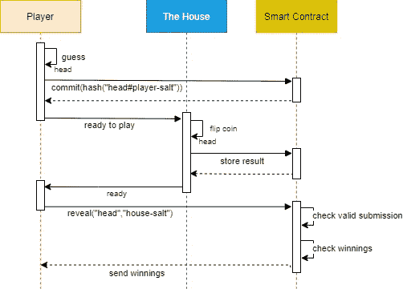
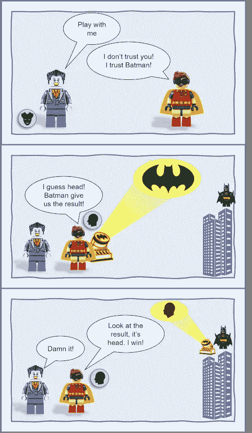
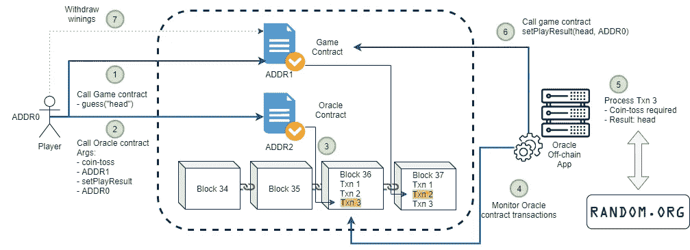
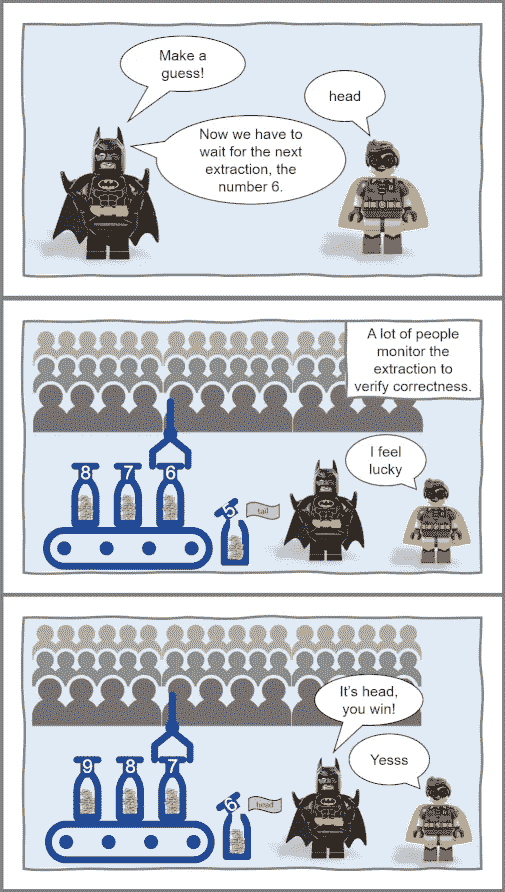
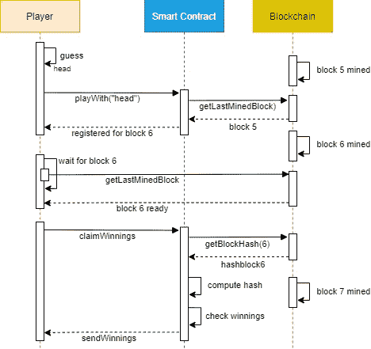

# 如何管理区块链上的随机性

> 原文：<https://medium.com/coinmonks/batman-flips-a-coin-on-blockchain-9d1a818d094e?source=collection_archive---------16----------------------->

Photo by [Obi - @pixel6propix](https://unsplash.com/@obionyeador?utm_source=medium&utm_medium=referral) on [Unsplash](https://unsplash.com?utm_source=medium&utm_medium=referral)

如果我在区块链上实现一个掷硬币游戏会怎么样？我需要的第一件事是确定掷硬币结果的随机性来源。

问题来了，我们如履薄冰！

我可能会尝试使用智能合约中的函数来实现这一点，但这是不可能的，因为区块链上的事务需要内在的确定性。

智能协定必须是确定性的，因为当给一个方法相同的输入时，网络上的每个节点必须能够产生相同的结果。如果不同节点的智能契约执行给出不同的输出，则永远无法达成共识。

非决定论导致共识失败。

所以，随机性的来源必然来自链外。

在这方面，可以采取一些办法。最著名的有:

*   提交并揭示
*   可信的 oracle
*   使用块哈希

哪种方式最有效取决于安全需求和环境。

# 提交并揭示

它是如何工作的？

别担心，这不是另一个鲍勃和爱丽丝的故事，而是一个奇妙的蝙蝠侠和罗宾的故事。

在这个故事中，蝙蝠侠挑战罗宾猜硬币的结果。罗宾做了一个猜测，并把结果放进了保险箱。然后他把封闭的保险箱送给蝙蝠侠。现在，罗宾不能改变保险箱里的结果，因为保险箱在蝙蝠侠手里。蝙蝠侠不能打开保险箱看结果，他必须掷硬币。蝙蝠侠把掷硬币的结果告诉罗宾。罗宾现在把密码发给蝙蝠侠，让他打开保险箱，并验证猜测。

在这种情况下，罗宾是一个快乐的蝙蝠侠助手。

Commit Reveal in Gotham

从技术上来说，玩家必须提交他的选择，但不要透露出来，而是以一种事后可以验证的方式。
玩家(Robin)用一个只有他自己知道的 salt 散列这个猜测，并将散列提交给一个智能合约。以这种方式，他提交了猜测而没有透露它。
“房子”(蝙蝠侠)抛硬币，并将结果存储在智能合约存储器中。
现在玩家要通过发布“头”和他用来智能契约的盐来透露他的猜测。
契约可以计算散列，然后检查它是否与先前提交的散列匹配，因此它是有效的提交。如果猜对了，合同会把他的赢款发给玩家。

Commit Reveal on a Blockchain

这是承诺方案的简化版本，因此我们不需要处理“最后的启示者问题”。然而，必须实施一种管理“惩罚”的方法。如果“房子”从来不透露抛硬币的结果怎么办？有一个时间间隔，在此之后，合同允许玩家无论如何提取奖金？

这里的最后一点是，随机性是由房子赋予的，你必须相信它，否则它看起来就像一个“奇偶游戏”，而不仅仅是一个抛硬币游戏。

# 可信的 Oracle

在这个故事中，我们有小丑在“房子”的角色，罗宾在玩家的角色，蝙蝠侠在神谕的角色。蝙蝠信号是代表区块链交易的一种方式。小丑向罗宾挑战掷硬币游戏，但罗宾不信任小丑打算掷的硬币，他只信任蝙蝠侠的硬币。所以他公开宣称自己的猜测，并用蝙蝠信号告诉蝙蝠侠抛硬币。蝙蝠侠抛硬币，用蝙蝠信号，每个人都可以看到，显示硬币投掷的结果。

现在小丑必须付钱给快乐幸运的蝙蝠侠助手罗宾。

Trusted Oracle in Gotham

现实世界中的事情是如何运作的？

随机性的来源是一种链外服务(例如 randomness)，而 Oracle 合同和 Oracle 链外基础设施(下图中的应用程序)填补了区块链世界和外部服务之间的差距。Oracle 从链外来源检索数据，并在链上传输数据，将其放入智能契约存储中。

更详细:
1)玩家将自己的猜测(人头)存储在一个游戏契约中，
2)然后，他用 Oracle 服务需要的所有信息调用 Oracle 契约，
3)玩家调用成功包含在 block #36 中作为 Txn3，现在他要等待

一旦 Txn3 事务被验证，oracle 请求就可以被视为 Oracle 契约发出的 EVM 事件或状态变化。

一家受信任的公司部署了一个应用程序，该应用程序确切地知道要监控哪些事件和合同，并定期查询区块链。

因此，在某个时刻:
4)找到 Txn3，
5)Oracle 应用程序离线检索所需数据(在这种情况下，所需数据是随机的掷硬币结果)，
6)Oracle 应用程序调用游戏合约上的方法来存储掷硬币结果(真实性证明保证数据未被篡改)，
7)现在玩家可以检查并最终提取他的奖金。

Trusted Oracle on a Blockchain

使用这种方法，不仅要信任提供这种服务的 Oracle 公司，还要信任服务提供商(在这种情况下是 random.org)。此外，Oracle 服务不是免费的，此外，您必须为回调方法提供汽油费，并最终获得访问所请求数据的权限。

其他方案也是可能的；例如，外部应用程序可以直接请求和返回数据，从而无需 Oracle 智能合约。

# 使用块哈希

蝙蝠侠再次向罗宾挑战掷硬币游戏。掷硬币的结果来自一个公共抽取，在那里许多人监督并验证其正确性。提取的结果是头。

罗宾是我见过的最幸运的助手。

Using block hash in Gotham

这是一个概念，但在区块链的环境中，这个概念如何转化呢？

这里，随机性的来源是由未来的块哈希给出的，因为新块的哈希是不可预测的，并且每个人都可以验证哈希以及基于该哈希的计算的正确性。

玩家将其猜测注册到智能合约中，并获得区块链开采的最后一个区块号。现在，他必须等待下一个区块被开采。一旦区块被开采，他可以通过调用智能合同来要求奖金。智能合约检索先前链接到玩家的块散列，计算出它只有两个可能的值(头或尾)，如果结果与猜测匹配，则合约将奖金发送给玩家。

如果玩家输了，他总是可以检查没有欺骗，因为他能够检索他已经注册的块散列，并且他知道哪个是对该散列的计算，因为它在智能合约中是公开可用的。

Using block hash on a blockchain

这种方法的主要缺点是矿商可以选择是否发布区块。因此，矿工可以故意丢弃他们不喜欢的块，以这种方式影响块散列。

当游戏的奖励很小时，矿工没有动机在游戏中作弊，但是如果奖励的金额大于方块奖励，矿工可以考虑扔掉方块，希望找到另一个保证他获胜的人。

这里要研究的另一点是块散列的随机性。

感谢阅读，我希望你喜欢它！