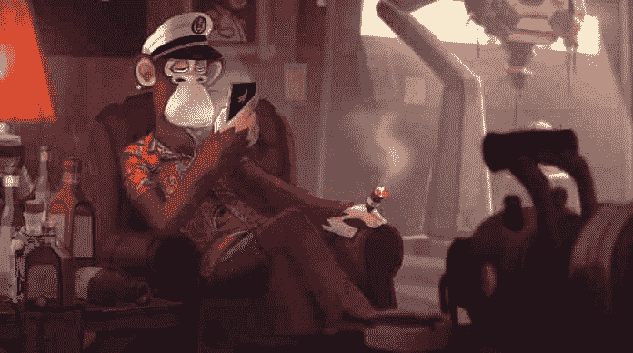

# BAYC 的元宇宙“另一边”在释放后燃烧了 1.75 亿美元的以太坊天然气费，硬币价格下跌

> 原文：<https://medium.com/coinmonks/baycs-metaverse-otherside-burns-175m-in-ethereum-gas-fees-upon-release-apecoin-price-falls-40ab2a7d74f2?source=collection_archive---------48----------------------->

5 月 1 日，无聊猿游艇俱乐部(BAYC)与“彼岸”元宇宙造币厂撞毁以太坊。对另一边元宇宙虚拟土地契约 NFTs 的难以置信的需求和预期导致以太坊燃气费飙升。

# 无聊猿游艇俱乐部的另一面是什么？

无聊猿游艇俱乐部是有史以来最成功的 NFT 系列之一。基本上任何与 BAYC 有关的东西似乎都变成了黄金，包括变种人猿游艇俱乐部(MAYC)和无聊猿养狗俱乐部(BAKC)，它们都是 BAYC 原始系列的 NFT 衍生系列。BAYC“宇迦实验室”的开发商一直在购买 BAYC 的所有顶级 NFT 收藏竞争对手，包括“CryptoPunks”和“MeeBits ”,使他们成为 NFT 世界的首要品牌。随着最近元宇宙世界的爆发，BAYC 和宇迦实验室很自然地效仿并制作他们自己的元宇宙，这正是他们在“另一边”元宇宙所做的。

“彼岸元宇宙”将由 20 万块虚拟土地组成，可以用 [ApeCoin(建造在区块链以太坊上的 BAYC 土著硬币)作为名为“Otherdeeds”的 NFT 购买。自从宇迦实验室——无聊猿游艇俱乐部等受欢迎的 NFT 项目的创造者——宣布了元宇宙的另一个项目后，对实际出售的期望高涨。铸造另一个契约的成本在晚上 9 点开始销售之前宣布为 305 美元，按照$APE 在开盘时 19.16 美元的价格计算，约为 5846 美元。虽然加密市场在过去一周下滑，但由于预期另一边元宇宙的土地出售，ApeCoin 的价格升至历史新高。](https://bumblebeecrypto.com/2022/04/20/apecoin-skyrockets-over-50-in-three-days-amongst-rumors-of-a-bayc-land-drop/)

当 Otherside otherdeed 销售于 5 月 1 日上线时，它给以太坊网络——一枚硬币所基于的区块链——造成了巨大的破坏。来自以太网扫描的数据显示，在过去的 24 小时内，用户已经支付了近 64，000 以太网费，相当于超过 1.75 亿美元，与另一边的元宇宙有关。一些以太坊爱好者认为，合同中包含的一些简单的造币技巧可能有助于节省一些与高需求造币厂相关的过高油价。辛迪加道(Syndicate DAO)的联合创始人威尔·帕珀(Will Papper)表示，该合同“几乎没有天然气优化”，并提供了几个可以“节省数百万美元”的“技巧”

宇迦实验室也就该事件发表了一份声明，称造币厂“太大了，以至于以太扫描崩溃”，并为“关闭以太坊的灯一段时间”道歉 BAYC 的创始人还承诺为交易失败的用户报销燃气费，并建议 ApeCoin 未来可能会减轻其区块链。

# 另一边元宇宙土地出售后，BAYC 硬币价格下跌

出售后，ApeCoin 的价格也受到了影响。在过去一周左右的时间里，加密货币表现最佳的$APE 在接下来的几个小时里暴跌了约 30%，目前跌至 16.50 美元，几天前的交易价格为 26 美元。这在某种程度上是意料之中的，因为投资者在出售前涌入购买 APE 以参与出售，并可能计划在土地出售后出售他们的 ApeCoin。

来源:BumbleBeeCrypto.com

# 分享这个:

> 加入 Coinmonks [电报频道](https://t.me/coincodecap)和 [Youtube 频道](https://www.youtube.com/c/coinmonks/videos)了解加密交易和投资

# 另外，阅读

*   [如何在加拿大购买加密货币？](https://coincodecap.com/how-to-buy-cryptocurrency-in-canada)
*   [无聊猿游艇俱乐部(BAYC)回顾](https://coincodecap.com/bored-ape-yacht-club-bayc-review) | [拜比特 vs 比特币基地](https://coincodecap.com/bybit-vs-coinbase)
*   [5 款最佳加密交易终端](https://coincodecap.com/crypto-trading-terminals) | [最佳 DeFi 应用](https://coincodecap.com/best-defi-apps)
*   [比特币基地 vs 瓦济克斯](https://coincodecap.com/coinbase-vs-wazirx) | [比特鲁点评](https://coincodecap.com/bitrue-review) | [波洛涅克斯 vs 比特克斯](https://coincodecap.com/poloniex-vs-bittrex)
*   [德国最佳加密交易所](https://coincodecap.com/crypto-exchanges-in-germany) | [Arbitrum:第二层解决方案](https://coincodecap.com/arbitrum)
*   [币安交易机器人](/coinmonks/binance-trading-bots-d0d57bb62c4c) | [OKEx 评论](/coinmonks/okex-review-6b369304110f) | [Atani 评论](https://coincodecap.com/atani-review)