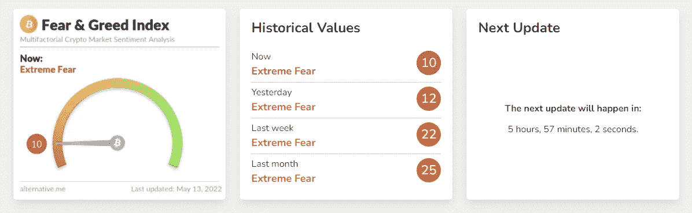
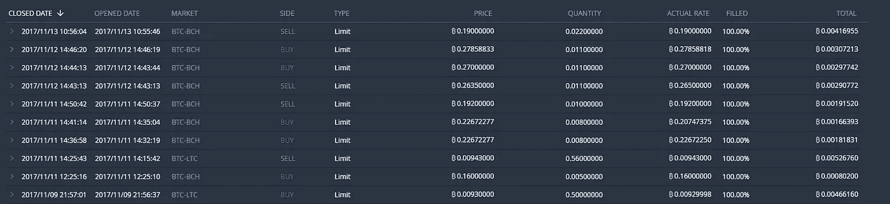
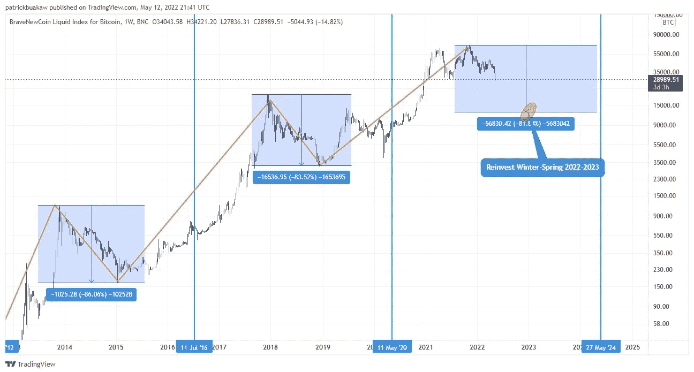
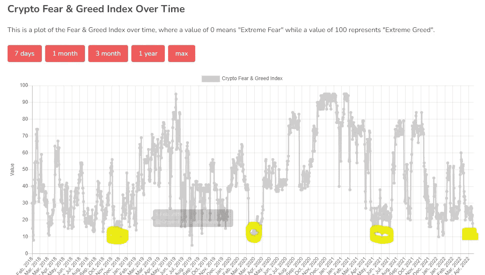

# 当别人恐惧时，你要贪婪…

> 原文：<https://medium.com/coinmonks/be-greedy-when-others-are-fearful-661ed12308e4?source=collection_archive---------0----------------------->

## 不要让恐慌吓跑你。

大多数关注 crypto 的人可能已经注意到，比特币已经崩溃。大多数替代硬币都下跌了近 50%,而我，可能和许多其他人一样，已经看到很多钱消失在空气中。由于 UST 已经失去了佩格，而卢娜的图表看起来像一个完整的地毯拉，看图表是一个难以下咽的药丸。虽然大多数人(可以理解)现在都很恐慌，但我想试着给你一个关于当前形势的调解观点，并告诉你在所有的恐慌中仍然存在着机会！我最近已经发布了很多概述，但是在当前充满恐惧的市场条件下，我想向你展示我坚持的原则，这些原则告诉我一切都会好的。

# “当别人贪婪时要恐惧，当别人恐惧时要贪婪”

― **沃伦·巴菲特**

Fear and greed index

正如沃伦·巴菲特曾经说过的，当别人贪婪时要恐惧，当别人恐惧时要贪婪。如果我们看一下恐惧和贪婪指数，它合乎逻辑地显示现在市场上存在极度的恐惧。这就是你下一步行动的力量所在！我在这个市场已经呆了足够长的时间，知道随着时间的推移，即使你最大的损失也会再次出现(尽管 UST 和卢娜可能不会这样，谁知道呢)。

My order history of 2017

我亲身经历了 2017 年的炒作和泡沫。我的朋友们开始买入比特币和 altcoins，它们的名字我都不认识。我盲目地跟随他们进入这个奇怪的空间，在一周的时间里，我的初始投资从 500 美元增长到了将近 2000 美元。我无法相信正在发生的事情，加上不眠之夜，这感觉就像一个奇怪的疯狂进食，只是没有停止。直到它真的…

一切都崩溃了，不知何故，我仍然相信它会越来越多。我没有退出计划，在这方面，2017 年的这个周期没有任何变化。我稳定地持有我的资产，我不知道我在做什么。我最初的 500 美元在几年后暴跌了 90%,只剩下 50 美元，在忘记这些投资后，如果我一直持有到 2020 年，它们又回到了 200%的利润！

# 这就是我今天想给你的！

Historical BTC price.

看一下上面的图表。我绝不是一个金融顾问，你应该总是做你自己的研究，但比特币和它的替代币已经崩溃了 90%。这发生在 2014 年、2017 年，现在又发生在 2022 年。每一次，它都在几年后创造了新 ATH。最终，这是每个人买入比特币时所承担的风险，我预计比特币未来将创下历史新高！

Fear and greed history chart

在目前的市场条件下，有很多不确定性和疑虑，正如你在上面的图表中看到的，它(几乎)每次都表明了一个完美的买入时机。你可以用这些信息来挖掘一些高质量的硬币，这些硬币能够在即将到来的加密冬天的熊市中存活下来！大多数(另类)硬币有将近 50-60%的折扣，这是一个很好的购买机会。也就是说，如果你仍然有菲亚特躺在球场外…

# 最后

昨天(2022 年 5 月 12 日),我在以太坊投资了我最后一辆菲亚特。由于比特币和以太坊已经在许多加密的冬天和熊市中证明了自己，我认为将我最后的美元投资于这些硬币将是一个安全的赌注。时间会告诉我们这将如何结束，但我仍然期待以太坊在现在和几年内冲击 10K，目前的价格似乎是一个偷窃！即使现在，专家们已经在说以太坊正在慢慢赶上比特币，随着以太坊的主导地位慢慢攀升(是的，即使现在处于熊市)，我仍然相信这种翻转迟早会发生。

我不是你的密码顾问，但我仍然想向你展示我对当前市场状况的看法。虽然我仍然没有亏本(如果它不继续这样下去)，但我不会担心市场的现状，现在你可以装满你的袋子了。这可能需要几年时间，但我们将看到区块链技术的革命！

**其他链接:**

*   为了让我的故事对每个人都免费，请给我买杯咖啡吧！https://ko-fi.com/igormd
*   如果你想开始交易，可以考虑用我推荐的库币！【https://www.kucoin.com/r/rf/1de5d 
*   想从每天 1%的活塞赛跑开始吗？考虑使用我的好友链接！[https://piston-token.com/ref/igormd](https://piston-token.com/ref/igormd)
*   想成为页面上的特色吗？给我发邮件！

> 加入 Coinmonks [电报频道](https://t.me/coincodecap)和 [Youtube 频道](https://www.youtube.com/c/coinmonks/videos)了解加密交易和投资

# 另外，阅读

*   [印度最佳 P2P 加密交易所](https://coincodecap.com/p2p-crypto-exchanges-in-india) | [柴犬钱包](https://coincodecap.com/baby-shiba-inu-wallets)
*   [八大加密附属计划](https://coincodecap.com/crypto-affiliate-programs) | [eToro vs 比特币基地](https://coincodecap.com/etoro-vs-coinbase)
*   [最佳以太坊钱包](https://coincodecap.com/best-ethereum-wallets) | [电报上的加密货币机器人](https://coincodecap.com/telegram-crypto-bots)
*   [交易杠杆代币的最佳交易所](https://coincodecap.com/leveraged-token-exchanges) | [购买 Floki](https://coincodecap.com/buy-floki-inu-token)
*   [3 commas vs . Pionex vs . crypto hopper](https://coincodecap.com/3commas-vs-pionex-vs-cryptohopper)|[Bingbon Review](https://coincodecap.com/bingbon-review)