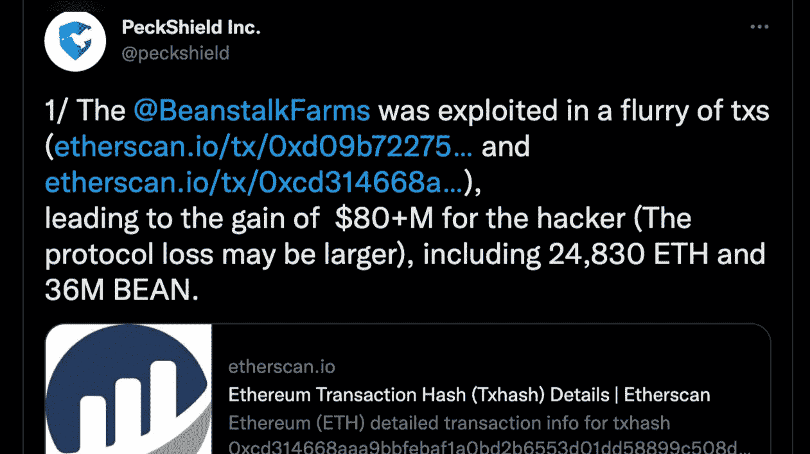
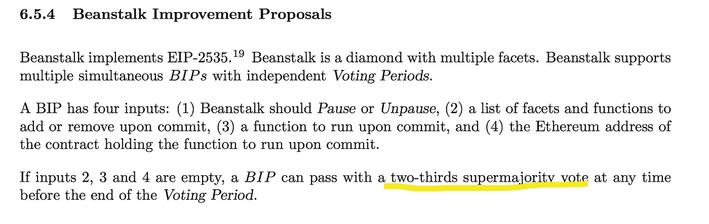
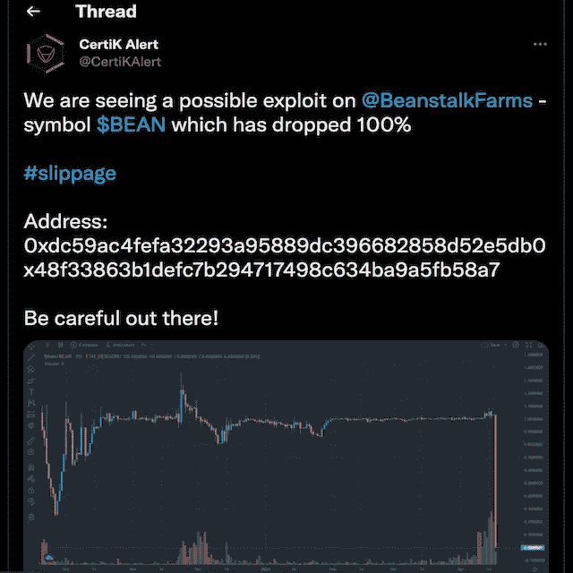
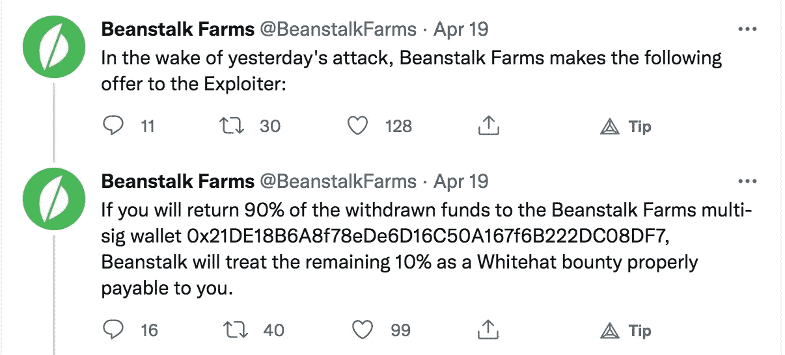
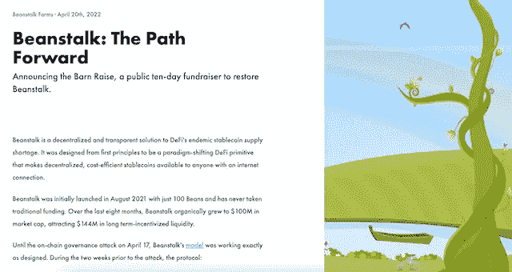

# 豆茎漏洞——简化的事后分析

> 原文：<https://medium.com/coinmonks/beanstalk-exploit-a-simplified-post-mortem-analysis-92e6cdb17ace?source=collection_archive---------4----------------------->

# 前言

建立在以太坊基础上的 Beanstalk 是一个基于信用的算法 stablecoin 协议，旨在破坏 DeFi 和寻租抵押 stablecoin 市场，**在 2022 年 4 月 17 日周日的一次闪电贷款攻击中损失了 1 . 82 亿美元**。攻击者能够识别并利用治理设计中的缺陷。它使攻击者能够获得协议的控制权。攻击者耗尽了其资产的流动性池，并带走了 7600 万美元，BEAN 从其 1 美元的挂钩价格下跌了约 75%。如果您是该协议的新手，我强烈建议您在继续之前阅读一下[我的文章](/@everythingblockchain/beanstalk-reaping-defi-bean-efits-463dc1e1f9d9)，这篇文章详细介绍了 Beanstalk 及其治理机制。在本文中，我将介绍漏洞利用是如何准备的以及它是如何发生的，然后是 Beanstalk 的回应。所以事不宜迟，让我们深入细节。

# 豆茎漏洞

整个攻击基于一个漏洞，该漏洞使攻击者能够利用协议的多数表决治理系统。简单来说，任何拥有三分之二(绝对多数)选票的个人都可以在任何时候通过 BIP。

[快速贷款](https://www.coindesk.com/learn/2021/02/17/what-is-a-flash-loan/)在 DeFi 越来越受欢迎，因为它们为个人提供了从套利交易中获利的令人兴奋的机会。然而，DeFi 是几个黑客和恶意演员的家，他们利用这些贷款窃取大量的密码。(*快速贷款消除了对抵押品的需求，因为初始贷款必须在交易结束时偿还。如果借款人无法保证偿还，则交易失败，从而消除了贷款人的风险*。那么攻击者是如何成功的呢？我们将在下一节中讨论这一点。

很多人提到这种行为不能被归类为黑客或盗窃，它只是治理设计中一个巨大缺陷的结果。但是，我想补充一点，这是以下几个因素的结合-

1.flash Loan——对于攻击者获得 Beanstalk 的链上治理的多数控制权至关重要。
2。治理机制 emergencyCommit()函数，它允许攻击者立即在链上执行提议。通常，执行一个 BIP 链至少需要 7 天时间，但是利用紧急提交功能帮助攻击者绕过了这个时间(执行时需要 2/3 的共享)

简而言之，攻击者利用快速贷款获得了足够的抵押品，成为了超级多数，通过了 BIP，从豆茎农场诈骗了 1 . 82 亿美元。

# t-1 2022 年 4 月 16 日

第一步:[攻击者](https://etherscan.io/address/0x1c5dcdd006ea78a7e4783f9e6021c32935a10fb4)从龙卷风现金中获得资金，并通过[突触桥](https://etherscan.io/tx/0x1fb73ec5ed8c25b9ca7c9c3c465ab4bbca8554927094f939d96600271475e101)将其桥接。
第二步:这个动作之后是一个[存放](https://etherscan.io/tx/0xf5a698984485d01e09744e8d7b8ca15cd29aa430a0137349c8c9e19e60c0bb9d)212，858 豆到豆茎仓的相同地址。
步骤 3:步骤 2 有助于生成足够的茎杆(*这是产生收益的治理令牌)*和种子(*既得茎杆*)，使攻击者能够创建 Beanstalk 改进建议(BIP18 和 BIP19)。

需要注意的几件事
*BIP18 最初是空白的(稍后将详细介绍)
*BIP19 被攻击者战略性地命名为 InitBip18，其中包含一份经过验证的合同，向乌克兰捐赠 25 万美元，向提议者捐赠 1 万美元。

# 2022 年 4 月 17 日登陆日

闪贷对豆茎发起攻击

[闪贷](https://etherscan.io/tx/0xcd314668aaa9bbfebaf1a0bd2b6553d01dd58899c508d4729fa7311dc5d33ad7)(约美元)用于从 Aave 获得 3.5 亿戴、5 亿和 1.5 亿，从 Uniswap v2 获得 3200 万比恩，从 SushiSwap 获得 1160 万。这些令牌被用来增加曲线池中的流动性，BEAN 用于治理投票。因此，攻击者首先使用戴、和生成 BEAN3CRV-f 来伪造 3CRV。然后，在另一个合同中存入 3200 万美元 BEAN 和 2500 万美元来创建新的令牌 BEAN3LUSD-f

接下来，攻击者将上述资产存放在豆秸筒仓中，并获得足够的豆秸和种子，以获得总发行量的 70%(*LP 储户每存放一粒豆获得的种子是豆存款的两倍*)。该份额使攻击者能够获得 2/3 的绝对多数票，并执行 emergencyCommit()函数。

现在，攻击者部署并投票支持了一个伪造的协议改进提案(BIP18)，该提案耗尽了池基金，并将令牌(BEAN/WETH-BEAN LP/BEAN 3 crv-f/BEANLUSD-f)转移给了攻击者。这使得攻击者能够偿还快速贷款，并通过硬币混合工具 TornadoCash 获得 24，830 wet 的利润(约 7600 万美元，剩余的 1.06 亿美元用于偿还 AAVE 的快速贷款)。

攻击者设法欺骗社区，让他们相信 BIP18 只是为了向乌克兰捐赠地址捐款。一旦攻击者通过 flash loan 获得了多数治理股权，emergencyCommit 功能会帮助攻击者在投票后立即执行该提案，就这样 Beanstalk 损失了大约 1 . 82 亿美元。

损失的 1.82 亿美元的明细:

*   3600 万豆(3600 万美元)
*   来自 ETH-BEAN UNI v2 LP 令牌的 3300 万美元 ETH 和 3200 万美元 BEAN(6500 万美元)
*   7920 万 BEAN3CRV-f 曲线 LP 代币(7920 万美元)
*   160 万比恩-LUSD 曲线 LP 代币(160 万美元)

一旦攻击者耗尽了 Beanstalk 的资金，BEAN 的价格就从其与美元挂钩的价格暴跌了 75%。

当天晚些时候，Beanstalk 在 Twitter 上证实了这一事件。“豆茎今天遭受了一次攻击”。

点击[此处](https://bean.money/blog/beanstalk-governance-exploit)阅读豆茎官方声明。

我想补充的是，不仅团队反应灵敏、平易近人，而且社区也比以往任何时候都更加强大。Beanstalk 在 2022 年 4 月 19 日概述了继续雄心勃勃的旅程的前进道路。**“这是对豆茎管理模式的攻击，而不是对其经济设计的攻击”。**点击[此处](https://bean.money/blog/path-forward)了解青苗计划如何前进。

# 结束语

虽然闪贷黑客和智能合同漏洞在 DeFi 中并不新鲜，但这次不同于以往的任何利用。它揭示了治理和相关方面的问题，必须认真设计这些问题，以防止今后发生此类事件。

限制治理提议的范围和使用链外解决方案可以减少这种情况。此外，必要时可以使用内置的 timelock 特性实现链上治理。

投票和执行之间必须有足够的时间，以便用户可以仔细审查提案。黑客只用了 13 秒就清空了账户。

显然，不要投资超过你能承受的损失。

如果你觉得这很有帮助，请考虑通过小费、订阅和关注来支持。

**一切区块链—** 追求简化元宇宙链的不同区块。

**社交**

[Substack](https://everythingblockchain.substack.com/account?utm_source=menu-dropdown) ， [Twitter](https://twitter.com/EverythingB0x) ， [Youtube](https://www.youtube.com/channel/UCkcc6EceEAu1sMoi2dKczCQ) ， [Medium](/@everythingblockchain) ， [Reddit](https://www.reddit.com/user/cyekmyster)

**下线**

[智囊团](https://app.usebraintrust.com/r/everything1/)，[预研](https://www.presearch.org/signup?rid=2491437)，[币安](https://accounts.binance.com/en/register?ref=12626399)，[库科恩](https://www.kucoin.com/ucenter/signup?rcode=rJCLFS2)

本文提供的信息仅用于教育目的，不得视为投资建议。在正确呈现任何信息方面的任何失误都是我们的责任。我们否认与使用此内容相关的任何责任。