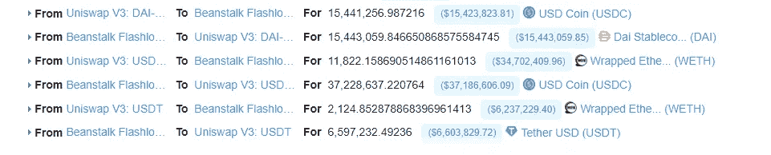

# BeanstalkFarms 攻击事件分析

> 原文：<https://medium.com/coinmonks/beanstalkfarms-attack-event-analysis-6980482a9b00?source=collection_archive---------9----------------------->

## 0x01 事件背景

BeanstalkFarms 是一个基于信用的分散式 StableCoin 协议，由于闪贷攻击，该协议损失了约 1.82 亿美元

## 豆茎游戏攻略

一个分散的基于信用的稳定币协议。运行在开源、无许可协议(如 Bitcoin4 和以太坊)上的去中心化计算机网络代表了下一个经济和技术前沿:无信任商品和服务。

Beanstalk 依赖于 3 个相互关联的部分:

1.  一个分散的价格先知，
2.  筒仓，一种分散的治理机制，以及
3.  这是一个分散的信贷机构。

豆茎发行了 3 个 ERC-20 标准代币:

1.  豆子，豆茎稳定币，
2.  一个产生收益的治理令牌，以及
3.  种子，每季产生万分之一的茎秆。

Beanstalk 依赖于 3 个相互关联的部分:

1.  一个分散的价格先知，
2.  筒仓，一种分散的治理机制，以及
3.  这是一个分散的信贷机构。

## 1.分散价格 Oracle

Beanstalk 使用两个 Uniswap 流动性池——USDC:ETH 和 BEAN:ETH——来创建一个分散价格 oracle。当两个池的比率相同时，1 豆的价格被认为等于 1 美元。

Beanstalk 计算每个季节 1 粒咖啡豆的时间加权平均价格(TWAP)。

## 2.筒仓:一种去中心化的治理机制

Beanstalk 使用 Silo(Beanstalk 去中心化自治组织)来创建健壮的去中心化治理机制。

## 0x02 攻击者信息

攻击发生在以太坊链条上，主要攻击信息如下:

攻击者的钱包地址

0x 1 C5 dcdd 006 ea 78 a7e 4783 F9 e 6021 c 32935 a10fb 4

主要攻击交易

0xcd 314668 AAA 9 bbfebaf 1 a 0 BD 2 b 6553d 01 DD 58899 c 508d 4729 fa 7311 DC 5d 33 ad 7

攻击者创建的合同

主要攻击逻辑契约:0x 79224 BC 0 BF 70 EC 34 f 0 ef 56 ed 8251619499 a 59 def

0x 728 ad 672409 da 288 ca 5b 9 aa 85 D1 a55b 803 ba 97d 7

0 xe 5 ECF 73603d 98 a 0128 f 05 ed 30506 AC 7a 663 dbb 69

0x 259 a 2795624 b 8 a 17 BC 7 EB 312 a 94504 ad 0 f 615 D1 e

治理费合同

0 xf 480 ee 81 a 54 e 21 be 47 aa 02 d0f 9 e 29985 BC 7667 c 4

## 0x03 攻击分析

在攻击交易之前

对攻击者合约地址的交易进行分析发现，在主要攻击交易 0xcd3146 发生的前一天，攻击者通过 Uniswap 分散式交换将 73 eth 兑换为 BEAN，然后将 BEAN 资金存入 Beanstalk 合约(以获得提案权)

然后创建了 0x 259 a 2795624 b 8 a 17 BC 7 EB 312 a 94504 ad 0 f 615d 1 e 契约，这里定义为建议契约。

然后攻击者连续两次调用 0x956afd68 方法，就是 propose 方法:propose((address，uint8，bytes4[])[]，address，bytes，uint8)，使用刚创建的契约(0x259a279)和一个未知的提议契约(0x e 5 ECF 73603d 98 a 0128 f 05 ed 30506 AC 7 a 663 dbb 69)作为参数，

通过对项目的分析可知，如果提案通过，提案契约中指定的内容将立即执行
继续分析交易，发现在攻击交易的同时，攻击者通过 0x677660ce4 交易(0x e 5 ECF 73603d 98 a 0128 f 05 ed 30506 AC 7a 663 dbb 69)创建了提案契约

继续分析主要攻击交易:0xcd 314668 AAA 9 bbfebaf 1 a 0 BD 2 b 6553d 01 DD 58899 c 508d 4729 fa 7311 DC 5d 33 ad 7

## 攻击交易详细信息

*   攻击者闪贷

攻击者通过闪贷分别从 **Aave** 、 **Uniswap V2** 、 **SushiSwap** 获得大量资金，作为后续攻击的准备。从下图可以看出，攻击者的闪贷总额:**3.5 亿戴**， **5 亿**，**1.5 亿**，**32100950 豆**，**11643065。**

*   攻击者转移闪贷资金

攻击者在 Curve.fi: **戴/USDC/USDT 池**中将上述资金中的戴、、资金兑换为 **979，691，328 3Crv** 流动性代币，并将 **15，000，000 3Crv** 兑换为 **15，251，318 LUSD**

接下来，攻击者用 **964，691，328 个 3Crv** 代币换取 **795，425，740**BEAN 3 crv-f 进行投票，将 **32，100，950 BEAN** 和 **26，894，383 LUSD** 加入流动性，得到 **58，924，887 BEAN lusd-f**

*   攻击者对恶意提案进行投票并撤回资金

攻击者会交换 **BEAN3CRV-f** 和 **BEANLUSD-f** 对提案进行投票，导致提案通过。因此，Beanstalk 协议契约向攻击契约转移了大量令牌。

*   攻击者转换资金并偿还闪贷

攻击者用**1007734729 3 crv**获得的全部**beans 3 crv-f**和全部**beans lusd-f**换取**28149504 LUSD**。

攻击者在 SushiSwap 和 Uniswap V2 返还闪付贷款

攻击者用**16471404 LUSD**兑换**16184690 3 crv**。随后， **511，959，710 3 车币**换成 **522，487，380**， **358，371，797 3 车币**换成 **365，758，059 戴**， **153，587，913 3 3 3 车币**换成 **156，732**

*   攻击者偿还了一笔快速贷款

*   攻击者转移盈利资金

攻击者摧毁 **UNI-V2 LP** 后获得**10883 wet**和**32511085 BEAN**

攻击者向乌克兰加密货币捐赠了价值约 25 万美元的 25 万 USDC。

攻击者将获利的加密货币兑换成**13947 WETH**并转入攻击者的合约。最终，攻击者共获得**24820 WETH**，价值约**7208 万美元**。

## 0x04 漏洞详细信息

通过分析攻击过程，发现攻击者明显进行了投票治理的关键操作，并成功获利。这里直接分析治理契约 **GovernanceFacet** 。

攻击者通过**governance facet**contract propose 方法发起提议，生成提议 id，判断攻击者是否有资格发起提议以及判定提议数量的条件。由于攻击者已经通过之前的操作进行了资金质押，所以如果满足这个条件，就可以正常发起求婚。
继续看攻击者如何满足提案通过的投票条件:

在合同中，通常采用投票方式对提案进行投票。这里，调用 **recordVote** 方法来记录投票。投票是通过 **balanceOfRoots(account)方法**计算的，这是用户的资金地址，攻击者通过闪贷资金交易所获得可投票的令牌，因此攻击者可以利用大量的投票权使其提案通过。
但是为什么攻击者可以在投票后直接转移资金呢？合同没有提案时限吗？
转到治理费契约的另一种方法，emergencyCommit 紧急提交提案。

从契约代码中可以明确，**getGovernanceEmergencyPeriod()**方法的返回时间是 1 天，也就是说在 **emergencyCommit** 方法中，只要提议时间大于一天，就可以成功调用该方法。由于攻击者通过 flash loan 基金投票支持恶意提案，因此这里 emergencyCommit 可以成功执行和伪造。

## 0x05 总结

从这次攻击来看，安全风险在链上治理相关函数的契约逻辑中。由于用户投票的数量是基于用户持有的余额来确定的，并且没有向可投票资金添加时间锁定，所以攻击导致攻击。用户发起恶意提案，利用闪贷获取大量资金进行投票，导致最终恶意提案生效，正式项目合同的资金被转移。

## 0x06 安全建议

*   建议在项目启动前严格审核合同风险。
*   建议为与链上治理、提案发布和提案执行相关的重要功能添加时间锁。如果出现恶意提议，也可以缓冲；避免使用账户当前资金余额统计票数，避免重复投票，避免通过闪贷借款投票；
*   项目方和社区应密切关注所有提案。如果存在恶意提案，建议禁止其在提案表决期间接受表决并执行；

参考:

 [## 豆茎简介

### 一种基于分散信用的稳定币协议

medium.com](/beanstalkfarms/introducing-beanstalk-557c45cb8d80) 

> 加入 Coinmonks [电报频道](https://t.me/coincodecap)和 [Youtube 频道](https://www.youtube.com/c/coinmonks/videos)了解加密交易和投资

# 另外，阅读

*   [德国最佳加密交易所](https://coincodecap.com/crypto-exchanges-in-germany) | [Arbitrum:第二层解决方案](https://coincodecap.com/arbitrum)
*   [币安交易机器人](/coinmonks/binance-trading-bots-d0d57bb62c4c) | [OKEx 评论](/coinmonks/okex-review-6b369304110f) | [Atani 评论](https://coincodecap.com/atani-review)
*   [最佳加密交易信号电报](/coinmonks/best-crypto-signals-telegram-5785cdbc4b2b) | [MoonXBT 评论](/coinmonks/moonxbt-review-6e4ab26d037)
*   [如何在 Bitbns 上购买柴犬(SHIB)币？](https://coincodecap.com/buy-shiba-bitbns) | [买弗洛基](https://coincodecap.com/buy-floki-inu-token)
*   [CoinFLEX 评论](https://coincodecap.com/coinflex-review) | [AEX 交易所评论](https://coincodecap.com/aex-exchange-review) | [UPbit 评论](https://coincodecap.com/upbit-review)
*   [十大最佳加密货币博客](https://coincodecap.com/best-cryptocurrency-blogs) | [YouHodler 评论](https://coincodecap.com/youhodler-review)