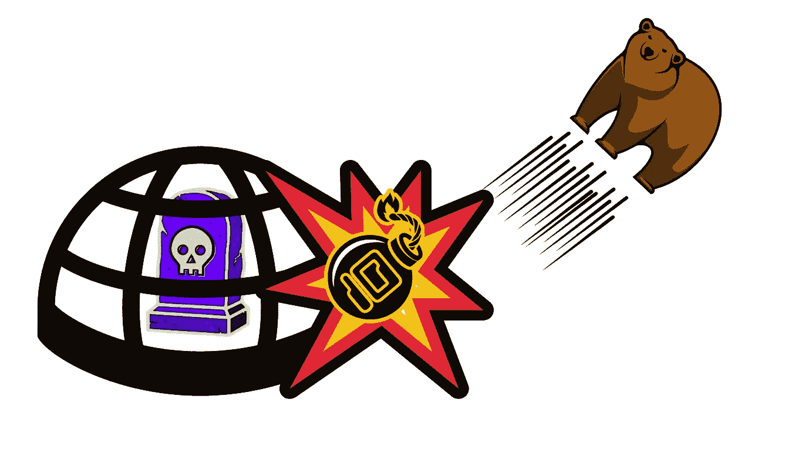

# 抗熊市亏损

> 原文：<https://medium.com/coinmonks/bear-market-resistant-defi-c64d55d5eb?source=collection_archive---------5----------------------->

## 你如何在下行加密市场获利？

BTC 和 ETH 分别下跌了 60%和 70%。

一些重要的第 1 层替代方案，如 AVAX、SOL 和 FTM 下降了 80%以上。

许多 DeFi 协议下降了 90%以上，甚至为零。