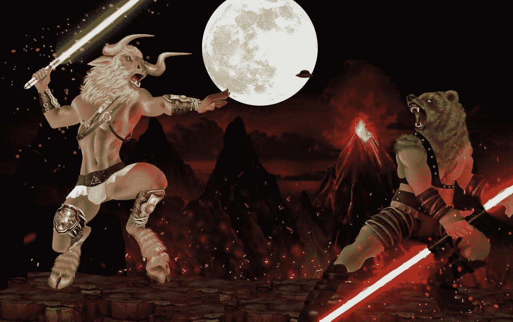

# 加密市场的熊市迹象，而游戏 Fi 项目在困难时期表现出色！

> 原文：<https://medium.com/coinmonks/bearish-signs-in-crypto-market-while-game-fi-projects-perform-in-times-of-trouble-870fcf6e696b?source=collection_archive---------48----------------------->

2022 年 5 月 30 日

**尽管有牛熊之战，但游戏保真/区块链游戏显示了前景**

****

**随着所有最近在密码领域的发展导致了市场的严重下滑，人们被置于一个困难的境地。无论你在哪里看任何市场，无论是传统市场还是发展中市场，图表显示的都不是一个好的读数。像 Terra LUNA 这样的项目在最近的审查中，由于市场崩溃引起的各种复杂情况，看到了他们的项目失败。LUNA 的股价下跌了 95%以上，对加密经济造成了严重影响。关于算法稳定资本及其支持的资产，出现了许多问题。**

**尽管金融市场存在负面情绪，但 NFT 的公用事业项目，如 STEPN、GALA Games、ImmutableX、Onixcoin 和一些元宇宙/游戏币，一直保持着每日活跃用户，并稳步发展其生态系统。自 2020 年和疫情开始以来，游戏趋势显著增加，这表明大多数散户投资者寻求有趣或娱乐活动，以逃避媒体不断发布的负面新闻。随着市场的现状以及以太坊和索拉纳等主要网络失去价值，游戏开发商和玩家看到了集成在一个不是专门针对 NFT 游戏的区块链上的影响。无论你的游戏是否越来越受欢迎，用户越来越多，项目对整个链的影响都会影响你的项目的内在价值。区块链向世界展示的技术越多，我们就越觉得有必要将市场分成不同的领域，以方便互操作性和稳定性。**

**像 Gala Games 和 Onixcoin 这样的项目正在为这个问题提供解决方案，它们为 NFT 游戏提供了一个独立的网络。Onixcoin 是为游戏和独立游戏开发者开发区块链网络的最新项目。所有游戏开发者都需要定制的服务和资源，这是游戏行业发展的关键。总部位于台湾台北的 Onixcoin 团队正在解决当前独立游戏开发商在将新游戏或现有游戏集成到区块链网络中所面临的挑战。**

****

**Onixcoin 于 2021 年 10 月 31 日推出其 mainnet，计划于 2022 年第三季度发布该平台上第一款游戏名称的 alpha。游戏的名字将是军队的加密，一个可交易的卡牌游戏的基础上突出的数字在加密空间，如埃隆马斯克，CZ，Satoshi，加密黑客等。这个概念被认为是 2022 年最受期待的版本之一。亚历杭德罗·卡瓦列罗、罗德里戈·桑托斯和安东尼·塞维多是其中的几位领军人物**

> **加入 Coinmonks [电报频道](https://t.me/coincodecap)和 [Youtube 频道](https://www.youtube.com/c/coinmonks/videos)了解加密交易和投资**

# **另外，阅读**

*   **[3 商业评论](/coinmonks/3commas-review-an-excellent-crypto-trading-bot-2020-1313a58bec92) | [Pionex 评论](https://coincodecap.com/pionex-review-exchange-with-crypto-trading-bot) | [Coinrule 评论](/coinmonks/coinrule-review-2021-a-beginner-friendly-crypto-trading-bot-daf0504848ba)**
*   **[莱杰 vs n rave](/coinmonks/ledger-vs-ngrave-zero-7e40f0c1d694)|[莱杰 nano s vs x](/coinmonks/ledger-nano-s-vs-x-battery-hardware-price-storage-59a6663fe3b0) | [币安评论](/coinmonks/binance-review-ee10d3bf3b6e)**
*   **[Bybit Exchange 审查](/coinmonks/bybit-exchange-review-dbd570019b71) | [Bityard 审查](https://coincodecap.com/bityard-reivew) | [Jet-Bot 审查](https://coincodecap.com/jet-bot-review)**
*   **[3 commas vs crypto hopper](/coinmonks/3commas-vs-pionex-vs-cryptohopper-best-crypto-bot-6a98d2baa203)|[赚取加密利息](/coinmonks/earn-crypto-interest-b10b810fdda3)**
*   **最好的比特币[硬件钱包](/coinmonks/hardware-wallets-dfa1211730c6) | [BitBox02 回顾](/coinmonks/bitbox02-review-your-swiss-bitcoin-hardware-wallet-c36c88fff29)**
*   **[BlockFi vs 摄氏度](/coinmonks/blockfi-vs-celsius-vs-hodlnaut-8a1cc8c26630) | [Hodlnaut 审核](/coinmonks/hodlnaut-review-best-way-to-hodl-is-to-earn-interest-on-your-bitcoin-6658a8c19edf) | [KuCoin 审核](https://coincodecap.com/kucoin-review)**