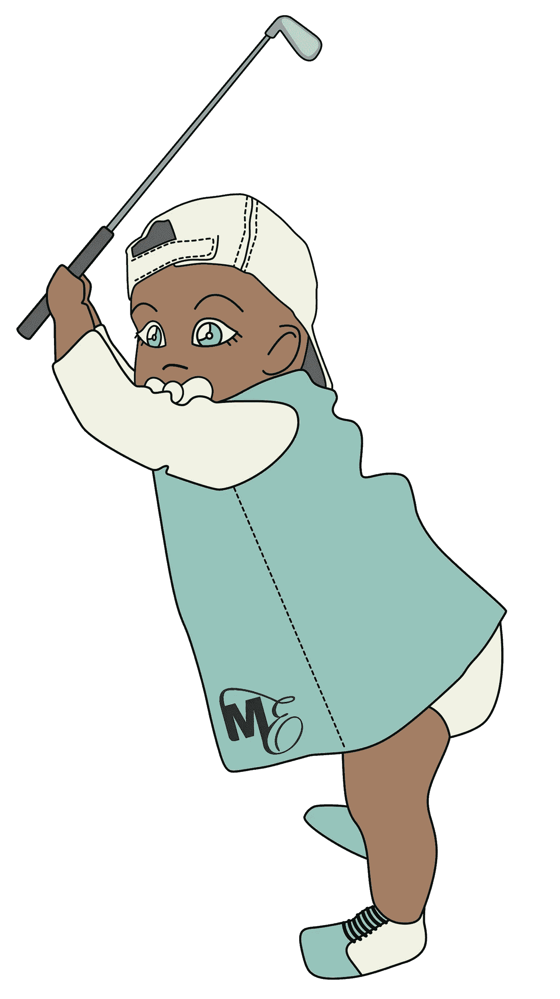

# 从看跌到看好 Crypto & DeFi

> 原文：<https://medium.com/coinmonks/bearish-to-bullish-about-crypto-defi-4cfc0e7bde8c?source=collection_archive---------24----------------------->

Image Credit: [Eva K](https://commons.wikimedia.org/wiki/File:Bulle_und_B%C3%A4r_Frankfurt.jpg)

加密货币的繁荣相当于现代的淘金热。对于那些关注我作品的人来说，这种说法听起来很矛盾。在过去的六个月里，我一直在预测加密技术的可怕未来，并对我对 NFT 市场和分散金融(DeFi)概念的评估更加严厉。但是，您必须明白，我是通过只关注金融欺诈和洗钱的视角来看待这个分散化的世界的。

话虽如此，我承认人类正在向一个高度数字化和虚拟化的世界迈进，在这个世界里，我要么上车，要么走开。不过，老实说，我徘徊在犹豫不决的阵营，这在很大程度上与 NFT 市场发生的金融闹剧有关。每周都有一条关于 NFTs 的令人震惊的新闻出现在我们的新闻提要中。就在这个月，我们被关于种族主义的非功能性交易的新闻打击，关于 T2 非功能性交易的产生和存在是如何破坏环境的，关于 NFT 的创造者购买他们自己的非功能性交易(内幕交易？)以及新一波金融犯罪如[拉地毯](/coinmonks/rug-pull-cons-hurt-nft-credibility-63df82fd75e4)，现在[反拉地毯](https://slate.com/technology/2022/02/cool-kittens-nft-scam-coup-rug-pull-dao.html)。

尽管如此，困扰 NFTs 和加密货币的金融欺诈和洗钱问题可能只是建立完全分散的金融系统过程中的成长烦恼？最初的淘金热(1848 年至 1855 年)也有其成长的烦恼，其中许多都有很好的记录，从人类的角度来看更具悲剧性。然而，这七年的时间跨度改变了历史的进程，导致了制造业、服务业、木材业、服装业、运输业、农业和零售业的扩张。尽管加利福尼亚在淘金热之前没有银行，但由于淘金热的结果，它在世纪末成为了一个经济强国。

如果做得好，由加密货币驱动的去中心化金融平台可以像淘金热一样给世界带来积极的变化，如果不是更多的话。有时，为了创造革命性的东西，一个概念、想法或产品必须经历一些严重的成长痛苦，最终用户才能实现其全部利益。毕竟，这是一个与其它任何经济周期一样的增长周期。然而，分散金融的概念正在我们眼前迅速发展，这使得这一时刻，至少对于那些关注的人来说，成为人类历史上一个相当重要的时刻。

从全局的角度来看，我有没有可能变得有点看好分散金融？一切皆有可能，对吧？我是一个元数据迷，所以当我回顾显示真实进步的数据时，我倾向于倾听。尽管加密货币存在固有的金融欺诈和货币问题，但分散化金融难题的大部分现在都已到位。我想，如果我在下面提供几个例子来说明为什么我认为去中心化的概念可能会继续存在，可能会帮助我的读者更好地理解我的想法。

以下是一些基本示例:

**摩根大通&公司:**世界上最有影响力的金融机构之一，现在是第一家进入元宇宙的银行，[最近在分散地](https://www.coindesk.com/business/2022/02/15/jpmorgan-is-the-first-bank-into-the-metaverse-looks-at-business-opportunities/)开设了一家名为 Onyx 的休息室。此外，摩根大通还发布了一份名为《元宇宙的机遇》的白皮书，旨在帮助企业在有点混乱的元宇宙导航。对于那些仍然质疑分权概念的人来说，这本书值得一读。

> “我们将我们的白皮书整合在一起，以帮助客户打破噪音，突出当前的现实，以及接下来需要在技术、商业基础设施、隐私/身份和劳动力方面建设什么，以便最大限度地发挥我们在元宇宙生活的全部潜力。”——克里斯汀·莫伊(Christine Moy)，摩根大通的加密和元宇宙负责人[到 Coindesk](https://www.coindesk.com/business/2022/02/15/jpmorgan-is-the-first-bank-into-the-metaverse-looks-at-business-opportunities/)

**梅塔(脸书):**显然马克·扎克伯格和脸书已经烧掉了[超过 5 亿美元](https://techstory.in/zuckerberg-has-burned-500-billion-for-meta/)转移到梅塔。对于一家拥有世界上最大用户群的公司来说，这种向分散平台的转变起初似乎还为时过早，但我认为 META 拥有实现这一目标的资源，只要它能留住其脸书用户。

**瑞士、新加坡、萨尔瓦多等:**虽然我已经报道了限制或威胁限制加密货币的国家(中国和印度)，但还有更多国家对加密技术持友好态度。诚然，这些国家的人口加起来比不上中国和印度，但这些国家对分散金融的热情是会传染的。谁不想体验一下瑞士的秘密山谷呢？

我对分散自治组织(Dao)的出现特别感兴趣，它们有能力扰乱传统的创业资金来源，甚至纳斯达克，投资者如何分享利润，如何做出决策，以及 Dao 提供的产品和服务如何推出。举例来说，Dao 可能只存在于元宇宙，而其他人可能投资于实物资产，如乡村俱乐部，[我在以前的文章](https://blog.personalitynft.com/dao-startup-sells-nfts-for-funding-4492b7b601b5)中提到过。

Image credit: [Ewingmason](https://commons.wikimedia.org/wiki/File:Baby_Madison_-_Golf.png)

世界正在迅速变成一个去中心化的数字仙境，充满了机遇，但也充满了坑坑洼洼、金融欺诈和洗钱问题，我认为这些都是成长的烦恼。确实有实质性的成长烦恼，但最终，只是成长的东西。淘金热开始了。你或你的企业准备好利用它了吗？还是像我一样骑墙观望，研究市场？

*   结束

> 加入 Coinmonks [电报频道](https://t.me/coincodecap)和 [Youtube 频道](https://www.youtube.com/c/coinmonks/videos)了解加密交易和投资

# 另外，阅读

*   [币安期货交易](https://coincodecap.com/binance-futures-trading)|[3 comas vs Mudrex vs eToro](https://coincodecap.com/mudrex-3commas-etoro)
*   [如何购买 Monero](https://coincodecap.com/buy-monero) | [IDEX 评论](https://coincodecap.com/idex-review) | [BitKan 交易机器人](https://coincodecap.com/bitkan-trading-bot)
*   [CoinDCX 评论](/coinmonks/coindcx-review-8444db3621a2) | [加密保证金交易交易所](https://coincodecap.com/crypto-margin-trading-exchanges)
*   [红狗赌场评论](https://coincodecap.com/red-dog-casino-review) | [Swyftx 评论](https://coincodecap.com/swyftx-review) | [CoinGate 评论](https://coincodecap.com/coingate-review)
*   [Bookmap 评论](https://coincodecap.com/bookmap-review-2021-best-trading-software) | [美国 5 大最佳加密交易所](https://coincodecap.com/crypto-exchange-usa)
*   [如何在 FTX 交易所交易期货](https://coincodecap.com/ftx-futures-trading) | [OKEx vs 币安](https://coincodecap.com/okex-vs-binance)
*   [CoinLoan 评论](https://coincodecap.com/coinloan-review) | [YouHodler 评论](/coinmonks/youhodler-4-easy-ways-to-make-money-98969b9689f2) | [BlockFi 评论](https://coincodecap.com/blockfi-review)
*   [XT.COM 评论](https://coincodecap.com/profittradingapp-for-binance) | [币安评论](https://coincodecap.com/xt-com-review)
*   [SmithBot 评论](https://coincodecap.com/smithbot-review) | [4 款最佳免费开源交易机器人](https://coincodecap.com/free-open-source-trading-bots)