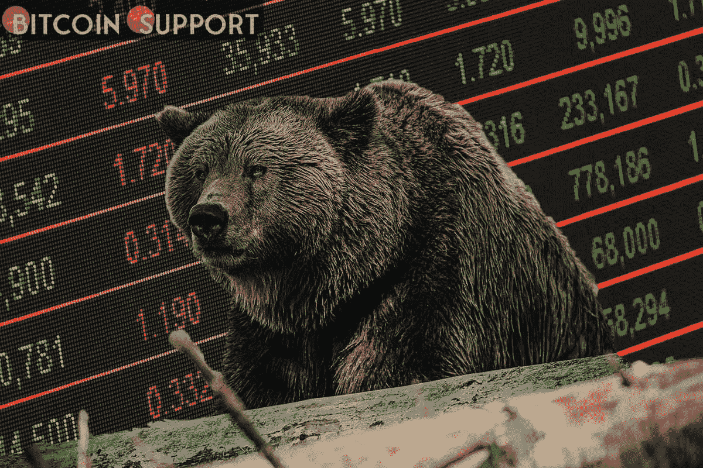
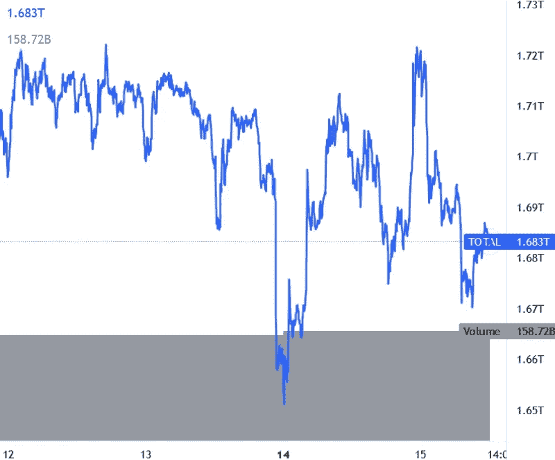

# 熊市统治比特币和以太坊，各大 altcoins 苦苦挣扎

> 原文：<https://medium.com/coinmonks/bears-rule-bitcoin-and-ethereum-while-major-altcoins-struggle-959d5c99c6c0?source=collection_archive---------116----------------------->

**Visit our website:-** [**https://bitcoinsupports.com/**](https://bitcoinsupports.com/)

比特币的价格正在努力超过 39000 美元。

如果以太坊跌破 2500 美元，XRP 可能跌破 0.75 美元。

EGLD 和符文涨幅均超过 8%。

比特币价格上行尝试突破 39500 美元但未果。BTC 开始跌破 39，000 美元，目前交易价格低于 38，700 美元(世界协调时 11:44)。

同样的，大部分的 altcoins 都在努力获得牵引力。ETH 未能突破 2570 美元，仍有可能进一步下跌。如果 XRP 清除 0.75 美元的支撑，它可能会迅速下跌。ADA 货币对正在努力维持在 0.78 美元的支撑位之上。

**Visit our website:-** [**https://bitcoinsupports.com/**](https://bitcoinsupports.com/)

**比特币的价值**

在又一次尝试突破 39500 美元失败后，比特币的价格开始下跌，一天内已经下跌了约 1%。下一个主要支撑位在 38，000 美元，低于此价格可能会重新测试 37，550 美元。如果多头未能守住这一水平，则有可能跌破 37，200 美元的支撑。在上行方面，39，000 美元是一个即时阻力位。下一个主要阻力位仍然在 39，500 美元附近，在此之上价格可能会上升到 40，000 美元。

**以太坊价格**

以太坊价格未能突破 2600 美元阻力区。ETH 开始了新的下跌趋势，目前交易于 2550 美元关口下方。下一个重要支撑位在 2500 美元附近，在此之下空头可能会尝试更深的下跌。另一方面，价格可能会上涨并重新进入 2600 美元的阻力区。下一个阻力位在 2650 美元附近。2650 美元上方的强劲上涨可能为向 2750 美元移动铺平道路。

**阿达、BNB、索尔、多格、XRP**

价格卡尔达诺(ADA)继续奋力突破 0.82 美元阻力。它的交易价格低于 0.80 美元，低于 0.78 美元是可能的。如果空头成功，价格可能会跌至 0.75 美元。BNB 目前在 365 美元附近盘整。370 美元附近，有即时阻力。第一个主要阻力位于 375 美元附近，超过这个价格可能会上升到 385 美元。

索拉纳(SOL)现在 80 美元左右盘整。如果价格收于 80 美元以下，价格可能会继续下跌。在 72 美元附近，找到了下一个重要的支撑。

DOGE 仍有进一步跌破 0.110 美元支撑的危险。下一个关键支撑位在 0.105 美元附近，在此下方，多头可能会努力保持 0.105 美元不动。

XRP 价格正在下跌，并试图保持在 0.75 美元以上。如果出现明显的负突破，价格可能会跌至 0.72 美元。在 0.70 美元附近，找到了下一个重要的支撑。

**其他 altcoins 今日行情**

LUNA、AVAX、DOT、SHIB、MATIC、UNI、ICP、WAVES、THETA、FTM、ZEC、STX 属于红区的加密货币。另一方面，RUNE 上涨了近 12%,突破了 7.8 美元的关口，使其周涨幅达到约 83%。在一天内上涨 8%并超过 154 美元后，EGLD 目前在一周内上涨了近 16%。

总而言之，比特币价格未能突破 39，500 美元和 40，000 美元的阻力位，如果短期内未能触及 40，000 美元，将面临进一步下跌的风险。

**访问我们的网站:-**[**https://bitcoinsupports.com/**](https://bitcoinsupports.com/)

**免责声明:以上为作者观点，不应视为投资建议。读者应该自己做研究。**

> 加入 Coinmonks [电报频道](https://t.me/coincodecap)和 [Youtube 频道](https://www.youtube.com/c/coinmonks/videos)了解加密交易和投资

# 另外，阅读

*   [BigONE 交易所点评](/coinmonks/bigone-exchange-review-64705d85a1d4) | [电网交易 Bot](https://coincodecap.com/grid-trading)
*   [氹欞侊贸易评论](https://coincodecap.com/anny-trade-review) | [CoinSpot 评论](https://coincodecap.com/coinspot-review)
*   [新加坡十大最佳加密交易所](https://coincodecap.com/crypto-exchange-in-singapore) | [购买 AXS](https://coincodecap.com/buy-axs-token)
*   [投资印度的最佳加密软件](https://coincodecap.com/best-crypto-to-invest-in-india-in-2021) | [WazirX P2P](https://coincodecap.com/wazirx-p2p)
*   7 个最佳零费用加密交易平台
*   [最佳网上赌场](https://coincodecap.com/best-online-casinos) | [期货交易机器人](/coinmonks/futures-trading-bots-5a282ccee3f5)