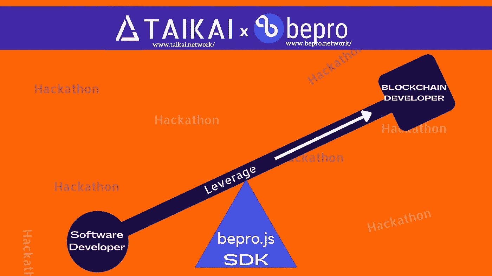
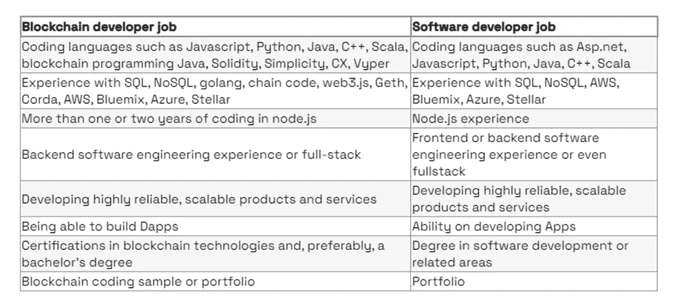

# 用 Bepro.js 和 Taikai Hackathon 成为区块链开发者

> 原文：<https://medium.com/coinmonks/become-a-blockchain-developer-with-bepro-js-and-taikai-hackathon-d7caa53d0e60?source=collection_archive---------17----------------------->

## Bepro.js SDK 是完美的区块链工具，Taikai 是软件开发人员成为区块链开发人员的完美学习成长环境

Become a Blockchain Developer With Bepro.js and Taikai Hackathon — by Valuefirst

一个软件开发者和一个区块链开发者在技术上没有太大区别，但是在财务上有区别。软件开发人员到区块链开发人员或多或少是从 Web2 到 Web3 的过渡，所需的技能和专业知识非常相似，但收入不同，我们理解你为什么想进行跳跃。

## 相似点或不同点(如果你喜欢的话)

[赛洛斯](https://taikai.network/en/hvasconcelos)，h .[区块链开发者 vs 软件开发者关键差异](https://taikai.network/en/blog/blockchain-developer-vs-software-developer)将他们的异同点列表如下

Source -Taikai Blog. Software Developer vs Blockchain Developer The Key Difference by [Vasconcelos](https://taikai.network/en/hvasconcelos), H

从表中，您可以看到主要的技术差异是需要在您已经掌握的软件编程技能的基础上学习区块链建筑语言。Bepro.js 是一个无价的区块链建筑 SDK

## **增加了跳跃所需的技能**

*   学习 Goland、Solidity、C#、Vyper、Simplicity 等区块链构建语言。
*   实践再实践，因为经验是开发无错误、无漏洞 Dapps 的关键，尤其是在财务方面
*   解决问题和创新能力。
*   附加阅读

a.[如何成为区块链开发者:循序渐进指南](https://www.simplilearn.com/tutorials/blockchain-tutorial/how-to-become-a-blockchain-developer)

b.[成为区块链开发者所需的技能](https://www.upgrad.com/blog/skills-needed-to-become-blockchain-developer/) r

## **Bepro.js:你的区块链 SDK**

Bepro.js 是一个开源的 JavaScript 框架，用于加速构建区块链相关的功能，而无需学习任何智能的特定于合同的语言。这对于加速软件开发者成为区块链开发者来说是无价的。

## **为什么要使用 bepro.js**

Bepro.js 是开发人员的理想选择有几个原因，包括但不限于

*   更好的升级:你可以以更快的方式将区块链相关的功能添加到你的软件中，并避免所有与智能合同开发相关的重复任务。
*   JavaScript SDK: JavaScript 是世界上使用最多的编程语言之一，尤其是对于 web 应用和前端用途。你不需要增加额外的语言来构建分散的 Web3 应用程序。
*   更快的上市时间:提高智能合同的开发、测试和部署速度；
*   降低成本:通过使用开源框架降低您的应用程序开发成本；
*   成为一个强大的品牌和社区的一部分:BEPRO 有一个非常强大和积极参与的社区，你也可以成为其中的一员。我们有一个受人喜爱的品牌，你可以用它来从事与你的兴趣和目标相一致的有趣和具有挑战性的项目。

## 在哪里可以找到 bepro.js 资源

*   你会在这里找到 bepro.js 安装
*   你会找到你需要的所有文件[在这里](https://bepronetwork.github.io/bepro-js/index.html)
*   你会在这里找到 GitHub 库

## **TAIKAI Hackathon 最佳实践环境**

根据赛洛斯的说法，拥有一个学位很重要，但是作为一名区块链开发人员或软件开发人员，经验是获得第一份工作的必备条件。

TAIKAI hackathon 平台为 web3 和区块链开发者提供了一个积极的环境和社区，供人才学习、工作和成长。你可以通过我们的黑客马拉松来练习你的技能，或者通过我们的招聘挑战来申请一个 web3 职位。

此外，通过 Bepro 网络协议，我们将开发者与运营商或任何希望将分散应用构建到分散市场的人联系起来。这意味着你也可以参与奖金和赚取过程中的密码。

今天就开始使用 bepro.js，创建你的 [TAIKAI 账户](https://taikai.network/en/signup)选择你的第一个黑客马拉松，关注[招聘挑战](https://taikai.network/en/hiring-challenge)最终找到你梦想的工作，所有这些都在 Taikai x Bepro 社区中。

Taikai Hackathon 是完美的环境，bepro.js 是帮助您从软件开发人员过渡到区块链开发人员的完美工具。

## 关于贝普罗网络

Bepro Network 是 DeFi、游戏、预测市场等的代码库。我们是一个代码即服务协议，为基于区块链的应用程序提供技术和支持。

[电报](https://t.me/betprotocol) | [不和](https://discord.gg/bepronetwork) | [推特](https://twitter.com/bepronet) | [LinkedIn](https://www.linkedin.com/company/betprotocol/) | [网站](https://www.bepro.network/)

## 关于泰凯

TAIKAI 是一个人才市场，通过众包解决方案将创作者和组织联系起来，以应对他们的挑战。该公司为黑客马拉松和招聘挑战开发的工具可以对新想法、产品和人才进行全球测试和验证。

[Twitter](https://twitter.com/taikainetwork)|[LinkedIn](https://www.linkedin.com/company/taikainetwork/)|[网站](https://taikai.network/)

[订阅](/@value-First)阅读更多我的文章。谢谢你

> 加入 Coinmonks [电报频道](https://t.me/coincodecap)和 [Youtube 频道](https://www.youtube.com/c/coinmonks/videos)了解加密交易和投资

# 另外，阅读

*   [3 商业评论](/coinmonks/3commas-review-an-excellent-crypto-trading-bot-2020-1313a58bec92) | [Pionex 评论](https://coincodecap.com/pionex-review-exchange-with-crypto-trading-bot) | [Coinrule 评论](/coinmonks/coinrule-review-2021-a-beginner-friendly-crypto-trading-bot-daf0504848ba)
*   [莱杰 vs n rave](/coinmonks/ledger-vs-ngrave-zero-7e40f0c1d694)|[莱杰 nano s vs x](/coinmonks/ledger-nano-s-vs-x-battery-hardware-price-storage-59a6663fe3b0) | [币安评论](/coinmonks/binance-review-ee10d3bf3b6e)
*   [Bybit Exchange 审查](/coinmonks/bybit-exchange-review-dbd570019b71) | [Bityard 审查](https://coincodecap.com/bityard-reivew) | [Jet-Bot 审查](https://coincodecap.com/jet-bot-review)
*   [3 commas vs Cryptohopper](/coinmonks/3commas-vs-pionex-vs-cryptohopper-best-crypto-bot-6a98d2baa203)|[赚取加密利息](/coinmonks/earn-crypto-interest-b10b810fdda3)
*   最好的比特币[硬件钱包](/coinmonks/hardware-wallets-dfa1211730c6) | [BitBox02 回顾](/coinmonks/bitbox02-review-your-swiss-bitcoin-hardware-wallet-c36c88fff29)
*   [block fi vs Celsius](/coinmonks/blockfi-vs-celsius-vs-hodlnaut-8a1cc8c26630)|[Hodlnaut 审核](/coinmonks/hodlnaut-review-best-way-to-hodl-is-to-earn-interest-on-your-bitcoin-6658a8c19edf) | [KuCoin 审核](https://coincodecap.com/kucoin-review)