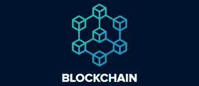

# 成为 Web3.0、区块链开发人员，并在 CSC 获得每年高达 10 万美元的收入

> 原文：<https://medium.com/coinmonks/become-a-web3-0-blockchain-developer-and-earn-upto-1000-per-year-with-csc-9cf11cf62ce4?source=collection_archive---------1----------------------->

**区块链** [**Web3**](/@kryptmystr/be-part-of-web3-0-with-csc-83e46f461710) **。o**

作为一名 Web3.0 开发人员，你需要了解**区块链是什么**，它是如何工作的，以及为什么它可能会扰乱我们交换商品和支付的方式。区块链行业仍在增长，许多人仍在逐渐接受区块链的概念，毫无疑问，这是一个快速增长的生态系统。

区块链是一种分散的、分布式的、通常是公共的数字分类账，由称为*块的记录组成，如**[***CSC***](https://www.coinex.org/?lang=en_US)*，这些记录用于记录跨多台计算机的交易，因此任何涉及的块都不能被追溯更改，除非所有后续块都被更改。**

**[CoinEx 智能链(CSC)](http://CoinEx Smart Chain (CSC) , it is a decentralized and high-efficiency public chain  with high efficiency, created by the CoinEx public chain team for decentralized  - 01 - finance. It can provide developers with an efficient and low-cost on-chain environment to run decentralized smart contract applications (DApps) and store digital  assets.) ，是一个去中心化、高效率的公链，由 CoinEx 公链团队为去中心化金融打造。它可以为开发者提供一个高效、低成本的链上环境来运行去中心化智能合约应用(DApps)和存储数字资产。**

**Web 3.0 是即将到来的第三代互联网，网站和应用程序将能够以类似人类的智能方式处理信息。随着 Web 3.0 网络将通过分散式协议(区块链和加密货币技术的基础)运行，我们可以期待看到这三种技术和其他领域之间的强大融合和共生关系。它们将通过智能合约实现互操作、无缝集成和自动化。Web 3.0 是一种更加分散的互联网访问方式，在数据保护方面提供了高级安全性。**

*   **智能合同。**

**智能合同是一种计算机程序或交易协议，旨在根据合同或协议的条款自动执行、控制或记录法律上相关的事件和行为。智能合同的目标是减少对可信中间人的需求、仲裁和执行成本、欺诈损失，以及减少恶意和意外例外。**

****区块链发展****

**区块链开发商**设计了拟议中的区块链系统**的安全性和架构。本质上，核心区块链开发者创建了基础，其他人将在此基础上进行构建。**

**对区块链开发商的需求正在飙升。在这里，我们将了解智能合同、可靠性，并知道如何为现实世界的应用程序构建和部署分散的应用程序。**

**成为区块链开发者是我在 2022 年做出的最有意义的决定，嘿！你很准时。**

****基础和基本面****

**在我们开始令人兴奋的旅程之前，我建议您先了解计算机科学的基础知识。区块链发展需要努力。在开始这个旅程之前，先学习计算机科学的基础知识。**

**既然你已经发现自己在这里，我想相信你已经学会了区块链，节点，共识的基础知识，以及这项技术的所有主要组成部分。**

****现在让我们深入区块链开发。****

1.  ****去中心化应用—** 建立在区块链之上的应用被称为去中心化应用，或 DApps。点击了解更多 DApps [。](/@kryptmystr/how-to-develop-your-dapp-on-csc-9e149766d164)**

**DApp 必须具备:**

*   ****使用 JavaScript 或 React 或 Vue 等框架/库构建的标准前端**。**
*   **一个坚固性后端，建立在区块链之上。**

****2。开发—** 要完全理解 DApp 的前端和后端如何通信和交换数据，您需要学习前端开发和标准后端开发的基本原则。如果没有标准 web 开发的主要原则的坚实基础，不建议直接进入区块链和 web3.0 开发。**

*   **在开发你的第一个 DApp 之前，先学习前端开发的基础知识和网络的工作原理。分散式应用程序可以用任何语言编写前端代码和用户界面，如标准 JavaScript 框架前端，以调用后端**
*   **后端:dapp 的后端代码运行在一个分散的对等网络上。分散式应用后端与“标准”应用后端有很大不同，首先是区块链技术被用作分散式数据存储的主要来源。**

****3。智能合约—** 要引入 dapps，我们需要引入智能合约。智能合约是位于以太坊区块链上的代码，完全按照编程运行。Dapps 可以去中心化，因为它们是由写入契约的逻辑控制的，而不是个人或公司。这也意味着你需要非常仔细地设计你的合同，并彻底地测试它们。**

**你也需要完全理解以太坊。以太坊和智能合约就像面包和黄油，你需要两方面的知识。**

****以太坊**是运行在计算机网络上的软件，确保被称为**智能合约的小程序的复制和处理。****

*   **[**Solidity**](https://docs.soliditylang.org/en/latest/)**—**Solidity 是一种面向对象的高级语言，用于实现智能合约。智能合约是在以太坊状态下管理账户行为的程序，它是任何去中心化应用程序的关键组件，为其业务逻辑提供动力，并允许您在区块链上存储信息。**

****4。连接—** 现在您已经知道如何创建智能合同，您需要一种方法来连接您的前端与您的本地或远程 Solidity(或类似的)后端，使用从 HTTP 到 WebSocket 的任何东西。这里我们使用一个 javascript 库来实现这一点**

*   ****Web3.js****

**web3.js 是一个**库集合**，允许您使用 **HTTP** 、 **WebSocket** 和其他通信协议直接从基于 JavaScript 的前端连接本地或远程以太坊节点。**

****5。部署框架—** 构建成熟的 dapp 需要不同的技术。软件框架包括许多需要的特性，或者提供简单的插件系统来挑选你想要的工具。框架提供了许多现成的功能，例如:**

*   **启动本地区块链实例的功能。**
*   **编译和测试智能合约的实用程序。**
*   **在同一个项目/存储库中构建面向用户的应用程序的客户端开发插件。**
*   ****混音****

**Remix 是一个用于合同开发和部署的在线工具。**

****6。工具****

**连接到 [CSC testne](https://testnet.coinex.net/) t 并启动:**

*   **根据区块链软件的新版本测试应用程序**
*   **开发应用程序而没有损失实际资金的风险**
*   **与公共网络相比，在较小的范围内分析区块链数据**
*   **在正式发布之前提供对区块链的早期访问。**

**这些是你成功成为区块链开发者的一些主要步骤，每个人进入这个领域的道路都是不同的，没有正确的方法，也没有错误的方法。但是成功的关键是不断地学习。Web3.0 仍处于青春期阶段，仍在增长，生态系统中会有许多新的创新，因此最终成功的关键是不断学习、实践和试验。你的想法可能会成为下一个大事件。**

## ****结论****

**毫无疑问，随着 Web3.0 正在改变现代网络的叙事，区块链的发展前景广阔。自 2013 年 Vitalik Buterin 首次提出以太坊以来，智能合约进入了聚光灯下。以太坊诞生八年来，智能合约从无到有，得到发展，后来繁荣起来，吸引了很多关注。**

**[CSC](https://www.coinex.org/?lang=en_US) 生态系统是开始区块链开发者之旅的好地方。CSC 致力于为区块链建设基础设施，并遵循分散化和无许可街区建设的原则。作为对高性能交易的支持，CSC 与 EVM 完全兼容，并应用 PoS 模型，以便所有用户都可以在没有任何许可的情况下通过标记令牌成为节点。**

**用 [CSC 成为成功的区块链开发者。](https://www.coinex.org/?lang=en_US)**

**更多资源，请查看 [CSC 开发人员文档](https://docs.coinex.org/#/en-us/introduction)**

*   **加入 CSC 的[电报组](https://t.me/CoinExChain)。**
*   **关注 CSC 的 [Twitter](https://twitter.com/CoinEx_CSC) 账户。**
*   **加入 CSC 的[不和谐](https://discord.gg/5uBGRW9qSp)群。**

**关注我的[推特](https://twitter.com/kryptmystro)获取更多更新。**

> **加入 Coinmonks [电报频道](https://t.me/coincodecap)和 [Youtube 频道](https://www.youtube.com/c/coinmonks/videos)了解加密交易和投资**

# **另外，阅读**

*   **[CoinLoan 评论](https://coincodecap.com/coinloan-review) | [YouHodler 评论](/coinmonks/youhodler-4-easy-ways-to-make-money-98969b9689f2) | [BlockFi 评论](https://coincodecap.com/blockfi-review)**
*   **[XT.COM 评论](https://coincodecap.com/profittradingapp-for-binance) | [币安评论](https://coincodecap.com/xt-com-review)**
*   **[SmithBot 评论](https://coincodecap.com/smithbot-review) | [4 款最佳免费开源交易机器人](https://coincodecap.com/free-open-source-trading-bots)**
*   **[比特币基地僵尸工具](/coinmonks/coinbase-bots-ac6359e897f3) | [AscendEX 审查](/coinmonks/ascendex-review-53e829cf75fa) | [OKEx 交易僵尸工具](/coinmonks/okex-trading-bots-234920f61e60)**
*   **[如何在印度购买比特币？](/coinmonks/buy-bitcoin-in-india-feb50ddfef94) | [瓦济克斯评论](/coinmonks/wazirx-review-5c811b074f5b)**