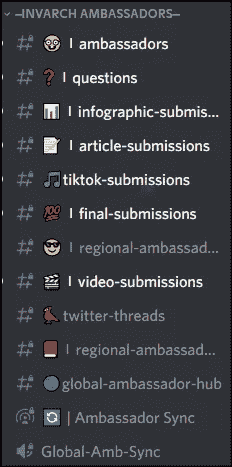
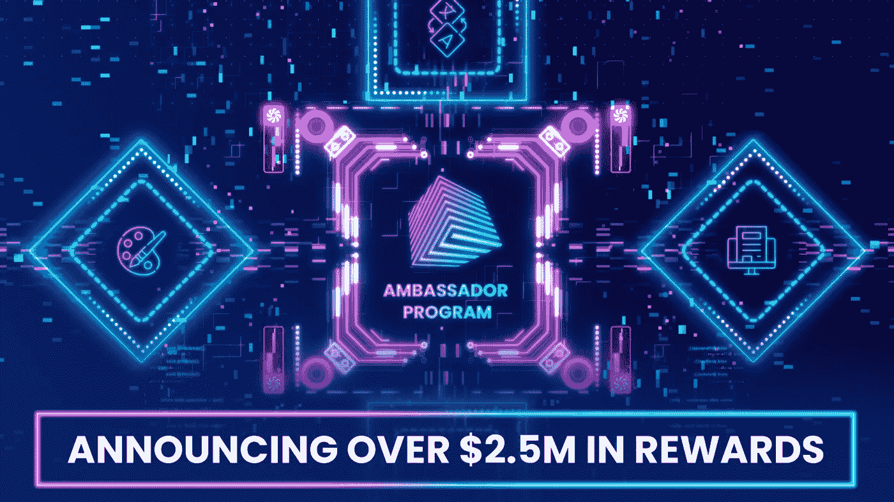
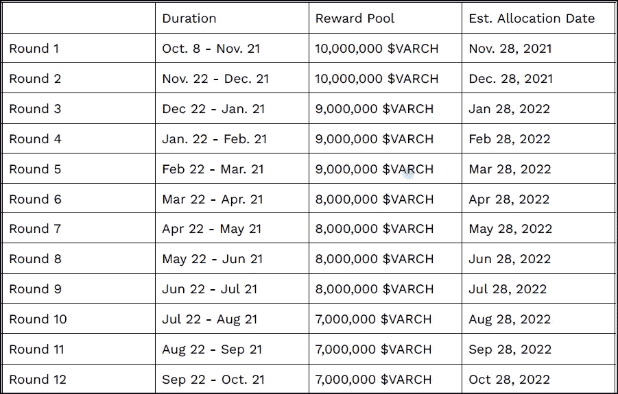

# 成为因瓦奇大使！应用程序打开！

> 原文：<https://medium.com/coinmonks/become-an-invarch-ambassador-applications-open-3e7485bbb21?source=collection_archive---------5----------------------->

InvArch 是一个用于 Web 3.0 的 IP 所有权、效用和交叉一致性认证协议。InvArch 的愿景是在理念和技术之间架起一座桥梁。这是同类网络中第一个允许用户将他们的想法转化为数字资产并将这些想法变为现实的网络！

## 因瓦奇大使计划

因瓦赫大使项目受其手册的约束，该手册最近已经更新，并将很快添加到新的主页上。

InvArch 目前有 700 名大使，并计划扩大到至少 1000 名。
InvArch 正在寻找多才多艺的大使来推动区块链革命的新时代。大使应该对社区的发展和联网感兴趣，成为 Polkadot 生态系统和 Web 3.0 爱好者的支持者，并对协议产生积极影响。

## 因瓦奇大使的任务是什么？

你可以在任何地方用手机或电脑完成大使任务。

作为 InvArch 大使，你应该能够使用社交媒体平台 Twitter、Subsocial、Medium、Reddit 以及最重要的 Discord。

大使们制作信息图表和视频，并撰写关于该项目的信息性文章。
创建的内容被提交给适当的部门进行审查。
大使等待地区大使的检查、修改或更正以及批准。如果任何内容必须被纠正或拒绝，理由是公平的。批准的提交会有一个绿色勾号。
之后，内容可以发布在相关的社交媒体平台上。最后，批准的作品需要以适当的格式发送到#Final-Submissions 通道。
每周五，社区经理将在全球大使的帮助下为最终提交的作品打分。每周五，提交的限制被重置，每一轮重置点。

## 因瓦奇大使奖励

因瓦奇大使计划非常慷慨。奖励包括:

*   关于该项目的第一手资料
*   直接询问因瓦奇团队成员
*   独家 NFTs，例如因瓦奇将发出一个特殊的 NFT，以赚取奖金，在其运动中成为一个波尔卡多 parachain。这个 NFT 横幅也可以用于 2022 年 Q2 的社区销售。

*   VARCH Token 奖励:
    -作为大使，你有绝佳的机会获得 var ch Token 作为完成特定大使任务的奖励。
    InvArch 团队将最初 VARCH token 供应量的 10%用于资助 in VARCH 大使计划。这些资金来自因瓦奇白皮书中提到的“生态系统增长”拨款。首先，这 100，000，000 VARCH 代币的价值为 2，500，000 美元，将在 12 个月内分发。

## 积分制

100，000，000 瓦奇通过 12 轮积分制分配。大使们可以通过他们的提交获得积分。每轮结束后，点数将被添加到一个池中。VARCH 代币将根据每轮累积的点数按比例分配，并根据点数由所有大使分享。

第二轮 InvArch 大使计划已经结束，正如所宣布的那样，第一轮的积分和 vArch 分配已经向机构群体完全公开。[看看第一批幸运大使的命运](https://docs.google.com/spreadsheets/d/e/2PACX-1vQ8Iu-2Oxfo5IBJxgahUDYQZ1KHQPnkYnYikPNCRKIfmuXAgY7UbBfW56HlTqVBIxeLQG7YAyyaqpap/pubhtml?gid=0&single=true)。

## 结论

做一个因瓦奇大使相对容易，也值得。看看[因瓦赫不和谐服务器](https://discord.gg/38Q6TmEMAc)了解更多。
你可以通过填写这张[申请表](https://docs.google.com/formsd/e/1FAIpQLScyek_HBYIhOHKlk3QJ2LnnKjhMHoDyEPDwuUYJ0igs2mbgQQ/viewform)来申请成为因瓦奇大使。

审查你的申请可能需要几周时间，而且不是每个人都能被接受，但你可以通过在 channel #starter-submissions 的 InvArch discord 服务器上展示你的技能来增加你的机会。
好运！

访问 InvArch 的官方渠道:
[**网站**](https://invarch.network/)[**推特**](https://twitter.com/InvArchNetwork)[**不和**](https://discord.gg/J5Qwcb7tbN)[**子社会**](https://app.subsocial.network/5857)[**媒介**](https://invarch.medium.com/)**电报**[**git hub【天**](https://github.com/Invarch)

> 加入 Coinmonks [电报频道](https://t.me/coincodecap)和 [Youtube 频道](https://www.youtube.com/c/coinmonks/videos)了解加密交易和投资

# 另外，阅读

*   [最佳比特币保证金交易](/coinmonks/bitcoin-margin-trading-exchange-bcbfcbf7b8e3) | [萝莉点评](/coinmonks/lolli-review-e6ddc7895ad8) | [比特币保证金交易](https://coincodecap.com/bityard-margin-trading)
*   [创造并出售你的第一个 NFT](https://coincodecap.com/create-nft) | [密码交易机器人](https://coincodecap.com/best-crypto-trading-bots)
*   [如何在 CoinDCX 上购买柴犬(SHIB)币？](https://coincodecap.com/buy-shiba-coindcx)
*   [CBET 评论](https://coincodecap.com/cbet-casino-review) | [库科恩 vs 比特币基地](https://coincodecap.com/kucoin-vs-coinbase) | [拜比特 vs 比特币基地](https://coincodecap.com/bybit-vs-coinbase)
*   [折叠 App 回顾](https://coincodecap.com/fold-app-review) | [LocalBitcoins 回顾](/coinmonks/localbitcoins-review-6cc001c6ed56) | [Bybit vs 币安](https://coincodecap.com/bybit-binance-moonxbt)