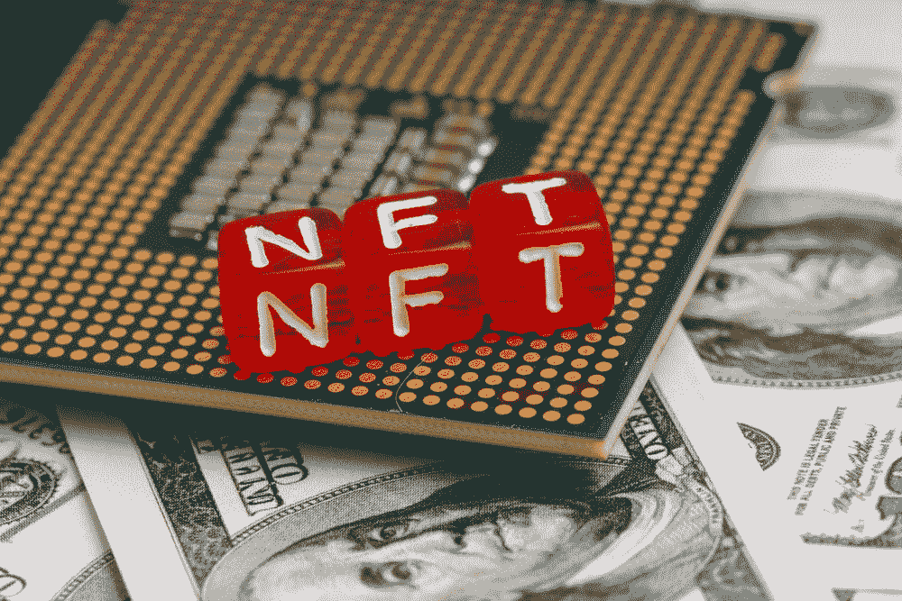

# 成为 NFT 职业选手

> 原文：<https://medium.com/coinmonks/becoming-an-nft-pro-26cb9466b192?source=collection_archive---------46----------------------->

# 什么是 NFT？

如果你一直生活在岩石下，你可能没有听说过**不可替代代币**。

这些特殊的加密令牌是不可替代的，充当数字资产的唯一标识符，通常以图片、视频或音乐的形式出现。

NFT 的行为可以证明你拥有这项资产，而世界上没有其他人可以证明你拥有这项资产。

**顶级 NFT 市场:** -[OpenSea](https://opensea.io/)
-[Rarible](https://rarible.com/)
-[Solana market place](https://solanart.io/)
-[Mintable](https://mintable.app/)

*其他新兴市场可能包括:*
-[-](https://looksrare.org/)
-[币安 NFT](https://www.binance.com/en/nft/home)

如果你是 NFT 的新用户，你需要一个加密钱包来存放你购买的 NFT。大多数*以太坊/多边形* NFT 市场使用的是“[元面具](https://metamask.io/)”(open sea，Rarible，LooksRare，Mintable…)而*索拉纳* NFT 市场使用的是“[幻影](https://phantom.app/)”钱包

# **如何用 NFT 的**赚$$$呢

*   *(低买高卖)*
*   **(随着密码价格上涨，NFT 价格也上涨。一些 NFT 的项目会给你特别的奖励，因为你只是拿着他们的 NFT**
*   *****出售*** (可以尝试出售自己的数字资产(图片、音乐等……))**

# **NFT 公司能为你做些什么？**

*   *****受欢迎程度*** (仅仅拥有某些 NFT 就会吸引其他志同道合的 NFT 爱好者，这可能会提升你的社会地位)**
*   *****财富*** (及早介入一个会爆发的 NFT 项目，或者卖掉自己的艺术品以获得丰厚利润)**

********

# ******NFT 的用例******

*   *********股份*** (NFT 可以作为一家企业的股份……拥有我们 NFT 的 1 份股份就相当于我们企业的 1 份股份，持有 NFT 可以获得股息)******
*   *********娱乐*** (想象一下，如果《低俗小说》被分成每一帧，每一帧都作为 NFT 出售……)【这种情况确实发生过，但不是整部电影；]](完整版的电影、歌曲、艺术、电视节目和社交媒体帖子/视频都将成为 NFT 的，并出售给那些想从 NFT 的提供商那里分一杯羹的人。******

# ********投资 NFT 需要注意什么:********

*   *********社区*** (这可以说是投资 NFT 项目时最重要的因素……社区的参与度如何？看起来是真订婚还是假订婚？社区是不是很活跃，总是想从项目中得到更多？他们的 Twitter 和 Discord 活跃度如何？)******
*   *********团队*** (团队是真正的“doxxed”吗？他们有这方面的经验吗？业主已经有观众了吗？)******
*   ********效用**(对新的 NFT 项目没有效用就像现在搬起石头砸自己的脚……NFT 的项目看起来不仅仅是简单的艺术，除非你的艺术很棒。)******

************

# ******永远要小心！！！******

******我怎么强调这一点都不为过！保持高度警惕，注意你点击的每一个链接，你做的每一笔交易，以及你接触的每一个人，因为骗子在这个空间里比比皆是，最好看的项目都被取消了。******

******点击所有链接之前，要再三检查，确保它们是你要找的官方链接。在发送 NFTs(或加密)给任何人之前，也要检查三次所有的钱包地址。******

********跟随我们的密码/NFT/区块链/元宇宙之旅**
[*insta gram*](https://www.instagram.com/thedudescrypto/)[*Twitter*](https://twitter.com/TheDudesCrypto/status/1506339874558955522?s=20&t=jS0t3kSXZ3wzKfomvvsCtA)[*YouTube*](https://youtu.be/jSBagJ2ZOvU)[*抖音*](https://www.tiktok.com/@thedudescrypto/video/7077986022054743302?is_copy_url=1&is_from_webapp=v1)*[*不和*](https://discord.gg/Cv8v2Ert8m)*******

******干杯，
公子哥儿们的密码******

> *******加入 Coinmonks* [*电报频道*](https://t.me/coincodecap) *和* [*Youtube 频道*](https://www.youtube.com/c/coinmonks/videos) *了解加密交易和投资*******

# ******另外，阅读******

*   ******[3 commas Review](/coinmonks/3commas-review-an-excellent-crypto-trading-bot-2020-1313a58bec92)|[Pionex Review](https://coincodecap.com/pionex-review-exchange-with-crypto-trading-bot)|[coin rule Review](/coinmonks/coinrule-review-2021-a-beginner-friendly-crypto-trading-bot-daf0504848ba)******
*   ******[莱杰 vs Ngrave](/coinmonks/ledger-vs-ngrave-zero-7e40f0c1d694) | [莱杰 nano s vs x](/coinmonks/ledger-nano-s-vs-x-battery-hardware-price-storage-59a6663fe3b0) | [币安评论](/coinmonks/binance-review-ee10d3bf3b6e)******
*   ******[by bit Exchange Review](/coinmonks/bybit-exchange-review-dbd570019b71)|[bit yard Review](https://coincodecap.com/bityard-reivew)|[Jet-Bot Review](https://coincodecap.com/jet-bot-review)******
*   ******[3 commas vs crypto hopper](/coinmonks/3commas-vs-pionex-vs-cryptohopper-best-crypto-bot-6a98d2baa203)|[赚取加密利息](/coinmonks/earn-crypto-interest-b10b810fdda3)******
*   ******最好的比特币[硬件钱包](/coinmonks/hardware-wallets-dfa1211730c6) | [BitBox02 回顾](/coinmonks/bitbox02-review-your-swiss-bitcoin-hardware-wallet-c36c88fff29)******