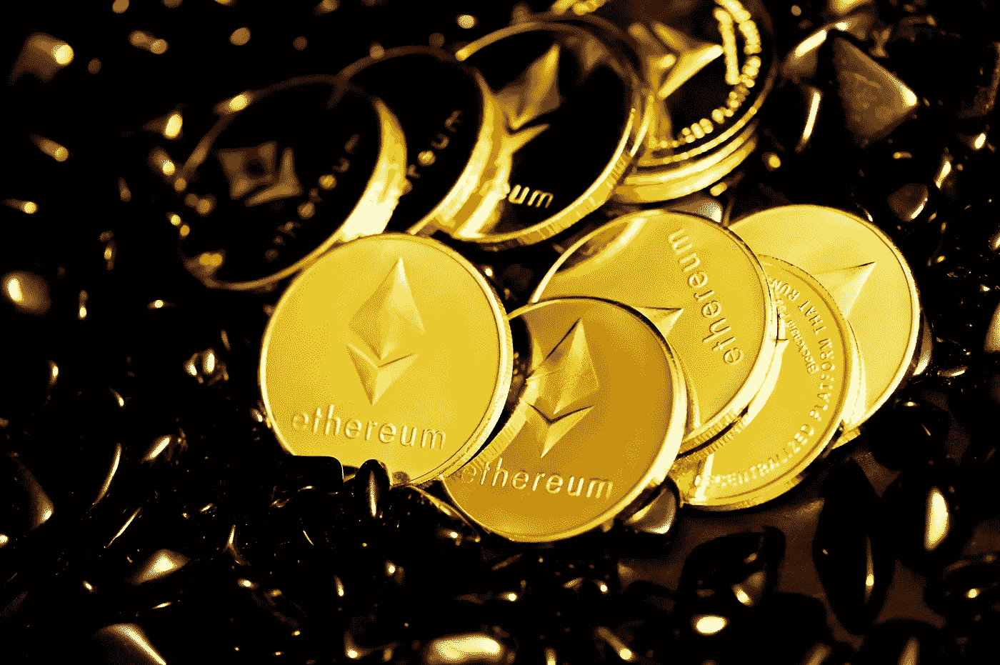

# 在回到 3300 美元之前，以太坊的价格将会巩固

> 原文：<https://medium.com/coinmonks/before-returning-to-3-300-the-ethereum-price-will-consolidate-54ed352c6d9b?source=collection_archive---------74----------------------->

Source photo Unsplash.com

随着令牌继续巩固，以太坊的价格可能会下跌，以找到关键的支撑位。乐观情绪的高涨可能推动 ETH 上涨，下一个目标是 3272 美元。
2851 美元，以太坊可能面临最艰难的挑战。
在向上上涨之前，以太坊的价格可能会继续下跌，以寻找关键的支撑位。联邦理工学院将不得不…