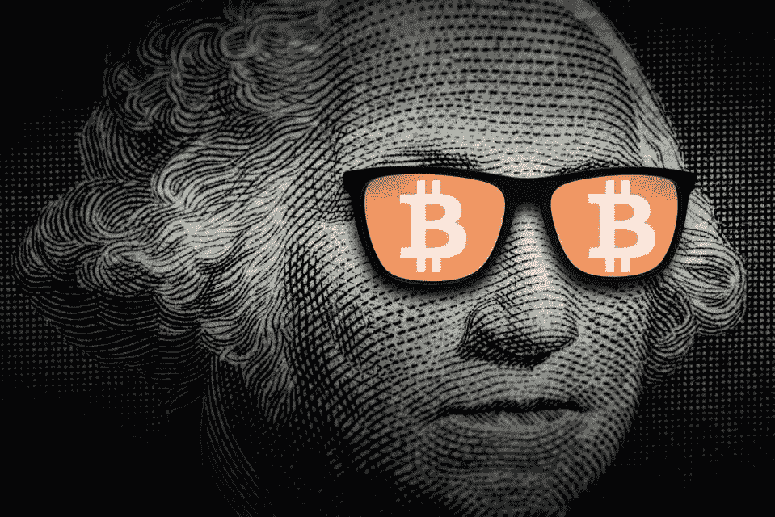

# 数字资产——购买前应该问的 32 个问题

> 原文：<https://medium.com/coinmonks/before-you-invest-answer-these-two-questions-20177b4b74ad?source=collection_archive---------43----------------------->

在你投资之前，请回答这两个问题:

首先，确定你的时间范围。你对短期交易还是长期投资感兴趣？

2.你要待多久？(选择一个最小值)

然后问自己以下关于硬币/项目的问题:

3.币有项目网站吗？

4.硬币是否用真实图片和真实外部简介链接列出项目团队成员？

5.该项目有“白皮书”吗？(读一下。)

6.市场问题是否被明确识别？

7.是否清楚地解释了解决方案(即“用例”)。

8.提出的解**只有**是硬币可解的吗？

9 .白皮书是通俗易懂还是过于复杂？

10.硬币的“象征经济学”是什么？

11.该币是否有可识别的公司支持？

12.硬币现在正在被使用吗？

13.硬币的缩放用法是什么(生长还是死亡？)

14.查看 CrunchBase.com 项目简介

15.它获得了哪些资助？

16.项目组是谁？他们的相关经历是怎样的？

17.这个项目消耗他们现金的速度有多快？

18.他们做生意多久了？

19.高管团队的流动率是多少？

20.查看项目的 Github.com 页面

21.项目开发者基数有多大？趋势是什么？(成长还是死亡？)

22.项目有多少提交(提交的代码)？(成长还是死亡？)

23.项目分叉了吗？如果有，是多少次？

24.它们是代码中已知的安全缺陷吗？

25.查看项目的 app.Santiment.net 简介

26.社交量是多少？(增长，零星，还是下降？)

27.价格是否只随着社交量的增加而上涨？(泵 N 卸载)

28.项目的网络活动是什么？(增长还是下降？)

29.该项目的每日活跃地址是多少？(增长还是下降？)

30.链上鲸的数量是多少？(增长还是下降？)

31.什么是交易量和市值？(增长还是下降？)

32.媒体是如何报道这个项目的？(Newsnow.com—按项目名称搜索)

*   *关于为什么这些问题如此重要的更详细的分析，请访问我的其他文章，包括“如何研究任何数字资产的基础知识”*

> 加入 Coinmonks [电报频道](https://t.me/coincodecap)和 [Youtube 频道](https://www.youtube.com/c/coinmonks/videos)了解加密交易和投资

# 另外，阅读

*   [3 商业评论](/coinmonks/3commas-review-an-excellent-crypto-trading-bot-2020-1313a58bec92) | [Pionex 评论](https://coincodecap.com/pionex-review-exchange-with-crypto-trading-bot) | [Coinrule 评论](/coinmonks/coinrule-review-2021-a-beginner-friendly-crypto-trading-bot-daf0504848ba)
*   [莱杰 vs Ngrave](/coinmonks/ledger-vs-ngrave-zero-7e40f0c1d694) | [莱杰 nano s vs x](/coinmonks/ledger-nano-s-vs-x-battery-hardware-price-storage-59a6663fe3b0) | [币安评论](/coinmonks/binance-review-ee10d3bf3b6e)
*   [Bybit Exchange 评论](/coinmonks/bybit-exchange-review-dbd570019b71) | [Bityard 评论](https://coincodecap.com/bityard-reivew) | [Jet-Bot 评论](https://coincodecap.com/jet-bot-review)
*   [3 commas vs crypto hopper](/coinmonks/3commas-vs-pionex-vs-cryptohopper-best-crypto-bot-6a98d2baa203)|[赚取加密利息](/coinmonks/earn-crypto-interest-b10b810fdda3)
*   最好的比特币[硬件钱包](/coinmonks/hardware-wallets-dfa1211730c6) | [BitBox02 回顾](/coinmonks/bitbox02-review-your-swiss-bitcoin-hardware-wallet-c36c88fff29)
*   [BlockFi vs 摄氏](/coinmonks/blockfi-vs-celsius-vs-hodlnaut-8a1cc8c26630) | [Hodlnaut 点评](/coinmonks/hodlnaut-review-best-way-to-hodl-is-to-earn-interest-on-your-bitcoin-6658a8c19edf) | [KuCoin 点评](https://coincodecap.com/kucoin-review)