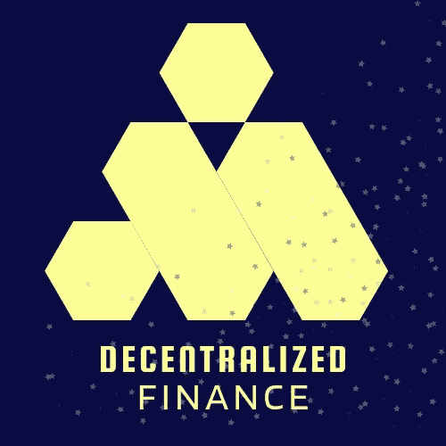

# 分散金融入门指南。

> 原文：<https://medium.com/coinmonks/beginner-guide-to-decentralized-finance-defi-30f9c6cb510d?source=collection_archive---------19----------------------->

分散金融(DeFi)创建了一个金融系统，在这个系统中，人们可以在没有任何中介的情况下转移资金。通过智能合同，区块链网络上的所有分散融资活动都实现了自动化。

DeFi 上的去中心化应用开放了各种活动让用户从中受益，例如，用户可以在生态系统中借贷，而无需提供任何像 KYC 这样的敏感信息。分散交换是 DeFi 的另一个功能，用户可以用很少的交易费与其他资产交换代币。

# 什么是 DeFi？

分散金融(DeFi)指的是一个由数字资产、分散应用程序、智能合同和协议组成的生态系统，构建在区块链网络之上。

去中心化金融旨在创建一个开源、无许可、透明的金融系统，不需要中介就可以为所有人所用。

该系统使买家、卖家、贷款人和借款人能够通过点对点方式与生态系统互动，而不是像银行这样的机构来促进交易。DeFi 还允许用户完全控制他们的资金，这使其安全可靠，不会出现第三方访问资金的问题。

这个系统是开源的，我们的意思是每个有钱包和一点资金的人都可以和这个生态系统互动。在不同国家的用户之间可以进行与生态系统的互动和交易之前，不必成为百万富翁。

DeFi 应用程序涵盖了广泛的服务，如分散式交易所(DEXes)、NFT 行业、博彩系统、借贷等等。分散交易允许用户以最低的交易费用用其他资产交换代币。集中式交易所也交换代币，但费用更高。

稳定币的创造和使用也是生态系统的目标。这些硬币与法定货币的价值挂钩，如欧元、人民币和美元。稳定的硬币对利率波动有抵抗力，这使它们适合于区块链的金融交易。一个主要的例子是戴，它是在以太坊发行的，并且与美元挂钩。

# DeFi 中的智能合同

分散式应用程序根据其智能合约在区块链上的编程方式来工作。

智能合约是分布在区块链上的数千台计算机上运行的代码片段。一旦部署在区块链，它只能由分散的自治组织控制。

DeFi 应用程序工作的框架和双方之间交易的执行由智能合约提供，因为它们编码了这些服务运行所需的活动。

# 世卫组织发明了 DeFi？

DeFi 不是某个人发明的，DeFi 应用程序首先出现在区块链以太坊上，这是由 Vitalik Buterin 发明的，从那以后，它们被发现出现在另一个利用智能合约实现交易自动化的网络上，如币安智能链和雪崩。

# DeFi 的主要使用案例

# 借贷

如果你有加密货币，你可以借出它，作为回报，你可以在一些协议上获利，比如 Aave 或 compound。您也可以从这个协议中借钱，这将要求您在访问借入的资金之前存放一些加密抵押品。

大多数 DeFi 协议会要求你存入多于你所借的金额，以避免抵押品价值下降时的损失，这可能对贷方不利。但你需要小心，如果资产价值下跌太多，协议可以采取你的抵押品，以避免损失。

由于协议是建立在区块链之上的，它要求借贷双方之间有最低限度的信任，在 DeFi 中，你不需要在获得这些服务之前提供任何 KYC(了解你的客户)。

# 分散的市场

这是 DeFi 生态系统中最重要的方面，是让你获得金融服务的方面。

DeFi 中的应用程序，如分散式交易所，为您提供了交易数字资产的空间，无需中介来保管您的资金，交易是在智能合约的帮助下在用户钱包内进行的。

除了用户可以完全控制他们的资金之外，它还带来了比集中交易更低的交易费用，因为它需要更少的维护工作。

# DeFi 会杀死 BANKS 吗？

传统银行能接触到你的钱，无论何时你想转账，他们都会代表你帮你转账。

在 DeFi 生态系统中，你可以自己控制你的资产，并随时转移，你不需要提供任何关于你自己的敏感信息，这是使用传统银行时的基本要求，你需要提供 KYC，通过信用检查，有时还需要证明你的收入。

传统银行很容易被黑客攻击，这可能导致永久性的金钱损失。但所有这些解决方案都是 DeFi 未来的目标，所有资金通过区块链网络都是安全的。

年龄是传统银行的另一个障碍，用户需要达到一定的年龄才能拥有账户，DeFi 不要求一定的年龄，你需要的是一个钱包和钱包里的一些资金，有了这些你就可以与 DeFi 互动。

# 分散应用

这是以太坊网络上的一个分散市场，在这里你可以借入和借出不同类型的硬币，从稳定币到备用币。

Aave 是由 Aave 协议发布的治理令牌的名称。只有 Aave 持有者才能管理协议。

这是以太坊网络上最大的加密货币交易所之一，他们利用智能合约来自动化所有活动。

人们可以通过向协议提供流动性池来获利。

根据 2020 年的交易量，uniswap 是最大的加密货币交易所，也是所有应用中最分散的应用。

**马克尔道:**以太坊生态系统中最古老的分散交易所之一，他们的主要功能是创造稳定的货币戴，其价值与美元挂钩。

只有治理令牌(MKR)的持有者才有投票权对协议进行任何更改。

# 结论

分散融资(DeFi)带来了一种更好的可选资金保障方式，因为每个分散应用程序都构建在区块链之上。用户可以保护和转移他们的资金，而不需要中介。人们可以通过在 DeFi 应用程序上提供流动性池、借贷资产来赚钱。

> *加入 Coinmonks* [*电报频道*](https://t.me/coincodecap) *和* [*Youtube 频道*](https://www.youtube.com/c/coinmonks/videos) *了解加密交易和投资*

# 也阅读

[https://medium.com/coinmonks/leveraged-token-3f5257808b22](/coinmonks/leveraged-token-3f5257808b22)

[https://coincodecap.com/crypto-exchange](https://coincodecap.com/crypto-exchange)

[https://coincodecap.com/best-swap-platforms](https://coincodecap.com/best-swap-platforms)

[https://coincodecap.com/best-online-casinos](https://coincodecap.com/best-online-casinos)

[https://medium . com/coin monks/top-5-crypto-lending-platforms-in-2020-that-you-need-to-know-a 1b 675 CEC 3 fa](/coinmonks/top-5-crypto-lending-platforms-in-2020-that-you-need-to-know-a1b675cec3fa)

[https://medium . com/coin monks/the-best-cryptocurrency-hardware-wallets-of-2020-e28 B1 c 124069](/coinmonks/the-best-cryptocurrency-hardware-wallets-of-2020-e28b1c124069)