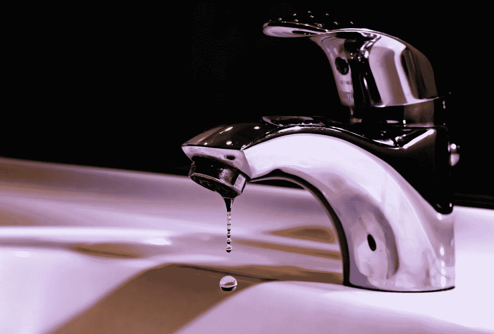

# 加密水龙头初学者指南

> 原文：<https://medium.com/coinmonks/beginners-guide-to-crypto-faucets-7204706d7bb0?source=collection_archive---------16----------------------->

[消防龙头](https://firefaucet.win/ref/895557)

Photo by [Jos Speetjens](https://unsplash.com/@jefspeetjens?utm_source=medium&utm_medium=referral) on [Unsplash](https://unsplash.com?utm_source=medium&utm_medium=referral)

# 水龙头秘密农业

谁不想要免费的密码？自从加密开始，水龙头被用来创造更多的加密意识。从比特币开始，第一个水龙头将为每项任务出售 5 BTC，如验证码、观看广告等。按照今天的 BTC 价格，那将价值超过 20 万美元。

如今，水龙头只是赚取免费密码的一种方式，你可以用你的时间来换取密码。加密的原始原因是一样的，你完成任务，促进加密赚取加密。这通常意味着关注项目的社交媒体账户、玩游戏、看广告等等。

在这篇介绍中，我们将讨论如何找到水龙头，如何注册一个流行的水龙头，以及如何为 crypto 服务。希望这能让你尝到水龙头的滋味，并鼓励你进入 crypto。你可以学习把密码从水龙头转移到你的钱包。为了给你一个详细的介绍，我将详细介绍一下[消防水龙头](https://firefaucet.win/ref/895557)是如何工作的。

**警告:**确保你不需要购买或存放 crypto 就可以开始使用。通常，这是一个危险信号。不要与任何人共享您的私钥或恢复短语。此外，确保您使用的是 https(地址栏中的锁图标)。我会使用一个单独的专用浏览器，没有任何广告拦截器来完成某些任务，以保护自己免受一些攻击。在任何网站上输入任何私人信息都要小心。除非你喜欢手机/平板上的一堆应用，否则挑挑你安装什么应用来换积分。

# 从消防水龙头开始

找到加密水龙头的最好网站之一是 bestfaucetsites.com 网站。你可以搜索你想获得的密码。这个表格显示了你用最低取款金额和取款费赚取加密的频率。这是一个很好的方式来确定哪个水龙头使用赚取一定的密码。多硬币(最后一个选项)也是找到水龙头的好方法，在那里你可以赚取多种类型的密码。在这个例子中，我将讲述我使用[消防水龙头](https://firefaucet.win/ref/895557)的经历。

# 登记

*   点击注册按钮。输入您的电子邮件、用户名和密码。
*   点击接受条款和隐私声明。
*   点击 reCaptcha 框
*   点击提交
*   你必须验证你的电子邮件地址。

# 基础知识

有不同的活动，有不同的奖励。所以你要做的是，完成一项活动，获得自动索赔点(ACP)。这是你正在赚的“硬币”。稍后，您可以将 ACP 转换为加密“钱包”。根据我的经验，1.1K 的 ACP 大约是 1 美元。钱包余额以美元存储，因此加密值将随市场波动。对于每个活动，你还可以获得活动积分(AP)。这是你的“经验”点，当你达到不同的里程碑时，你会得到一些奖励。有些活动您只能做一次，并且当天的开始/结束时间在 UTC 时区内。所以你需要在安排你的活动时间时考虑到这一点。这基本上涵盖了。看起来很简单，对吧？我们开始吧！

# 水龙头

这是主水龙头。你可以每 30 分钟认领一次。你必须通过一些验证码(Solvemedia，hCaptcha，或 reCaptcha)。一旦确认，你会得到一些随机数量的 ACP 和 10 AP。请注意，水龙头页面上有一些广告。有时，“完成”按钮会创建一个弹出窗口，只有当你第二次按下该按钮时才起作用。你会看到其他活动也有类似的招数让你打开更多带广告的网页。

# 每日奖金

这类似于你必须输入验证码才能获得随机的 ACP 和 AP 奖励。这将在 UTC 午夜重置，因为网站在确定一天的开始和结束时间时使用 UTC 作为时区。

# 点击付费(PTC)

对于这些，你可以通过浏览网页获得报酬。每个链接将打开一个新的选项卡/窗口。你必须把你的电脑的焦点放在那个网页上 8 秒钟。之后，你会得到一个 4 位数的图像，你必须输入这个图像来证明你不是机器人。对于每个网页，你得到 100 ACP 和 50 AP。您可以在 UTC 时区每天访问一次每个网页。

# 调查

这是你能挣一些严肃的 ACP 和 AP 的地方。许多研究人员，学术和商业组织，正在寻找人们填写调查来回答一些问题。你可以点击“调查”按钮，或者点击“Offerwall”找到更多的调查。我发现我用完了所有的调查，不得不去 offerwall 寻找更多的调查。

对于 offerwall 中的许多调查，你需要回答一些关于你属于哪个人群的初步问题。这将用于对你进行预筛选，看测量员在他们的调查池中寻找什么。有时，这些问题与产品、政治或医疗保健有关。主题根据研究的需要而变化。对于每个填写的调查，花费 1 分钟到 30 分钟的奖励可以在 8K 到 200K 之间。到目前为止，这是快速获得 ACP 的最好方法，因为有足够的调查供你一天 24 小时进行。

# 短链接

这些只是链接，你需要等待几秒钟(在某些情况下，你需要点击一些东西来启动计时器或在计时器超时后重定向)，点击一些东西(有时在几个新标签后多次)，向下滚动和/或完成验证码一定次数。有一次，我不得不按下后退键来取得进展。一些网站具有广告拦截器检测功能，因此如果您使用内置广告拦截器的浏览器或将其作为扩展，网站将检测并阻止您完成该活动。为了获得奖励，您可能需要多次通过某个链接。只是想弄清楚如何完成这个活动就像一个拼图。最后，一些链接是 NSFW，所以要小心，你是在一个私人的环境中工作时，这些短链接。

短链接奖励是每个短链接 50 AP 和 5–9 ACP。每个短链接完成 24 小时后重置。一天内完成 5、10、20 和 35 个短链接还会有奖励(在主页的任务下)。

# 跟踪活动和收入

在仪表板上，您应该跟踪的主要数字是 ACP。当你点击“转换”按钮时，这些将被转换成美元存入你的钱包。在那里，你可以选择你的美元存储在哪个加密钱包中。除此之外，还有你的个人数据。它包括 10%的奖金，级别和经验.%的奖金是基于你的水平。每收到一份奖励，您将额外获得%的奖金。上涨 0.001%/级别。等级是你达到 AP 里程碑的次数。其他统计数据包括:

*   **Exp** —你的经历，又名活动积分(AP)。
*   **排名** —显示你在 APs 排行榜上的排名。在一天结束时，会有一笔奖金支付给当天的前 20 名。
*   **声称今天** —你一天完成的活动数量。
*   **今天的短链接** —追踪你已经完成的短链接数量。

# 退出

需要将您的 ACP 交换到您选择的加密钱包。一旦被转换，它被储存为美元。然后，您可以将硬币提取到您设置的钱包地址。转换率是基于美元/硬币市场汇率的一些定义。所以，如果你想最大化你的收益，你应该在硬币的美元价格低的时候转换。对于每个加密，有 WP 和 FP，状态为填充、低或空。这意味着可用于钱包支付或水龙头支付的密码已满、低或空。提取限制是每天价值 10 美元的密码。仪表板页面上还有“自动水龙头”选项。当你打开它时，ACP 每分钟以大约 40 ACPs/分钟的速度转换为硬币列表。

# 优化技巧

同时做不同的活动。就像任何类型的农业一样，有些东西需要时间来重新设定/准备好与它们互动。所以优化你的水龙头养殖也是一样的。你想让等待和活动并行，这样你总是在做一些事情，也就是最大化利用你的时间。在用了几天[消防栓](https://firefaucet.win/ref/895557)之后，我发现这里有一些非常有效的优化。

*   索赔任务奖励每天一次，即完成短链接获得奖金，提供墙壁和水龙头索赔。
*   每日奖励每天一次。
*   小面—每 30 分钟—花 2 分钟
*   调查—花费 5-30 分钟—您可以随时休息
*   短链接——花费 5-15 分钟——需要等待 10 秒以上才能进行交互
*   PTC —花费 2 分钟—在输入 4 位数之前需要等待 8 秒钟

你可以尝试不同的组合来最大化你的收益。我发现，如果我在看一些 YouTube 视频或参加一些社交变焦会议，我可以在大约 30-45 分钟内完成 35 个短链接，如果我同时做 4-5 个的话。你不需要想太多，这样你就可以在完成简短链接的同时把大部分注意力放在会议或视频上。

这些调查往往报酬最高，因为 10-20 分钟的调查可以获得 2 万个 ACP。但是他们需要更多的注意力，因为有时他们会加入一些恶作剧的问题来看看你是否在注意。例如，他们可能会说:“这是为了检查你是否在集中注意力，请选择最不同意的”。我能抓住大部分，所以不知道如果错过太多会发生什么。一些警告说，如果你错过了太多的调查，你可能会被拒绝填写一些调查。

# 结论

在这篇文章中，你已经学习了什么是刻面，并通过一个[消防水龙头](https://firefaucet.win/ref/895557)教程如何注册和赚取加密。我还提供了一些关于如何并行化你的活动以最大化你每天收入的技巧。通过所有这些优化，我的收入在将近 3 个小时的活动中大概是 6 美元。我每小时挣 2 美元。因此，如果你认为一些硬币的价格在未来几年内会涨到 10 倍，那么它将是 20 美元/小时，这比一些最低工资高一点。如果比特币的价值像过去 10 年那样上涨 10，000 倍，那么你每小时就能赚 2 万美元。当然，有些硬币可能会变为零，所以明智地选择你的硬币。如果你喜欢水龙头，你可以去 bestfaucetsites.com 的[看看更多的水龙头。快乐的秘密农场！](https://bestfaucetsites.com/)

**注**:本文部分链接为推荐链接。如果你在他们的网站上注册，我会得到一些密码。

> 加入 Coinmonks [电报频道](https://t.me/coincodecap)和 [Youtube 频道](https://www.youtube.com/c/coinmonks/videos)了解加密交易和投资

# 另外，阅读

*   [币安 vs FTX](https://coincodecap.com/binance-vs-ftx) | [最佳(SOL)索拉纳钱包](https://coincodecap.com/solana-wallets)
*   [比诺莫评论](https://coincodecap.com/binomo-review) | [斯多葛派 vs 3Commas vs TradeSanta](https://coincodecap.com/stoic-vs-3commas-vs-tradesanta)
*   [Capital.com 评论](https://coincodecap.com/capital-com-review) | [香港的加密借贷平台](https://coincodecap.com/crypto-lending-hong-kong)
*   [如何在 Uniswap 上交换加密？](https://coincodecap.com/swap-crypto-on-uniswap) | [A-Ads 审查](https://coincodecap.com/a-ads-review)
*   [WazirX vs coin dcx vs bit bns](/coinmonks/wazirx-vs-coindcx-vs-bitbns-149f4f19a2f1)|[block fi vs coin loan vs Nexo](/coinmonks/blockfi-vs-coinloan-vs-nexo-cb624635230d)