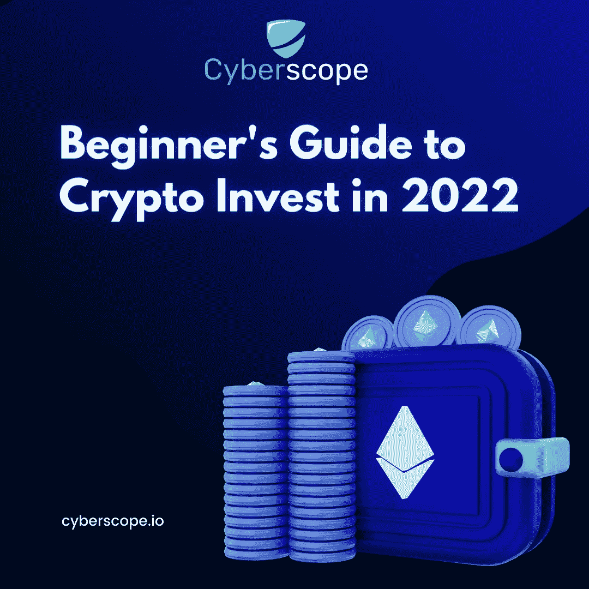

# 2022 年加密投资入门指南

> 原文：<https://medium.com/coinmonks/beginners-guide-to-crypto-invest-in-2022-461940ba63cf?source=collection_archive---------39----------------------->

# 1)不要用你需要的钱投资

这是不言而喻的——永远不要使用对你的生活有重大影响的钱。如果你需要钱来应付紧急情况，买房子，甚至只是为了活到下一个发薪日，不要冒险投资。高风险投资不适合手头拮据的人——它们会很快成为比其他任何东西都更大的财务负担。

# 2)了解市场

投资前评估市场。你不是唯一一个想通过加密货币赚钱的人，所以要确保其他人不会在你想买入的同时抛售他们的货币。如果你想检查市场是否上涨，你可以使用图表或价格历史记录等工具。

# 3)只用你至少一年内不需要的钱进行高风险投资

高风险投资是指在相当一段时间内可能不会给你的投资带来良好回报的投资。高风险投资的主要目标是快速赚钱，而且通常会发生得如此之快，以至于你可能甚至不到一年就能让你的钱翻倍。然而，这些投资耗时如此之长，以至于无法在官方截止日期前完成，这种情况并非闻所未闻。如果你用一年内需要的钱投资，那么如果投资失败，就没有安全网。不要冒着损失更多现金的风险，试图用更高的风险来弥补高风险投资中的损失。

# 4)不要单干

说到投资，你做的每一个决定都会影响到你的钱，错误可能会付出很大的代价。这就是为什么找一个拥有相关金融或商业知识的伙伴会非常有帮助，尤其是在审查选项和讨论策略的时候。你们可以一起工作，帮助对方做出最好的决定。

# 5)不要未经研究就贸然进行高风险投资

像所有投资一样，研究基础资产并确保你明白你将血汗钱投资在哪里是很重要的。如果你打算投资一个像 crypto 这样的高风险市场，你需要考虑很多事情。如果你正在考虑投资，在投入任何资金之前，确保你已经在市场上做了功课，并且你对这个决定有信心。检查[被审计的](https://www.cyberscope.io/#audit)和[被审计的](https://www.coinscope.co/kyc)项目，确保它们满足安全要求。

我们有很多充分的理由在做出任何决定之前研究高风险投资。在你开始投资之前，确保你花时间看了所有可用的信息，包括公司过去的表现和它的结构。许多高风险投资都是骗局，所以在继续投资之前，一定要检查危险信号。最后，网上有很多[工具](/coinmonks/free-smart-contract-audit-tools-for-investors-77cdbade85e1)帮你下结论。

你可以在这里阅读更多关于高风险投资策略[。](https://www.coinscope.co/blog/a-guide-to-high-risk-investments)

# 6)在投入资金之前，测试市场并参与空投

空投是加密货币区块链之后的一种促销营销活动，其中新的硬币或代币被引入市场。当新硬币推出时，该平台会向早期用户宣布免费的货币赠品。用户通常必须充当交换者，这意味着他们可能需要注册账户或与粉丝分享社交媒体帖子。

每个完成任务的人都将成为空投的合格参与者。空投当天，该平台将把承诺数量的货币转移到少数幸运获奖者的公共钱包中。在大多数情况下，参与者不能保证空投，因为他们每次都抽取大量的数字。

参加[空投](https://www.coinscope.co/blog/crypto-airdrops-how-to-earn-tokens-without-risking-any-money)是一个非常好的实践，因为你可以不用冒任何钱的风险就能获得代币。

[*Cyberscope*](https://www.cyberscope.io/) *是密码行业领先的智能合同审计& KYC 公司之一，已经审计了 500 多个区块链项目和 NFT。所有主要发射台的官方合作伙伴。*

…

*最初发布于*[*https://www . cyber scope . io*](https://www.cyberscope.io/)*。*

> 加入 Coinmonks [电报频道](https://t.me/coincodecap)和 [Youtube 频道](https://www.youtube.com/c/coinmonks/videos)了解加密交易和投资

# 另外，阅读

*   [Bookmap 评论](https://coincodecap.com/bookmap-review-2021-best-trading-software) | [美国 5 大最佳加密交易所](https://coincodecap.com/crypto-exchange-usa)
*   [加密交易机器人](/coinmonks/crypto-trading-bot-c2ffce8acb2a) | [造币评论](https://coincodecap.com/coingate-review)
*   最佳加密[硬件钱包](/coinmonks/hardware-wallets-dfa1211730c6) | [Bitbns 评论](/coinmonks/bitbns-review-38256a07e161)
*   [新加坡十大最佳加密交易所](https://coincodecap.com/crypto-exchange-in-singapore) | [购买 AXS](https://coincodecap.com/buy-axs-token)
*   [红狗赌场评论](https://coincodecap.com/red-dog-casino-review) | [Swyftx 评论](https://coincodecap.com/swyftx-review)
*   [投资印度的最佳密码](https://coincodecap.com/best-crypto-to-invest-in-india-in-2021)|[WazirX P2P](https://coincodecap.com/wazirx-p2p)|[Hi Dollar Review](https://coincodecap.com/hi-dollar-review)