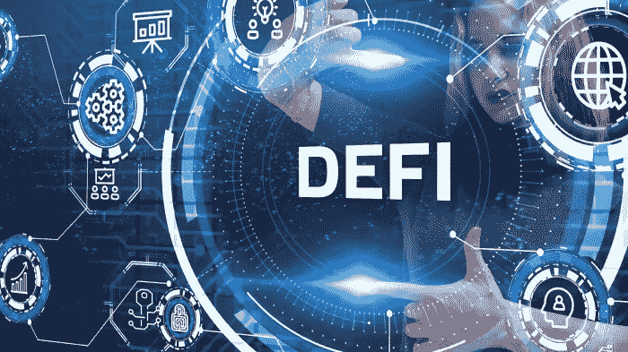

# 用简单英语解释的分散金融初学者指南

> 原文：<https://medium.com/coinmonks/beginners-guide-to-decentralized-finance-explained-in-plain-english-34888bb5e9b5?source=collection_archive---------22----------------------->

[Financial times](https://www.ft.com/content/b856c2fd-5019-4002-b549-5b047c35e00f)

分散金融(DeFi)旨在纠正当前银行系统的缺陷。想象一下，一个新的金融系统全天候运行，用户可以控制他们的钱，交易成本很低甚至为零？这些是分散融资的承诺。

有趣的是，这个金融系统不仅仅是科幻电影里的东西。分散金融已经出现了。 [DeFi 在过去几年里发展如此之快，以至于它的重要性已经不容忽视。这一件将帮助你把你的 DeFi 游戏从一个新手提升到一个 DeFi 高手。您将了解分散金融，Defi 如何工作，以及以太坊区块链上的顶级 DeFi 协议。让我们深入研究一下。](https://www.circle.com/blog/the-growth-of-defi)

# 什么是分散金融？

分散金融是由两个术语创造的——分散和金融。分散化描述了一个没有集中控制或权力的开放系统。另一方面，金融涉及借贷、储蓄、保险等经济活动。

在这一点上，你可以把分散金融看作是一个开放的金融系统，让用户控制他们的资金，并使他们能够在不受任何中央当局控制的情况下获得金融服务。

Defi 的关键驱动因素是其透明度、无许可性质和激励制度。例如，在 DeFi 中，任何地方的任何人都可以提供并接受金融服务。

# 分散融资(DeFi)是如何运作的？

在用户可以访问传统金融(TradFi)金融服务之前，必须存在两个实体。第一个是保存或提供资金的银行或资金管理者，第二个是制定银行和用户之间协议条款的法律机构。

然而，DeFi 运行的不是中介，而是[的智能合同](https://academy.binance.com/en/glossary/smart-contract)。这些是指定双方合同条款的区块链电码集。当相关方履行协议时，代码将执行给定的指令。

DeFi 协议中的循环供应由称为液体提供者的成员提供，以分享奖励和参与协议管理。

访问智能合同和使用 DeFI 需要一些独特形式的分散式应用程序，称为 Dapps。由于 Defi 运行在计算机代码上，它们往往更加自主、可靠、易于维护和扩展。

# 分散财务的目标是什么？

DeFi 的一些目标包括:

# 隐私

DeFi 保持用户身份的私密性和匿名性。它不要求用户在使用 dapps 之前透露他们的身份。你只需要一个存有加密货币的 Web 3.0 钱包。

# 交易速度快

获得加密支持贷款和保费保险的首要要求是在你的钱包里有足够的密码作为抵押品。由于消除了背景调查和文书工作，Defi 服务省时高效。

# 更好的奖励

DeFi 切断了饥饿的银行和利润驱动的中介机构的服务。因此，它为流动性提供者提供了更高的回报，并且在使用时几乎不收取利息。

# 透明度

Dapps 运行在智能合约上，智能合约的代码通常是开源的。这在成员之间建立了信任和透明度，因为任何人都可以查看代码，以了解系统的工作方式和资金是如何部署的。

# 金融包容性

分散融资的无许可性质使每个人都可以获得，无论他们的信用评分和背景如何。这使其能够为全球数百万无银行账户的个人提供金融普惠。

# 你能用 Defi 做什么？

分散金融使用户能够享受银行提供的所有服务。其中包括:

# 省钱

您可以将法定货币、稳定货币和数字资产存入加密货币储蓄账户，以获得诱人的回报。

# 得到贷款

DeFi 为借贷资金提供了一个不可信的生态系统。这些协议是由存款人和借款人的大量财政激励维持的。

# 分散市场上的交易

分散市场是使用户能够在没有中介的情况下交易数字资产(密码和 NFT)的平台。它们是最常用的 DApps 之一，因为它们让用户完全控制自己的资产和身份，并使他们能够以更低的成本进行交易。分散交易所(DEX)也是早期发现 100 倍代币的最佳场所，因为在此类交易所上市代币的门槛通常较低。

# 买保险

Defi 协议为救援基金提供保险，防止投资者被清算，或者在财政部遭到黑客攻击时提供刺激，使项目保持运转。

# 交易合成资产:

DeFi 上的合成交易所使投资者能够交易资产，而不是在区块链。稍后将详细介绍。

# 玩零损失游戏:

这些是分散的协议，如 [PoolTogether、](https://pooltogether.com/)用户将资金集中到无风险储蓄账户，就有机会获得每日奖励。每天产生的利息随机分配给储户。存入储蓄账户的钱被路由到一个流动贷款平台。由于代码是开源的，因此可以相对安全地轻松验证。

# 以太坊生态系统的顶级 DeFi 协议

以下是以太坊生态系统中需要关注的分散金融协议的简短列表:

## Uniswap

Uniswap 是区块链以太坊上最大的分散式交易所。它使用户能够在没有中介的情况下交易或交换以太坊和其他 ERC 20 代币。

这家交易所巨头基于自动化市场模式运营，会员将资产存入不同的流动性池，收取一定份额的交易费。用户可以通过将他们的钱包连接到他们感兴趣的一对硬币的流动性池，从一个硬币交换到另一个硬币，然后进行交易。交易通常很快，只收取 0.3%的交易费。

Uniswap 是以太坊生态系统中最大的协议之一。在撰写本文时，它拥有一个治理令牌(UMI ),并公布了价值 80 亿美元的锁定资产。

## **合成酶**

[Synthetix](https://synthetix.io/) 是一个交易合成资产的分散市场。你可以把它想象成一个投资于链上不存在的资产价格(如股票、黄金、房地产)并从其价格波动中获利的地方。

SNX 充当 synthetix 网络的本地令牌。用户可以将 SNX 或 ETH 作为 mint synth 的抵押品。合成资产也可以在 synthetic.io 交易所作为 ERC-20 令牌进行交易。每当 synth 被交换时，SNX 持有者和矿商都会得到一部分交易费。

## Aave

Aave 是以太坊上一个分散的货币市场，用于借贷加密资产。假设你的钱包里有一些加密货币。在这种情况下，你可以把它存入 Aave 贷款池来赚取收益，或者用它作为抵押来借入贷款。

Aave 因其一系列令人兴奋的产品而闻名。例如，它具有高流动性，使用户能够随时提取资金，支持快速贷款，并提供稳定的回报。

Aave 上有超过 20 个贷款池，全球有超过 100，000 人使用。

## 阿尔法·霍莫拉

[Alpha Homora](https://alphaventuredao.io/) 是 Alpha Finance Lab 的一款创新产品，可让收益农民和流动性提供者从其流动性挖掘敞口中获得高达 2.5 倍的杠杆。这对双方来说都是双赢的，因为额外的流动性增加了 Alpha Homora 池的规模，同时借款人获得了更多的回报。

***有趣的事实:*** *DyDx 向流动性提供者提供高达 25 倍的杠杆头寸。*

Alpha Homora 最吸引人的特点是，养殖代币每天都被重新投资到收益农场。因此，农民从复利中赚取更多的 APY。像其他形式的杠杆交易一样，Alpha Homora 也有其特有的风险和弱点。在加入流动性池之前，阅读细则并理解杠杆是如何运作的，将会有所帮助。

## 向往。金融

[向往。Finance](https://yearn.finance/#/portfolio) 是南非著名程序员 Andre Cronje 的创意。他一直称赞 Defi 的祖父，直到他在 4 月份毫不客气地退出 DeFi。但是他的遗产项目仍然存在。

向往。金融聚合以太坊区块链上收益最好的农场，将用户的资金投入其中。这是一个至关重要的 DEFI 工具，可以帮助流动性提供者避免寻找最佳高收益农场的过度压力。该协议为 Aave、Uniswap、dydx、Compound、Fulcrum 等多种高收益借贷协议提供资产。

再者，向往。金融还能让用户在 WBTC 和稳定的硬币存款上获得高 APY。

# 如何开始使用分散财务(DeFi)

DeFi 就像一种语言。流利地使用它需要大量的练习。这里有一个途径来提高你的技能，从新手到真正的新手。

**第一步:创建一个加密货币钱包**

DeFi 之旅的第一步是创建一个钱包来存储您的令牌，并通过各种 Defi 协议移动资产。如果你想在以太坊生态系统上与 dapps 互动，强烈推荐使用 [MetaMask](https://metamask.io/) 。不过，[信任钱包](https://trustwallet.com/)和[幻影](https://phantom.app/)分别最适合币安智能链和 Solana Dapps。这里有一篇关于如何使用元蒙版的文章[和视频](https://decrypt.co/resources/metamask)

**第二步:在集中交易所购买以太坊**

你将需要以太(ETH)来支付大多数以太坊 dapps 的水电费。所以，试着在你的钱包里装尽可能多的 ETH 来练习。初学者购买 ETH 的最佳方式是通过接受您当地货币的集中交易所。这是一份关于如何在币安购物的有用指南

**第三步:在分散式交易所交换 ERC-20 代币**

ERC-20 代币是与区块链以太坊兼容的硬币。您可以使用基于以太坊的分散式交换(如 Uniswap)从一个 ERC-20 令牌交换到另一个令牌。导航到 Uniswap 官方网站，连接您的钱包，选择您要交换的配对，并在您的钱包中签署交易。这里有一篇关于 Uniswap 基本版的[文章](https://finematics.com/uniswap-uni-token-explained/)和[视频](https://www.youtube.com/watch?v=dIneNZTnFMw)

**第四步:在借贷协议中存款**

想让你的密码为你工作？投资到 DeFi 平台，赚取收益。分散式贷款平台使用户能够提供资金或获得贷款，同时保持对其资产的完全监管。例子是化合物和制造者。悬停到官方复合网站，熟悉界面。检查你可以存借的代币种类。按照提示借出受支持的代币以获得可观的奖励，或者批准您的硬币作为抵押品来借用另一个代币。这里有一篇关于如何使用化合物的文章和视频。查看 DeFi pulse，了解其他 DeFi 借贷平台。

**第五步:成为流动性提供者**

流动性提供者向分散的交易所流动性池提供流动性，以赚取一小部分交易费。这是 DeFi 中间体的材料。要继续这一步，你必须了解非永久性的损失，并决定你想属于哪个池。这里有一篇关于增加 Uniswap 池流动性的文章[和解说者](https://sharering.network/how-to-add-liquidity-on-uniswap-a-step-by-step-guide/)[视频](https://www.youtube.com/watch?v=tzDPb5QbDOs)。

**第六步:自动化高产农业**

通过将您的流动资金池代币移入 yield farming DeFi 协议来赚取奖励代币，从而最大化您的回报。Coingecko 是寻找高产农业机会的绝佳地点。但是你很快就会发现，奖励是不断变化的，跟上速率可能是一项极限运动。相反，流动性汇集者喜欢渴望。金融会自动为你找到最有利可图的资金池。

**第六步:** **从 synthetix 购买合成资产，分散投资组合。**

**第七步:用** [**液体赌注在**](https://messari.io/article/liquid-staking-with-lido) 的收益率上赚取收益率

**步骤 8:** 一旦你正确掌握了 DeFi 的工作方式，你可能会决定建立一个 Dapp 或通过起草提案参与社区治理。

# 使用 DeFi 的挑战

当前的 Defi 生态系统要成为我们金融系统的核心要素，必须首先克服一些挑战。其中包括:

# 技术风险

智能合约错误是 DeFi 中的一个严重问题。如果一项协议停止运作或失去资金，将可能招致巨大的损失。Defi 协议必须在发布前审查其代码中潜在的漏洞和后门。同样，投资者在存入辛苦赚来的资金之前，必须彻底审查他们想要投资的项目。

# 混乱的生态系统

Defi 生态系统是分散的。你很难找到一个能提供你需要的所有服务的 Dapp。因此，用户跨协议移动他们的资产比他们喜欢的更频繁。为了使 DeFi 更加用户友好，开发人员需要建立更多的入口协议，用户可以在一个地方访问他们所有的财务需求。

# 用户体验差

大多数完全去中心化的财务协议缺乏客户支持，这意味着用户必须自己弄清楚生态系统是如何工作的。

# 波动的资产价格

加密资产的相对易失性给 Defi 的大规模采用带来了问题。有几个例子表明，价格下跌让用户陷入了糟糕的债务，并使他们失去了 50/50 流动性池的份额。

# 结论。

分散金融的动机是通过给予用户对其资金的完全所有权和控制权来削弱集中金融机构的据点。

虽然这听起来可能不切实际，但数据表明，全球数百万人现在可以在 Dapp 上存钱、获得贷款、赚取利息并开展不同的金融服务，而无需依赖中介。

然而，注意到分散式应用程序有风险和局限性是有帮助的。这是有意义的，因为这项技术仍然是新的和发展中的。

随着越来越多的区块链支持智能合约，为用户提供更全面、更廉价的金融服务的去中心化产品将会发展起来。

尽管如此，DeFi 生态系统还是值得关注的。希望这篇文章能帮助你进入开放金融的疯狂世界。

> *加入 Coinmonks* [*电报频道*](https://t.me/coincodecap) *和* [*Youtube 频道*](https://www.youtube.com/c/coinmonks/videos) *了解加密交易和投资*

# 另外，阅读

*   [Bookmap 点评](https://coincodecap.com/bookmap-review-2021-best-trading-software) | [美国 5 大最佳加密交易所](https://coincodecap.com/crypto-exchange-usa)
*   [密码交易机器人](/coinmonks/crypto-trading-bot-c2ffce8acb2a) | [造币评论](https://coincodecap.com/coingate-review)
*   最佳加密[硬件钱包](/coinmonks/hardware-wallets-dfa1211730c6) | [Bitbns 评论](/coinmonks/bitbns-review-38256a07e161)
*   [新加坡十大最佳加密交易所](https://coincodecap.com/crypto-exchange-in-singapore) | [购买 AXS](https://coincodecap.com/buy-axs-token)
*   [红狗赌场评论](https://coincodecap.com/red-dog-casino-review) | [Swyftx 评论](https://coincodecap.com/swyftx-review)
*   [投资印度的最佳密码](https://coincodecap.com/best-crypto-to-invest-in-india-in-2021)|[WazirX P2P](https://coincodecap.com/wazirx-p2p)|[Hi Dollar Review](https://coincodecap.com/hi-dollar-review)