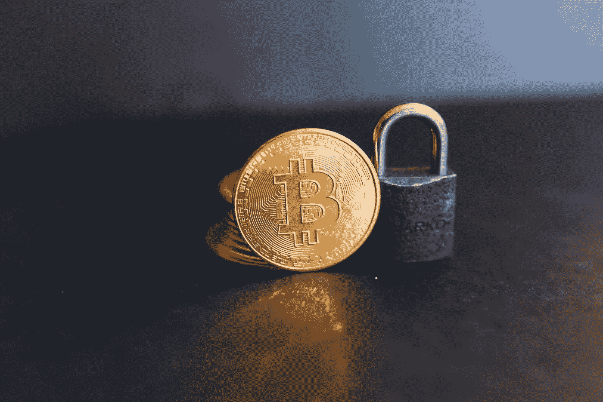
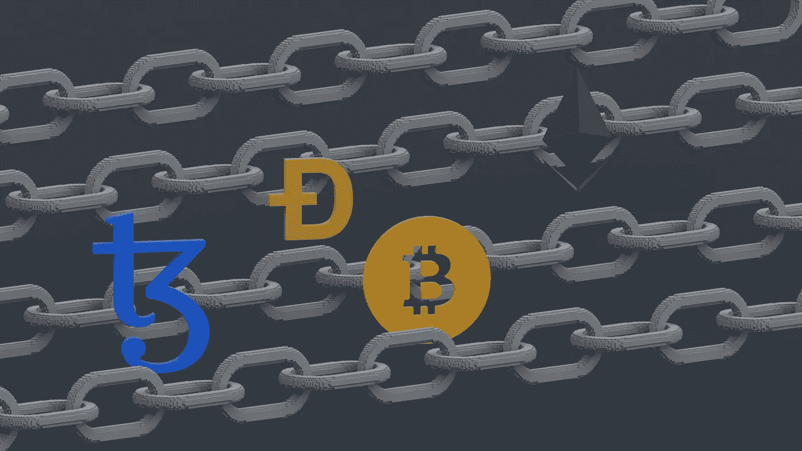

# Defi(分散金融)初学者指南

> 原文：<https://medium.com/coinmonks/beginners-guide-to-defi-decentralized-technology-86a4a99b9955?source=collection_archive---------34----------------------->

Source:Unsplash.com

DeFi 意为“去中心化金融”，是比特币或区块链中一系列金融应用的总称，消除了对金融中间人的需求。

更具体地说，DeFi 是将传统金融商品带到一个去中心化平台的“手段”。在那里，第三方的必要性被消除(或最小化)，安全性和透明性被强调，并且费用被大大降低。以太坊是目前 DeFi 应用数量最高的平台。然而，它并不是唯一能够托管 defi 应用程序的区块链；IOST，EOS 和创区块链也被使用。

> **参见:** [**在加密熊市中要做的 4 件事。**](/coinmonks/4-things-to-do-in-a-crypto-bear-market-c4b5bda76ba4)

【Defi 是如何产生的

Source: Unsplash.com

在传统金融(CeFi——中央集权金融)中，你不相信政府不会突然印钞导致通胀飙升。此外，你必须依靠第三方来保证你的资产安全。

DeFi 的创建是为了提供一个无障碍的金融系统。在那里，个人可以完全控制自己的资产。

从更广泛的意义上来说，DeFi 是一项雄心勃勃的努力，旨在利用区块链技术分散交易、贷款、投资、资产管理、支付和安全的典型金融用例。

最终，DeFi 将无法完全取代 CeFi。然而，它提供的服务种类比 CeFi 更多。

> **另见:** [**Web 2/Web 3:综合概述。**](http://Web 2/Web 3: A Comprehensive Overview.)

**在定义中:**

加密货币将取代资产。

区块链将取代组织、政府和公司。

进入门槛低:你只需要一台联网设备就能获得分散式融资。

因此，DeFi 工具不同于 CeFi 工具，尽管提供类似的金融服务，如贷款。此外，他们还提供全新的金融服务，如赌注和众筹。

**Defi 的优势**

Source; Unsplash.com

**真正的去中心化:**反对审查，允许所有社会经济阶层参与，没有第三方。

**成本更低:**利用区块链作为基础设施，成本降低，交易快捷，合同无欺诈。

**控制:**用户对资产拥有完全的控制权，不依赖外部方；defi 允许用户拥有私钥。

增加透明度:这限制了私人获利或错误信息的可能性..

DeFi 的灵感来自数字货币比特币背后的技术区块链，该技术使众多实体能够在没有中央机构的情况下保存交易历史的副本。

这一点很重要，因为集中式系统和人工控制者会限制交易的速度，同时减少用户对自己资金的直接控制。DeFi 是独一无二的，因为它将区块链的应用从简单的资产转移扩展到更复杂的金融用例。

大多数“DeFi”应用程序都建立在以太坊上，这是世界上第二大加密货币平台。与比特币平台不同，以太坊更容易创建超越简单交易的去中心化应用。2013 年，以太坊开发者 Vitalik Buterin 在最初的以太坊白皮书中强调了这些更复杂的金融用例。

这是因为智能合约的以太坊平台——在满足特定标准时自动执行交易——提供了更大的灵活性。以太坊上的编程语言，比如 Solidity，就是专门为创建和部署这种智能合约而构建的。

**最受欢迎的 DeFi 应用包括:**

**去中心化交易所(DEX):** 在线交易所协助用户将一种货币兑换成另一种货币，比如用美元兑换比特币，或者用乙醚兑换戴。dex 是一种直接联系用户的热交换，这样他们就可以交易加密货币，而无需将资金委托给第三方。

**Stablecoins:** 一种与非加密货币资产(如美元或欧元)挂钩的加密货币，以稳定其价格。

**借贷平台**:这些平台用智能合约取代了银行等在中间管理贷款的中介机构。

“**包裹的”比特币(WBTC** ):一种将比特币发送到以太坊网络的方法，这样比特币就可以直接在以太坊的 DeFi 机制中使用。WBTC 让用户有机会从他们通过上述分散贷款网络借出的比特币中赚取利息。

**预测市场**:对选举等未来事件的结果进行押注的市场。预测市场的 DeFi 版本的目标是在没有中间商的情况下提供相同的功能。

**除了这些用途之外，围绕着它们还产生了新的 DeFi 概念:**

*   收益农业(Yield Farming):对于准备冒险的精明交易者来说，有一种收益农业，用户探索各种 DeFi tokens 以获得更大回报的可能性。

> 加入 Coinmonks [电报频道](https://t.me/coincodecap)和 [Youtube 频道](https://www.youtube.com/c/coinmonks/videos)了解加密交易和投资

# 另外，阅读

*   [最好的卡达诺钱包](https://coincodecap.com/best-cardano-wallets) | [Bingbon 副本交易](https://coincodecap.com/bingbon-copy-trading)
*   [印度最佳 P2P 加密交易所](https://coincodecap.com/p2p-crypto-exchanges-in-india) | [柴犬钱包](https://coincodecap.com/baby-shiba-inu-wallets)
*   [八大加密附属计划](https://coincodecap.com/crypto-affiliate-programs) | [eToro vs 比特币基地](https://coincodecap.com/etoro-vs-coinbase)
*   [最佳以太坊钱包](https://coincodecap.com/best-ethereum-wallets) | [电报上的加密货币机器人](https://coincodecap.com/telegram-crypto-bots)
*   交易杠杆代币的最佳交易所
*   [最佳加密分析或链上数据](https://coincodecap.com/blockchain-analytics) | [Bexplus 评论](https://coincodecap.com/bexplus-review)