# 新手交易指南:烛台和指标

> 原文：<https://medium.com/coinmonks/beginners-trading-guide-candlesticks-indicators-976d970c80a5?source=collection_archive---------34----------------------->

# CoinDCXpathbreaker

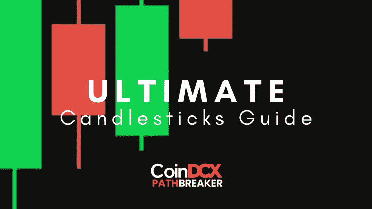

## 介绍

不管你是个密码迷还是资深的日内交易黄牛党——如果你读过哪怕一点点关于交易的单词，你肯定会遇到**图表** & **烛台** …

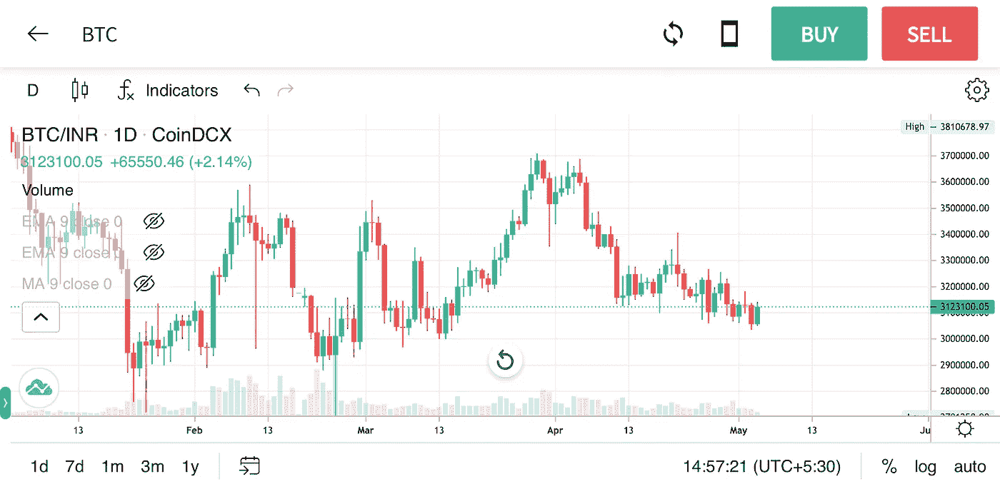

BTC/INR chart on CoinDCX App

上图中有多条绿色和红色的线条——弯弯曲曲的线条被称为**烛台。绿色烛台**显示买家的实力&**红色蜡烛**代表卖家的实力。简单吗？但这还没有结束，如果将烛台分成不同的类型，它们可以形成自己的世界，当与其他技术指标搭配时，图案&会成为更有效的组合……所以让我们开始吧:

## 基本蜡烛:

烛台由以下特征组成:

*   **蜡烛体(打开/关闭时形成)**
*   **上&/或下灯芯**
*   **颜色(默认为红色&绿色)。**

如果资产的开盘价低于收盘价，蜡烛就会变成绿色。如果资产的开盘价高于收盘价，蜡烛就会变成红色。

烛台的开/关是由图表的时间范围决定的。因此，在 1 小时图表中，每个蜡烛代表一个小时的数据。下面的例子:

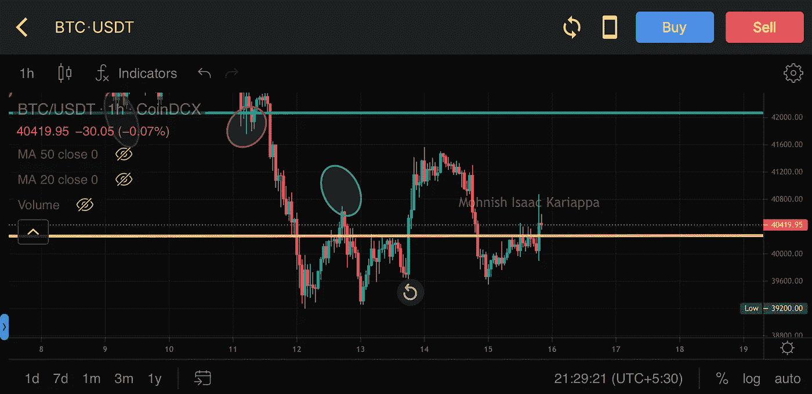

BTC/USDT 1H chart on CoinDCX Pro app

类似地，如果你用 1D 的时间框架做一个图表，那么每个蜡烛线代表一个 24 小时的时间段。在印度，新的日线图在 IST 时间早上 5:30 开始，之前的日线图在 IST 时间早上 5:30 结束。

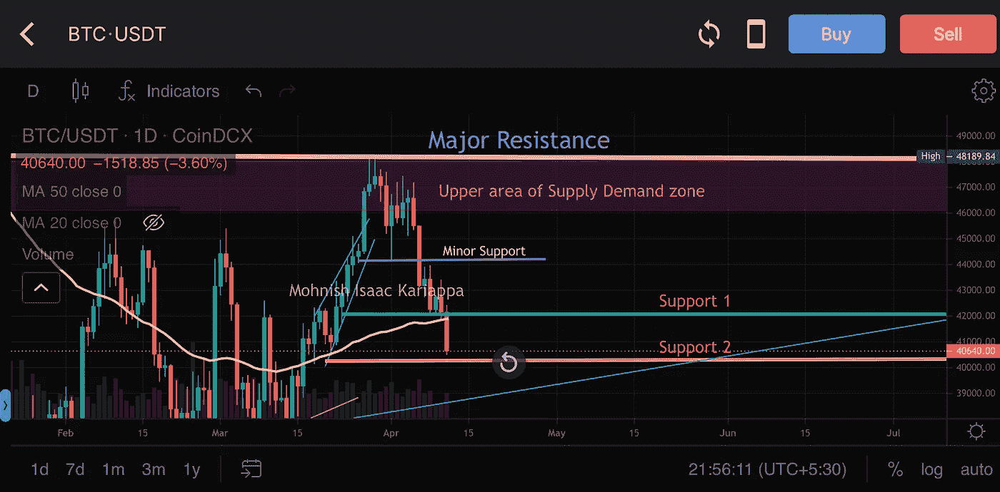

BTC/USDT 1D TF on CoinDCX Pro app

Candle closes 可能并不总是标准化的，并且会随着交易所和 UTC 的时间转换而变化。这种混乱的发生是因为没有真正的加密标准，因为它 24x7 的可操作性。虽然你会发现主要的知名交易所几乎总是有相同的蜡烛关闭时间。

## 蜡烛图案:

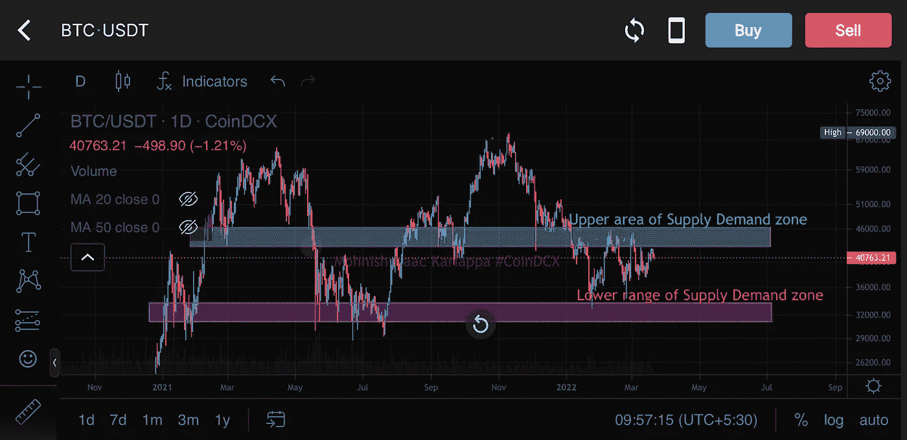

Group Candle patterns

CoinDCX Pro 应用程序上的 BTC/USDT 图表显示了一簇蜡烛在缩小时如何形成图案。上面的图表要么是在 69，000 美元水平确认一个**双顶**，要么是正在形成一个**头部&肩部形态。**这些图案只能通过烛台才能发现——所以，从 TA 的角度来看，它们非常强大。

这些蜡烛图组可以在资产价格结构中找到，也可以与其他技术指标相加或相减。

和任何技术形态一样，图表上有多根延续或反转蜡烛线。没有图表可以有一个连续的上升轨迹，因为市场上总会有买家和卖家推动价格向两个方向移动。

总的来说，这种连续的蜡烛线形成了模式交易的症结。

## Heikin-Ashi (HA)烛台

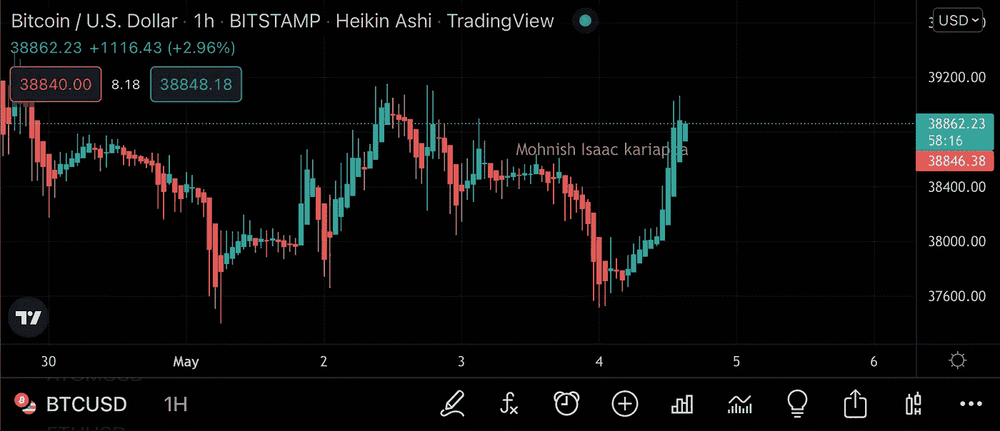

**Heikin-Ashi** 蜡烛图按时间顺序使用前期的开-闭数据点和本期的开-闭数据。

**蜡烛线在前期的上方打开和关闭，表明趋势的强劲看涨势头。类似地，蜡烛线在前期区域内的开盘价和收盘价表明价格趋势失去了动力。**

Heikin -Ashi 是黄牛党的一个很好的工具，因为从绿色到红色或从红色到绿色的颜色变化预示着一个新的价格行动的开始&前一个价格行动的消亡。这些信号的翻转可以被认为是多头或空头进场信号。**(这不是理财建议)**

如何通过以上学习找到一份工作？

在交易图表时，在第三根或第四根连续的彩色蜡烛线上，本地顶部也会被打破，这给我们的进场信号增加了汇合点。止损点位于无动量蜡烛线下方，或者如果蜡烛线变色，手动关闭止损点。

## 比尔·威廉姆斯分形-高级度量

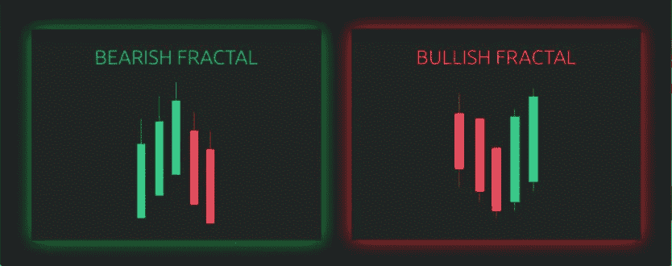

Source: Currency.com

**比尔·威廉姆斯分形** ( **BWF** )的工作框架与**黑金阿希**蜡烛相似，但与 HA 相比，它是一个滞后指标。

威廉姆斯分形图中的**看涨分形图**由**低-高-低**蜡烛图组成，而**看跌分形图**由**高-低-高**蜡烛图组成。根据 **BWF 定律理论，**多头趋势不应打破空头分形的形成，空头趋势也不应打破多头分形的结构。

## 点数图(P&F)图表

图表中使用的最少的烛台模式之一，该模式由 X 和 Os 表示——X 代表绿色，O 代表红色。

> 它是由“霍伊尔”在 1898 年首次提出的，强调收盘价。

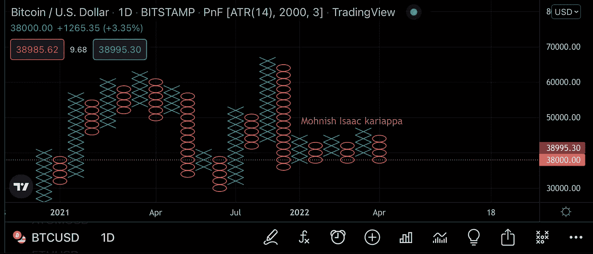

Point & Figure chart on Bitcoin/USD pair

这种图表形式用于结合**威科夫结构测量资产价格结构。这种特殊的模式不依赖于时间框架，而是更加强调资产的宏观价格结构。**

## 指示器

关于指标，重要的是要记住，大多数指标根本没有给出数据点，而少数指标可能是你最有力的盟友。我更喜欢能够自己绘制、使用数学计算并过滤掉噪音的指标。作为一个新手，总是关注干净的图表，而不是应用你能找到的每一个指标——我们的目标是交易，而不是用图表做抽象的 NFT。一些例子:

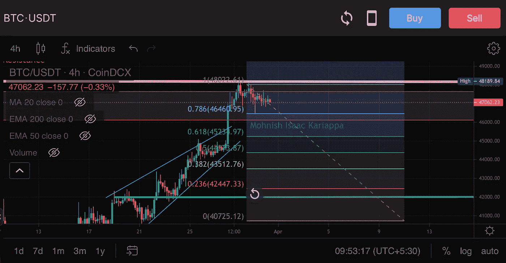

Fibonacci retracement tool

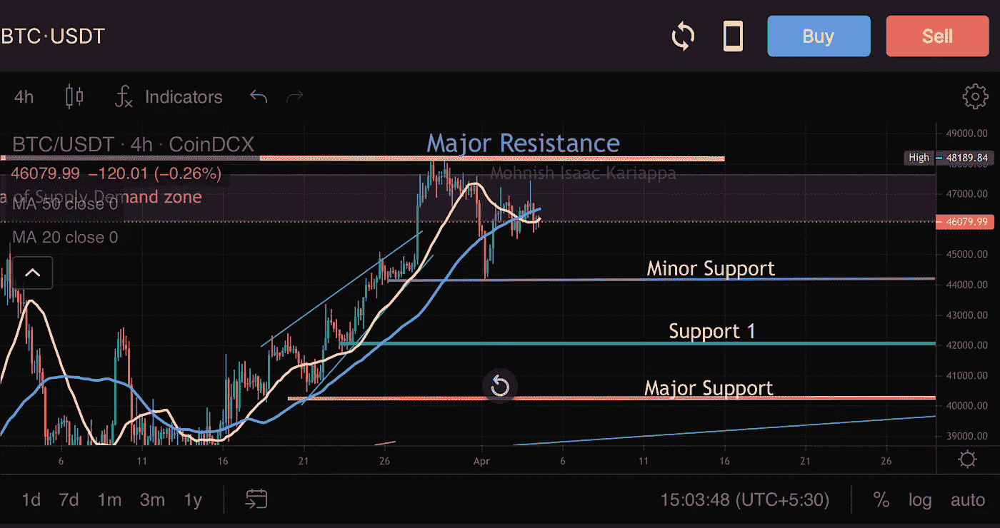

The 20 & 50 Moving-average

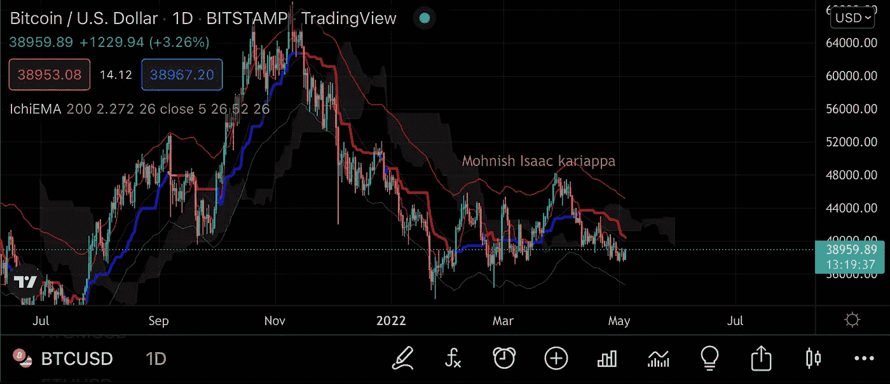

Ichimoku Cloud with Daily candle

对于我个人的交易分析，我非常依赖 Ichimoku 云、Fib 回撤和均线。我绝对讨厌使用像 Elliot Wave 这样的数据密集型指标，这些指标可能非常主观，很容易编辑，没有任何可靠的功能。它更像是交易者适应自己偏好的工具。

## 如何使用 Ichimoku 云

该指示器可用于:

*   **趋势判定**(一片云的颜色)
*   **进场信号**(价格在较低的云带上)
*   **退出信号**(云带下方烛台关闭)
*   **重返信号**(价格重返云带)

该指标的不利方面:如果市场处于盘整阶段，中性情绪和横向行动，它将使你的看涨期权失效。在这种情况下，最好使用**布林线**

使用**市云时的位置进入信号:**

*   **云上/云下价格**——这是在任何图表时间框架内确定看涨或看跌价格的绝对经典案例。
*   **看涨/看跌云** —云结构的变化结合价格波动的形成，我们可以确定资产是倾向于看涨还是看跌趋势。
*   **看涨/看跌 TK 交叉**——这里需要更高级的研究，简单地说，这种结构非常类似于均线交叉，但它发生在市云指标上。

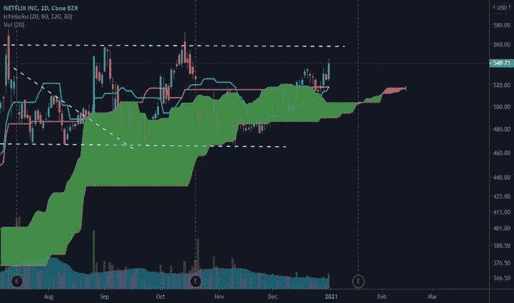

Image source: Tradingview.com (blog)

一个**一片云**持仓进场包括所有的信号，这些信号汇聚成看涨或看跌的价格结构。

> **TK 交叉**——在技术分析中，TK 交叉是指**一个一见云指标**的天肯线和金骏线(TK 线)的交叉。

当**空头 TK 交叉**出现在云上方时，这不应该被认为是建立空头头寸的信号，而是多头的退出信号。这是一个典型的看跌迹象，而不是完全确认。

类似地，云上方的 **TK 交叉**是一个非常看涨的指标，表明资产正在建立即将到来的价格行动，应该推断为一个高概率的多头重新进入。

## 结论

交易总是有一个陡峭的学习曲线，我自己在过去的 2.5 年里每天花了无数的时间，我几乎没有触及表面。

技术指标和烛台模式研究肯定能帮助你在你的旅程中提高你的技能或在这个空间内获得新的技能。

…

非常感谢 [CoinDCX](https://medium.com/u/a30fa2b03c2f?source=post_page-----976d970c80a5--------------------------------) 给我这个机会为外面的加密社区创造如此详细的教育内容，并让我成为**# coindcxpathbaker**计划的一部分🚀

> 加入 Coinmonks [电报频道](https://t.me/coincodecap)和 [Youtube 频道](https://www.youtube.com/c/coinmonks/videos)了解加密交易和投资

# 另外，阅读

*   [BigONE 交易所评论](/coinmonks/bigone-exchange-review-64705d85a1d4) | [电网交易机器人](https://coincodecap.com/grid-trading)
*   [氹欞侊贸易评论](https://coincodecap.com/anny-trade-review) | [CoinSpot 评论](https://coincodecap.com/coinspot-review)
*   [新加坡十大最佳加密交易所](https://coincodecap.com/crypto-exchange-in-singapore) | [购买 AXS](https://coincodecap.com/buy-axs-token)
*   [投资印度的最佳加密软件](https://coincodecap.com/best-crypto-to-invest-in-india-in-2021) | [WazirX P2P](https://coincodecap.com/wazirx-p2p)
*   [7 个最佳零费用加密交易平台](https://coincodecap.com/zero-fee-crypto-exchanges)