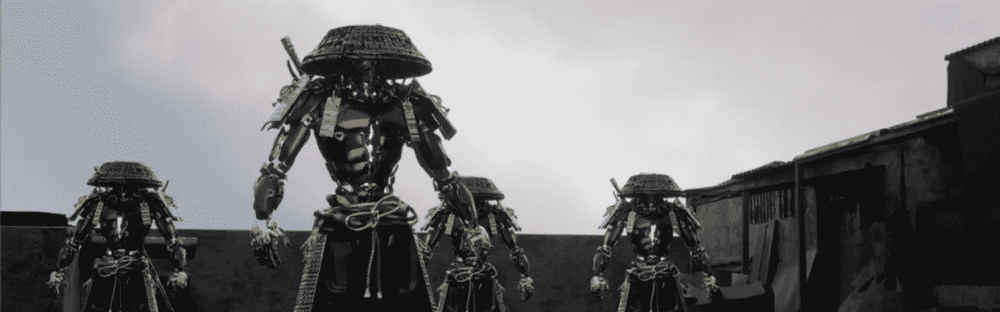

# 在 NFT 发布会的幕后👀

> 原文：<https://medium.com/coinmonks/behind-the-scene-of-the-metatribes-nft-launch-727c88affdc1?source=collection_archive---------52----------------------->

你好，伙计们！⌆

我是 [0xPierre](https://www.instagram.com/0xpierre.dev/) 👋
与 [BenBK](https://www.youtube.com/c/benbk) 项目的开发商。
我将告诉你一些关于我们的工作，以及我们是如何完成[元主题](https://themetatribes.com)的。

# **简介**

薄荷由三个不同的相组成。

MetaTribes 团队为我们提供了以下造币厂说明:

目标非常简单:创造一个没有气体战争的平稳下降，并避免机器人。

**预售公开造币:**

*   每个钱包最多 5 NFTs
*   荷兰拍卖:价格从每 NFT 1 ETH 开始，每 20 分钟下降 0.15 ETH，直到达到 0.15 ETH
*   销售必须持续 340 分钟
*   铸造必须是简单，干净，光滑的✨
*   NFT 街 6788 号被预订出售

**白名单私人造币厂:**

*   每个钱包最多 1 个 NFT
*   荷兰拍卖最后价格的-50%(0.075 瑞士法郎)
*   2000 年，NFT 被保留出售

**公共造币厂:**

*   每个钱包无限制的 NFTs
*   0.15 ETH 的铸币价格
*   所有剩下的 NFT 都在这次拍卖中

# 我们的主机和服务器

Twitter 上有 100，000 人，Discord 上有 55，700 名成员，这是有史以来最热门的 NFTs 项目，所有内容都在短期内播放，所有内容都放在一起，可以炸毁任何服务器！

整个网站都在 Kubernetes 的 Docker 容器中，具有自动缩放和缓存优化功能。感谢 [OVH](https://www.ovhcloud.com) 🚀

我们设法在不同的网站(mint，wordpress，即将推出)**上处理了超过 400 万个请求，没有任何中断或延迟**。
总共有 41.250 **(41.25k)个独立访客**。

总带宽消耗为 2.29 TB(太字节)，在峰值时，我们发送了 877 GB 的流量。

# 安全性

为了我们的服务器和网站的安全，我们使用 CDN 来加快网站加载速度，并避免任何类型的恶意攻击。

使用我们的设置，我们能够避免上个月 **阻止**或挑战的 **9.375 个恶意请求。**

我们也预见到了所有必要的情况，以保护我们的智能合同，我们已经保持了对局势的完全控制。

# 薄荷网站

造币厂网站是在 [React 开发的。JS](https://reactjs.org/) 借助 [NextJS](https://nextjs.org/) 。使用钩子和上下文来获得干净和可维护代码的最佳性能。

我们已经很好地压缩了网站上的所有图像和资产，以获得可观的性能增益。

此外，我们实现了 [Wallet Connect](https://walletconnect.com/) ,以便能够轻松地将您的钱包与其他类似于 Metamask 的工具连接起来，并且能够轻松地从您的手机中进行造币。该网站显然对所有类型的设备都有响应。

薄荷网站可用[这里](https://mint.themetatribes.com)

# 智能合约 ERC721A

我们开发了一个基于 [ERC721A](https://github.com/chiru-labs/ERC721A) 的智能合约。我们为预售造币厂和 Merkle 根添加了荷兰拍卖，以在合同中存储白名单地址。

在造币期间，我们特别致力于降低汽油成本。我们已经实现了平均 3 美元到 30 美元的汽油费，这是一个巨大的成功，我们非常自豪能够为您提供如此低的价格。

智能合约链接在 [Etherscan](https://etherscan.io/address/0xAcb978Ef383d6f82781d9b60d2820be28Bdb2081) 上可用。

# 谢谢你，🖤

我们在这个项目上非常努力，因为我们只有三周的时间来完成一切，你无法想象有 100，000 人(至少是绝对的)关注和评估你的压力。

MetaTribes 既不是地毯，也不是骗局。MetaTribes 是一个挑战和一个非常美丽的旅程，只是最近才开始，并将持续很长一段时间！衷心感谢所有帮助过或支持过我们的人。我们学到了很多东西，我们将在未来不断努力做得更好。🚀

由 [0xPierre](https://www.instagram.com/0xpierre.dev/) 👨‍💻

[Opensea 链接](https://opensea.io/collection/themetatribesgenesis)

> 交易新手？尝试[加密交易机器人](/coinmonks/crypto-trading-bot-c2ffce8acb2a)或[复制交易](/coinmonks/top-10-crypto-copy-trading-platforms-for-beginners-d0c37c7d698c)