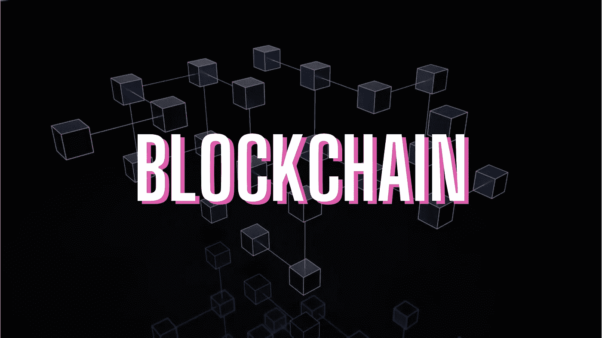
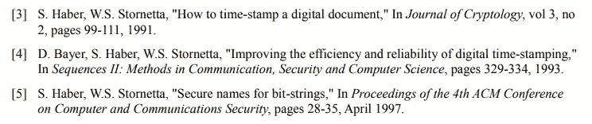

# 加密货币的幕后——区块链

> 原文：<https://medium.com/coinmonks/behind-the-scenes-of-cryptocurrencies-blockchain-82906e90e0fc?source=collection_archive---------31----------------------->

你知道截至今天，1 比特币相当于 39551 美元(3024830 印度卢比)的巨额金额吗？

由于数字货币/代币在当今世界具有如此巨大的影响，人们将大量财富投资于比特币和以太坊，因此了解它们和其他资产背后的技术非常重要。

所以我们开始吧！

如今，大多数内容创作者转向 YouTube、Instagram 和其他平台发布内容。你必须意识到，我们对他们的政策制定或其他决定几乎没有发言权。因此，如果有一天，Instagram 决定用著名的埃隆·马斯克(Elon Musk)的图片取代我们所有的订阅，它可以简单地做到这一点。\_(ツ)_/

但是等等，既然有了区块链，为什么还要担心呢？

因为区块链可以将权力从组织转移到网络的创造者和参与者手中，所以它越来越受欢迎。

还有一个有趣的事实。

*你知道区块链的概念在比特币诞生之前就存在了吗？*

A snip of the “References” section from Satoshi Nakamoto’s “Bitcoin: A Peer-to-Peer Electronic Cash System”

2008 年**，比特币的创始人中本聪**，在他们著名的白皮书——《比特币:点对点电子现金系统》中，三次引用了 s .哈伯和 W.S .斯托内塔的著作。

如果你真的很想知道为什么哈伯和斯托内塔创建了现在所谓的区块链，一定要读一读[Vipin bharat Han](https://www.forbes.com/sites/vipinbharathan/2020/06/01/the-blockchain-was-born-20-years-before-bitcoin/?sh=7c84d5cc5d71)写的这篇文章。

既然你已经知道了比特币的背后是什么，那么让我们来看看它实际上是如何工作的。

你还记得人们把交易记录在纸上的时代吗？随着时间的推移，随着技术的进步和信息的泛滥，数据被数字化并存储在数据库中。

今天，我们(必然)相信大组织会安全地存储我们的数据。

*信任…*

这就是为什么我们的记录在区块链上更安全。

> 区块链只包含多个独立利益相关方之间的同步数据。

我来帮你想象一下。

假设网络中有 5 个对等体。所有这 5 个对等体共享相同的数据，例如，您的交易细节。如果其中一个对等体改变了他机器上的数据，通常，为了他自己的利益，这个被操纵的数据很容易被发现，因为它与其他 4 个对等体不匹配。因此，数据在参与网络的所有对等体之间是同步的。

一旦达成**共识**(多数节点的一致意见)，数据就被添加到区块链上的一个块中。

现在出现了一个问题。谁把这些积木加到了区块链上？

是**矿工**。矿工解决一个密码难题(*工作证明*)，验证数据的真实性，并将它们添加到区块链中。成功添加一个区块后，他们将获得奖励。💰₿

A **genesis 块**是链的第一块。中本聪创造了比特币区块链的第一个区块。

区块链上的所有其他块被称为**有效块**。它们包含散列、时间戳、数据和随机数。

你会问为什么数据在区块链上更安全吗？好吧，这就是答案。

链上的每个有效块都有前一个块的散列。操作任何一个块上的数据都将导致生成的散列和下一个块上记录的散列不匹配。因此，如果其中一个块被重写，那么它后面的所有块也将需要操作，这使得*计算上不可能*。这使得区块链**成为不可改变的**。

网络上的每一个对等体都知道区块链上发生的每一个事务。因此，网络中有多少对等体/ **节点**就有多少数据副本。

显然，单个当事方不能自私地改变链条上的数据以从中获益。

如果需要，节点集体参与/ **投票**以决定对区块链进行的改变。

因此，这确保了消除单个当事方来决定网络上要进行的改变，而是让每个参与者都有发言权。

这实质上就是所谓的**分权**。权力是分散的，不在一个政党或组织手中，因此消除了系统中的错误、欺诈和偏见。

我知道这篇文章充斥着大量的信息和术语，但是让我用下面的**要点**来帮你快速回忆一下:

❑区块链由一系列*块*组成，其中包含经过验证的、不可变的同步数据。

❑*起源块*是区块链上的第一个块，所有其他块被称为*有效块*，用于保存数据、时间戳、随机数和哈希。

❑对等网络的每个节点都有整个区块链的副本。

❑共识机制用于在网络上所有节点的参与下做出重要决策。

❑矿工向区块链网络添加数据块，并从他们的工作中获得回报。

❑ *区块链的权力下放*使得权力从单一实体转移到网络中的所有参与者，从而消除了系统中的不公平。

❑比特币和以太坊是区块链技术的一个*应用*。

根据以上知识，你认为区块链可以用在什么地方？

如果你觉得这篇文章有用，喜欢，关注，传播。

> 加入 Coinmonks [电报频道](https://t.me/coincodecap)和 [Youtube 频道](https://www.youtube.com/c/coinmonks/videos)了解加密交易和投资

# 另外，阅读

*   [OKEx 回顾](/coinmonks/okex-review-6b369304110f) | [Kucoin 交易机器人](/coinmonks/kucoin-trading-bot-automate-your-trades-8cf0ca2138e0) | [期货交易机器人](/coinmonks/futures-trading-bots-5a282ccee3f5)
*   [AscendEx Staking](https://coincodecap.com/ascendex-staking)|[Bot Ocean Review](https://coincodecap.com/bot-ocean-review)|[最佳比特币钱包](https://coincodecap.com/bitcoin-wallets-india)
*   [霍比评论](https://coincodecap.com/huobi-review) | [OKEx 保证金交易](https://coincodecap.com/okex-margin-trading) | [期货交易](https://coincodecap.com/futures-trading)
*   [比特币基地跑马圈地](https://coincodecap.com/coinbase-staking) | [Hotbit 评论](/coinmonks/hotbit-review-cd5bec41dafb) | [KuCoin 评论](https://coincodecap.com/kucoin-review)
*   [购买 Dogecoin 的 7 种最佳方式](https://coincodecap.com/ways-to-buy-dogecoin) | [ZebPay 评论](https://coincodecap.com/zebpay-review)