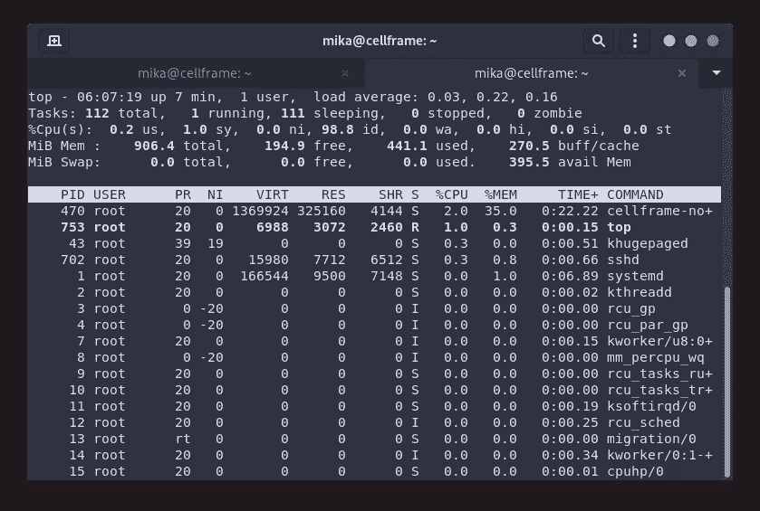
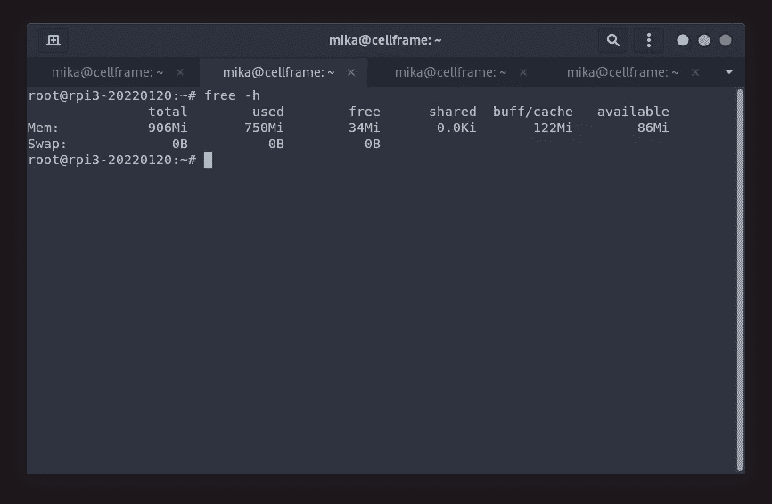
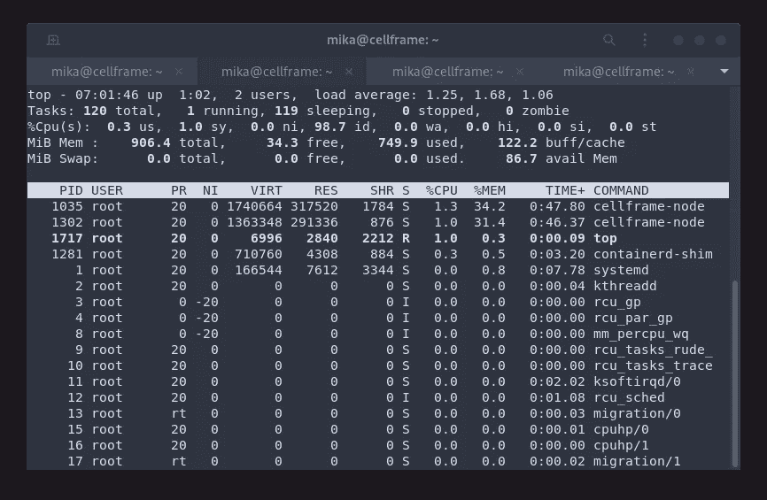
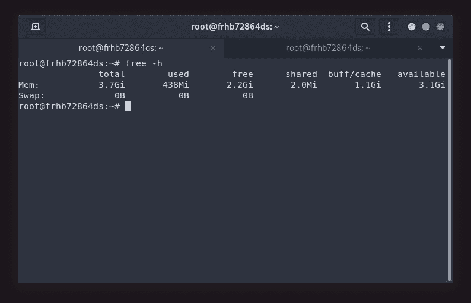
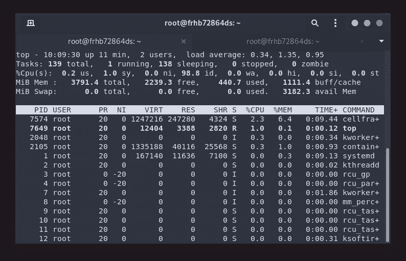
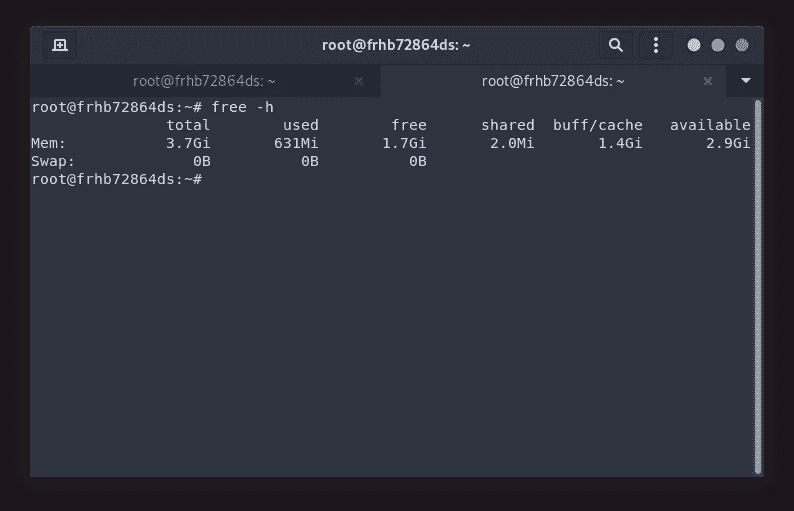
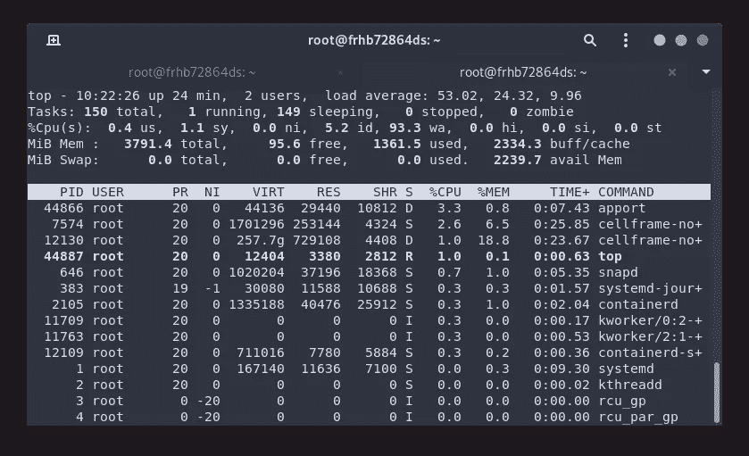

# 基准:树莓 Pi 上的多个单元框架节点

> 原文：<https://medium.com/coinmonks/benching-multiple-cellframe-nodes-on-a-raspberry-pi-389ebcc09ae1?source=collection_archive---------7----------------------->


我想我在 Twitter 上提到过，下一篇文章将是关于 Cellframe GlobalDB(如在全球数据库中)，但我在 Cellframe Telegram channel 中被这个分散了注意力:

```
User 1: Can I run a Cell node on a Raspberry Pi? If yes, one or more nodes with one Raspberry possible?User 2: Yes, one node per deviceMe: Or with Docker, multiple. But Raspberry Pi doesn't have enough power to do that though.Me: Or maybe it has? Have to test it soon™
```

所以我们在这里。又来了！

Raspberry Pi 肯定有足够的能力运行至少一个 Cellframe 节点，它已经被几个用户测试过了。

但是你能在它上面运行多个节点吗？

让我们来测试一下这些小小的 ARM64 计算机，好吗？

## 关于单元格框架

[Cellframe](https://cellframe.net/) 是一个雄心勃勃的第三代区块链项目，很少有人(包括我)已经开始谈论它是下一个波尔卡多特或草间弥生。

然而，这个项目更加面向服务，并且与 Polkadot/Kusama 相比具有一些优势(例如，后量子加密、2 级分片、P2P 跨链操作)。

Cellframe 是用 C 写的(这将使它快速和可移植)，目前它有一个 C 和 Python 的 SDK。将来会有更多受支持的语言出现。

我真的推荐访问他们的网站(【https://cellframe.net】T4)并阅读他们的白皮书！

## 测试过程

在这个测试中，我将使用两台不同的 Raspberry Pi 计算机(Raspberry Pi 3B+ (1GB 内存)和 Raspberry Pi 4 (4GB 内存))。Cellframe 节点版本为 5.1–67-arm 64(可从 [https://pub.cellframe.net 获得)。](https://pub.cellframe.net).)

之后，获得结果的步骤是:

*   在 SD 卡上安装 Debian
*   在树莓 Pi 上安装 Cellframe 节点
*   安装 Docker
*   从 Dockerhub 获取最新的 Debian 稳定映像
*   从该映像创建一个容器，并在其中安装 Cellframe 节点
*   创建该容器的快照
*   启动节点容器，直到 Raspberry Pi 求饶

节点配置:

*   主干网作为完整节点启用
*   Mileena 作为完整节点启用
*   Subzero 启用为完整节点

我想，我需要明确的是，仅仅在容器上运行节点并不意味着什么。节点保持空闲，只是连接到网络，但它并不真正执行任何模拟真实世界使用情况的操作。

由于我真的不知道如何模拟节点动作，我只是在主机系统中运行一个节点，然后在 Docker 容器中运行尽可能多的节点来测试节点。

嘿，无论如何不要把这个测试看得太重😉。

我们走吧！

## 主题 1:树莓派 3B+

这是我几年前就有的模型。我在同一台计算机上编写和测试了之前的 Cellframe 节点安装教程( [1](/@mika.hyttinen/running-your-own-cellframe-node-on-raspberry-pi-3b-65f670b898e0) 、 [2](/coinmonks/running-your-own-cellframe-node-on-raspberry-pi-2-3-4-400-the-easy-way-c0b7cfc3dfd8) )。

它的硬件规格并不令人印象深刻:

*   Broadcom BCM2837B0，Cortex-A53 (ARMv8) 64 位 SoC @ 1.4GHz
*   1GB LPDDR2 SDRAM

然而，Cellframe node 可以在其上完美运行。

安装 Docker 和 Cellframe 节点后，我决定等待大约 15 分钟，以获得关于 CPU 和 RAM 使用情况的更可靠的信息:


Available RAM: 340 Megabytes

让我们看看`top`的 CPU 使用情况:



CPU usage is low. Super low.

看到这么低的 CPU 使用率，还是比较让人印象深刻的！(我认为此时节点仍在同步！)

现在，我们已经可以说，这个特定模型中的可用 RAM 对于运行 2 个以上的节点来说太低了。

但无论如何，让我们在容器中启动另一个 Cellframe 节点，看看会发生什么。我创建了一个特殊的镜像，它安装了相同版本的 Cellframe 节点，并且配置与我的 Debian 安装完全相同。

大约 30 分钟后，我决定检查一下内存的使用情况:



Available RAM: 86 Megabytes

正如我所料。1GB 的 RAM 不够用。但是你应该记住 1GB 的内存在今天的标准中是非常低的。即使是最低端的手机也有 1GB 以上的 RAM！

让我们看看 CPU 的使用情况:



Two cellframe-node processes running. CPU usage is really low!

我只能说，我真的很感动！当节点空闲时，CPU 使用率约为 1%。

我认为这个特定模型的结论是，您可以在其中运行 2 个节点。这肯定会占用你所有的内存，但从技术上来说，这是可能的。

## 主题 2:树莓 Pi 4 4GB

这种特殊的型号很难买到，因为所有的零售商(我通常会使用)都没有这种型号的库存。

但是因为我真的想做这个测试，所以我在网上租了一个月的树莓派😆。

现在这款机型的硬件规格比树莓派 3B+更令人印象深刻:

*   Broadcom BCM2711，四核 Cortex-A72 (ARM v8) 64 位 SoC，1.5GHz
*   1GB、2GB、4GB 或 8GB lpddr 4–3200 SDRAM(取决于型号)

从技术上来说，这款电脑的 CPU 应该比树莓派 3B+电脑快两倍。

让我们使用相同的方法，就像我在我自己的树莓派 3B+上使用的方法一样。我首先将 Docker 和 Cellframe 节点安装到这台主机上，并查看了 RAM 和 CPU 的利用率:



Available RAM: 3.1 Gigabytes

而`top`命令给了我们:



As expected, low CPU usage.

现在，让我们启动一个已经安装了 Cellframe 节点的容器。与 3B+上的配置相同:



Available RAM: 2.9 Gigabytes

`top`的输出给了我们以下结果:



Two cellframe-node processes running. Low CPU usage.

你知道吗？让我们认真对待这个问题，推出两个新容器:


3 nodes running in containers + 1 on the host.

此时，我试图启动第四个容器，但系统反应太慢，我无法再运行`top`实用程序。

事实上印象非常深刻😆。

## 结论

好吧，我认为可以肯定地说，3B+模型应该只用于在“裸机”上运行 1 个节点。然而，我认为通过一些调整，在那个特定的模型上运行 2 个节点实际上是可能的。

然而，在 Raspberry Pi 4 上，我认为实际上可以运行 3 或 4 个节点(用于 VPN 共享或类似的事情)。从技术上讲，它的 CPU 能力是 3B+的两倍，内存也更多。它的 1gb 网络适配器显然能为您提供更高的网络速度。

这个测试实际上让我想到了 Cellframe node 的强大和可移植性。我有一个 4 岁的手机(Oneplus 6)，它的高通骁龙 835 的 CPU 能力可能是 3B+树莓派的 4 倍。

当我们让节点在手机上运行时，它将改变区块链世界的游戏规则。


The power of Cellframe node, in the palm of my hand.

## 对 Cellframe 上的建筑感兴趣吗？

加入他们的发展电报渠道:[https://t.me/cellframe_dev_en](https://t.me/cellframe_dev_en)

如果你对区块链的未来感兴趣，或者有什么问题，你也可以联系我:

**电报:** @CELLgainz

**推特:** @CELLgainz

> 加入 Coinmonks [电报频道](https://t.me/coincodecap)和 [Youtube 频道](https://www.youtube.com/c/coinmonks/videos)了解加密交易和投资

# 另外，阅读

*   [AscendEx Staking](https://coincodecap.com/ascendex-staking)|[Bot Ocean Review](https://coincodecap.com/bot-ocean-review)|[最佳比特币钱包](https://coincodecap.com/bitcoin-wallets-india)
*   [霍比评论](https://coincodecap.com/huobi-review) | [OKEx 保证金交易](https://coincodecap.com/okex-margin-trading) | [期货交易](https://coincodecap.com/futures-trading)
*   [网格交易机器人](https://coincodecap.com/grid-trading) | [Cryptohopper 审查](/coinmonks/cryptohopper-review-a388ff5bae88) | [Bexplus 审查](https://coincodecap.com/bexplus-review)
*   [7 个最佳零费用加密交换平台](https://coincodecap.com/zero-fee-crypto-exchanges)
*   [氹欞侊贸易评论](https://coincodecap.com/anny-trade-review) | [火币保证金交易](/coinmonks/huobi-margin-trading-b3b06cdc1519)
*   [分散交易所](https://coincodecap.com/what-are-decentralized-exchanges) | [比特 FIP](https://coincodecap.com/bitbns-fip) | [Pionex 评论](https://coincodecap.com/pionex-review-exchange-with-crypto-trading-bot)