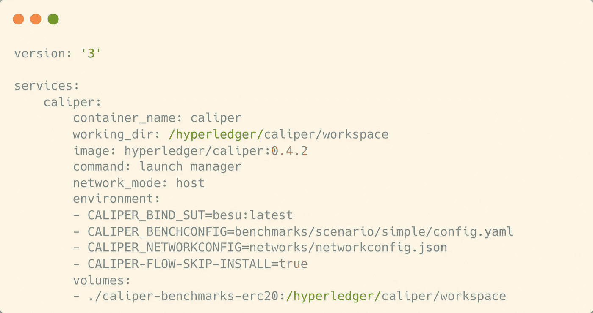
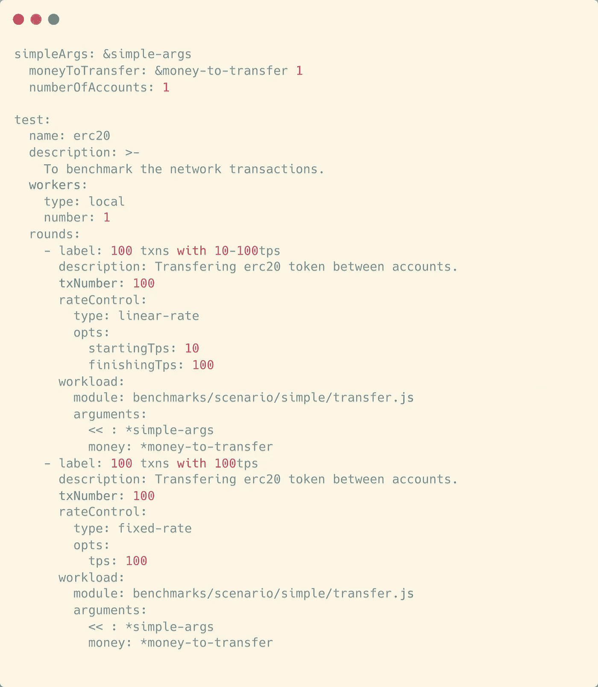
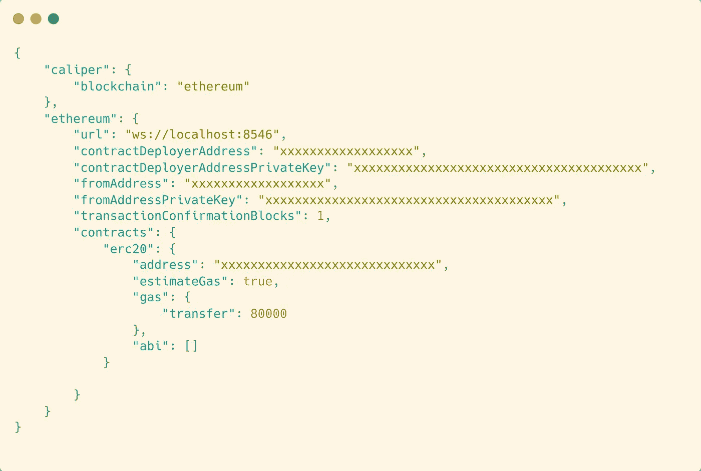
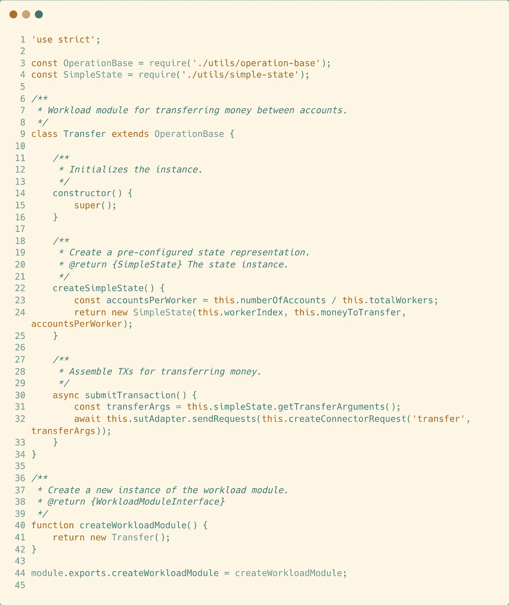
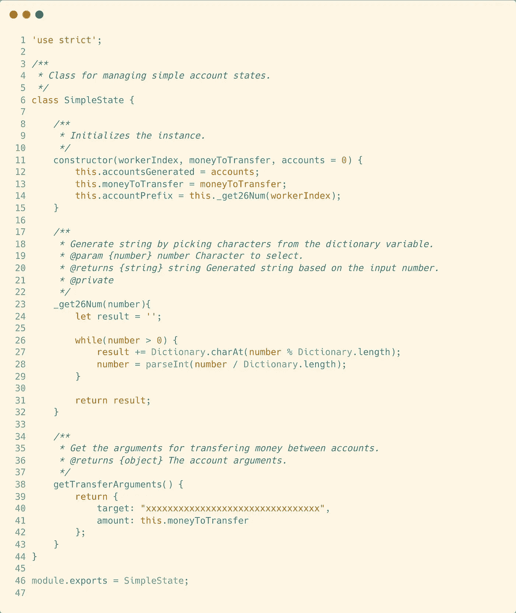
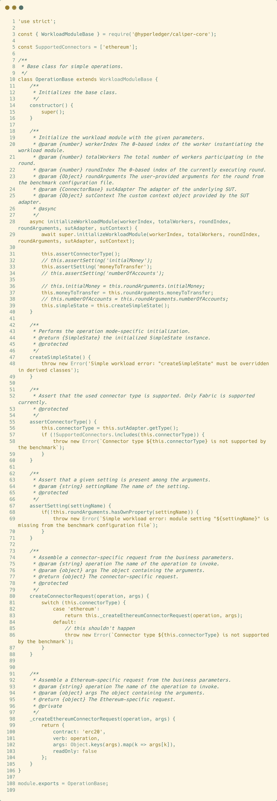
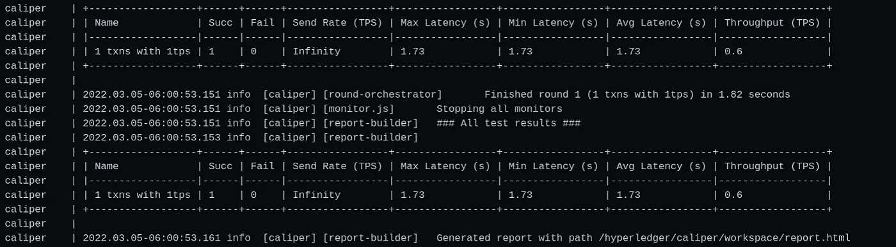
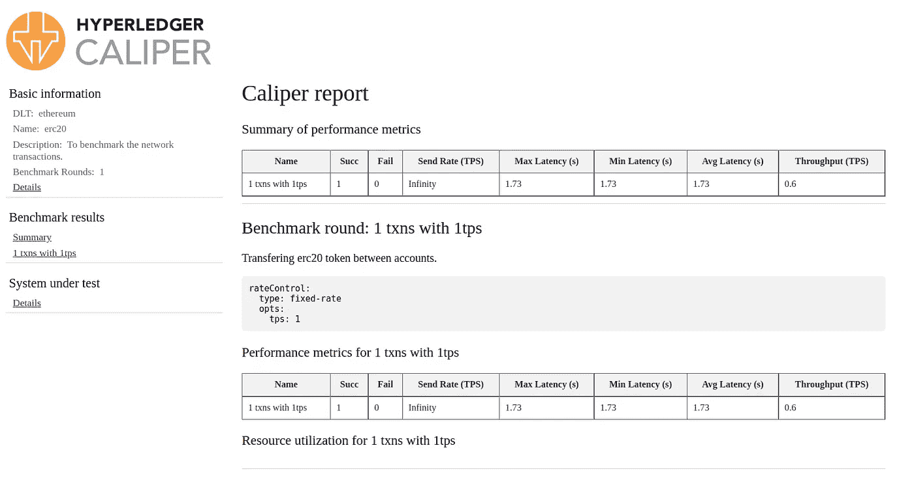

# 使用 Hyperledger 卡尺对区块链进行基准测试

> 原文：<https://medium.com/coinmonks/benchmark-blockchain-using-hyperledger-caliper-4c3f7f93896b?source=collection_archive---------2----------------------->

## 使用 ERC20 传输对私有区块链进行基准测试

了解我们生态系统的能力很重要，创造和维护一个私人的区块链也很重要。这些结果将帮助我们了解该系统是否满足我们的要求，或者是否将向用户提供免拥挤服务。如果没有，我们总是可以扩展它。
在本文中，我们将使用 Hyperledger besu 创建的 IBFT2.0 共识机制对私有区块链进行基准测试。如果您不熟悉它，请在这里找到一篇文章:

 [## 使用 Hyperledger Besu 创建私人区块链

### IBFT 2.0 权威证明共识机制

medium.com](/coinmonks/creating-a-private-blockchain-using-hyperledger-besu-96c7f281bab4) 

为了对我们的私有区块链进行基准测试，我们使用了 Hyperledger 旗下的另一个工具，名为 [*卡尺*](https://www.hyperledger.org/use/caliper#:~:text=Hyperledger%20Caliper%20is%20a%20blockchain,set%20of%20predefined%20use%20cases.) *。*

> Hyperledger Caliper 是一款区块链基准测试工具，它允许用户使用一组预定义的用例来衡量区块链实施的性能。Hyperledger Caliper 将生成包含大量性能指标的报告，作为使用以下区块链解决方案时的参考:Hyperledger Besu、Hyperledger Burrow、Ethereum、Hyperledger Fabric、FISCO BCOS、Hyperledger Iroha 和 Hyperledger 锯齿。

因此，目前有一个包含 4 个节点的专用区块链正在运行。现在我们必须配置一些连接器和基准测试场景。Hyperledger 在本 [*回购*](https://github.com/hyperledger/caliper-benchmarks) 中提供了一些不同案例的例子。但这更多的是一个一般的例子。出于好玩，我将对此进行一些更改，以便我们可以测试我们的私有区块链的 ERC20 令牌传输特性。

所以我复制了这个回购协议，并做了一些修改。最终代码可以在 这里找到 [*。在了解更多细节之前，如果你有兴趣，可以查看*](https://github.com/prasanth0105/caliper-benchmarks-erc20)**[*Hyperledger Caliper*](https://hyperledger.github.io/caliper/)*的文档。现在我们可以深入了解这个过程了。我们可以使用卡尺或 docker 图像的源代码。我将使用卡尺的 docker 图像进行基准测试。所以我在根目录下包含了一个 docker-compose 文件，如下所示。***

**

*docker-compose.yml*

*这里有一些你可能需要考虑的环境变量。`CALIPER_BIND_SUT`是指定被测系统(SUT)。目前，caliper 只支持一些网络。我们将其指定为 Besu，因为我们正在对 Hyperledger Besu 创建的网络进行基准测试。然后这里提到了两个重要的文件，`CALIPER_BENCHCONFIG`和`CALIPER_NETWORKCONFIG.` Benchconfig 指向包含测试用例或基准测试场景的文件。网络配置指定了 SUT。我们稍后将研究这两个问题。*

*另一个变量是`CALIPER-FLOW-SKIP-INSTALL`。通常卡钳的基准过程有一个顺序，即*初始化、安装、开始、测试和结束*。在引擎盖下，Caliper 正在向网络部署一个预定义的智能契约，并对该契约执行一些函数调用。通过监控这些契约函数调用，caliper 生成一个报告。在 Hyperledger 给出的例子中，向他们提供了一个简单的合同。它只有 3 个功能:创建、修改和查询。当我们使用该示例运行 caliper 时，它将首先将该合同部署到 SUT，并在不同的条件下执行这些功能。这是一般的测试方法。但是，如果想使用我们自己的智能合约呢？这也是可能的。我们可以将合同细节添加到配置中。但是卡尺在这方面有一个小缺点。我们不能使用在构造函数中接受参数的智能合约，因为在部署智能合约时没有任何传递参数的规定，因为部署是由 Caliper 管理的。这个问题的一个解决方案是我们自己部署一个合同，并将细节交给 caliper。这就是我们在这里所做的。在这种情况下，我们必须通知 caliper，您不必部署任何合同，这是由`CALIPER-FLOW-SKIP-INSTALL.`完成的*

*要消化的太多了！不管怎样，我们可以继续。进入核心，在代码中我们必须考虑三件事。*

# *基准配置文件*

*基准配置文件描述了应该如何执行基准。它告诉 Caliper 应该执行多少轮，应该以什么速率提交 TX，以及哪个模块将生成 TX 内容。它还包括关于监控 SUT 的设置*

**

*caliper-benchmarks-erc20/benchmarks/scenario/simple/config.yaml*

*在本例中，我们指定了两个测试用例，100 个事务，线性速率为每秒 10–100 个事务，100 个事务以固定速率运行。您可以根据自己的喜好进行配置。除了线性利率和固定利率之外，还有更多类型。你也可以试试。考虑从较小的值开始。否则，您的节点可能会过载。不要慌！停止卡尺，重启节点即可。你可以再次测试了。无论如何，我们暂时采用这种配置。*

# *网络配置文件*

*网络配置文件的内容是 SUT 特有的。该文件通常描述 SUT 的拓扑，其节点在哪里(它们的端点地址)，网络中存在什么身份/客户端，以及应该部署什么智能合同测径器或与之交互。*

**

*caliper-benchmarks-erc20/networks/networkconfig.json*

*首先，我们将连接器指定为“以太坊”，因为 besu 是以太坊的一个分支。然后给出了 SUT 的具体情况。请记住在您的连接节点中公开套接字 rpc url。因为在进行基准测试时，套接字连接比 http rpc 连接更可靠。*

*在编辑这个文件之前，我们需要在网络上部署一个 ERC20 契约。然后在配置中提供地址。还需要为合同的功能和 abi 指定气体限制。(在这张图片中，我将它留空，因为它太长了！！！)*

# *工作量模块*

*工作负载模块是基准测试的大脑。因为 Caliper 是一个通用的基准框架，所以它不包含任何具体的基准实现。当 Caliper 为给定回合安排 TXs 时，回合的工作负荷模块的任务是生成 TXs 的内容并提交它。每一轮都可以有不同的相关工作负载模块，因此根据阶段/行为分离工作负载实现应该很容易。工作负载模块只是节点。必须导出给定工厂函数的 JS 模块。除此之外，工作负载模块逻辑可以是任意的。真的，你可以在 Node.JS.
中编码的任何东西，因为它是大脑，我现在还没有在这方面做太多改变。即使在其中做了微小的改变，你自己也能发现。*

**

*caliper-benchmarks-erc20/benchmarks/scenario/simple/transfer.js*

*这是我们用于测试的传递函数的实现。在第 30 行，您可以看到函数是如何使用连接器与契约交互的。*

**

*caliper-benchmarks-erc20/benchmarks/scenario/simple/utils/simple-state.js*

*这是`transfer.js`的帮助文件。我们指定了一个地址作为目标地址，因为我们将所有 100 个 txn 发送到同一个帐户。如果你愿意，你可以设置一些逻辑，这样它就可以向 100 个不同的账户发送 100 条短信。hyperledger 的例子中有这样一个逻辑。*

**

*caliper-benchmarks-erc20/benchmarks/scenario/simple/utils/operation-base.js*

*这是另一个助手，它更特定于连接器。在第 98 行，我们有一个生成智能合约函数调用请求的函数。*

*现在我们都准备好了。执行`docker-compose up`运行卡尺。检查井径和节点的日志。只是为了确保我们没有让节点过载。成功执行后，您将在控制台中看到类似这样的内容。*

**

*Example output*

*像这样的报告。*

**

*caliper-benchmarks-erc20/report.html*

**感谢阅读……！！**

*Github 回购:[https://github.com/prasanth0105/caliper-benchmarks-erc20](https://github.com/prasanth0105/caliper-benchmarks-erc20)参考:[https://hyperledger.github.io/caliper/](https://hyperledger.github.io/caliper/)*