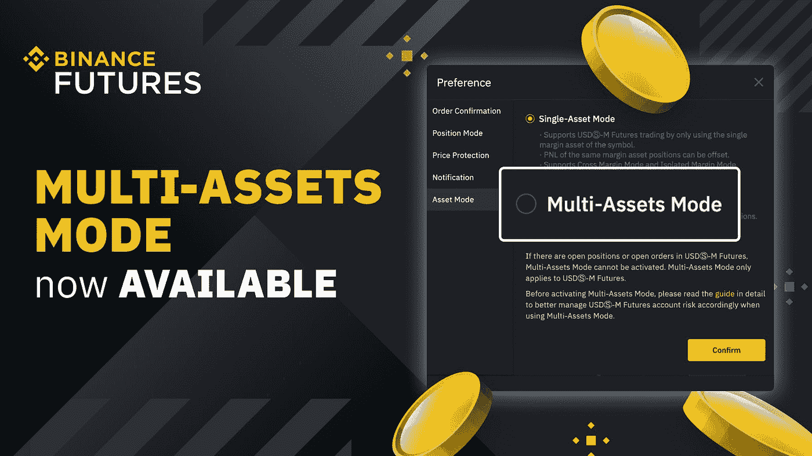
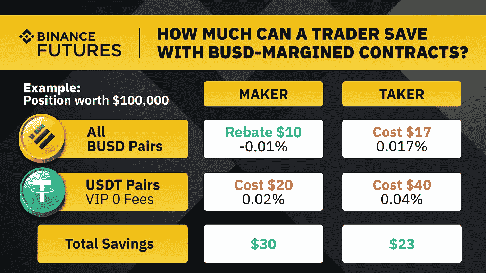
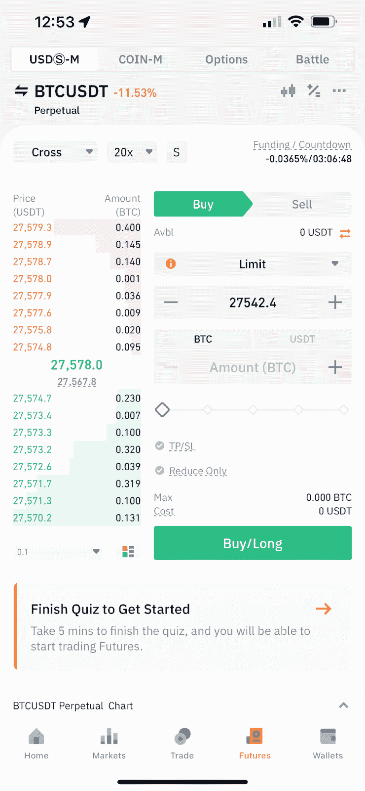
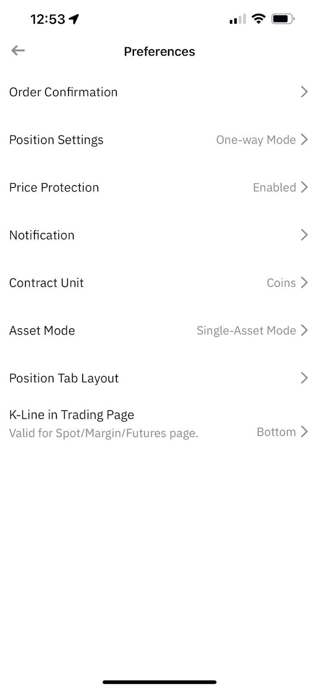

# 多资产模式交易币安期货的收益

> 原文：<https://medium.com/coinmonks/benefits-of-trading-on-binance-futures-with-multi-assets-mode-2bc14a729185?source=collection_archive---------7----------------------->

Photo: Binance

**什么是多资产模式？**

多资产模式(M-AM)允许交易者在 USDT 保证金(USDT-M)和 BUSD 保证金(BUSD-M)合约中分享他们的保证金。这有助于他们沉浸在不同的交易体验中。使用 BUSD 保证金合约时，交易者支付较低的费用和做市商回扣，从而获得 BUSD 期货交易对的费用折扣。这些组合包括永久合同，如瑞士联邦理工学院/BUSD 或 BTC/BUSD。多资产模式让对冲投降通过一个单一的帐户。

通过这样做，它让你获得套利的好处，也自动保护你免于清算，等等。M-AM 增加了[usdⓢ-m 期货](https://www.binance.com/en/futures/btcbusd_perpetual?utm_source=internal&utm_medium=homepage&utm_campaign=trading_dashboard)合约的使用案例。这提高了这些合同在各种市场条件下的灵活性和适应性。交易员现在可以通过 M-AM 成为各种衍生品的一部分，这些衍生品融合了 BUSD-M 和 USDT-M 合约的潜力。

多资产模式有助于交易 usdⓢ-m 期货多种保证金资产。目前提供的币安期货合约是通过 usdⓢ-m 期货产品线代表的 USDT-M 和 BUSD-M 合约。M-AM 包括在 USDT-M 和 BUSD-M 合约中分享您的保证金。

多资产模式推出后，币安期货交易的多功能性有所提高。正在讨论的功能增强了 usdⓢ-m 期货合约的使用案例。它还提高了交易者在各种市场情况下的灵活性和适应性。

交易员可以参与一个独特的衍生品分支，该分支融合了 BUSD 和 USDT 保证金合约的功能。随着两家稳定的银行分支进入期货交易，交易 BUSD 保证金期货的时机再好不过了。

任何一个合同产生的利润都可以以保证金的形式使用。这意味着这些利润可以减轻其他亏损交易的损失。因此，保证金余额反映的只是两个相关市场头寸的净 P&L。

了解[如何使用多资产模式交易 BUSD-M 期货](https://www.binance.com/en/blog/futures/how-to-use-the-multiassets-mode-to-trade-busdm-futures-421499824684902672?ref=P10U1GSP)。

**额外津贴&用 M-AM 在币安期货上交易 BUSD-M 期货的好处**

Photo: Binance

亲爱的 Binancians，高兴地知道一个令人兴奋的事实，币安期货超越了古老的期货和保证金交易。币安期货公司最近推出的产品是 BUSD-M 期货。这些有问题的 BUSD-M 期货合约让交易者获得了节省成本的优势，提高了他们的利润。BUSD 本身是一种 100%受监管的加密货币，与现金(相当于美元)挂钩。

币安期货公司的 BUSD 保证金合同是一种 BUSD 报价和抵押的线性期货产品。BUSD-M 合同在 BUSD 解决。这一发展现在通过将其计算成美元(或其他法定货币)大大简化了交易。BUSD-M 合约的交易员往往支付较少的费用和做市商回扣。折扣费用适用于多个 BUSD 交易对，即。瑞士联邦理工学院/BUSD 或 BTC/BUSD 永久合同。

使用 BUSD-M 合同将允许交易者容易和公平地用美元计算他们的交易。当通过 M-AM 交易(稳定的硬币结算)BUSD-M 合约时，交易者也面临更少的加密货币市场波动。你可以零费用购买和赎回这些合同。

M-AM 允许交易者在两个不同的方向交易，即使是同一种加密货币。由于在 BUSD 或 USDT 进行交易的可能性，现在这样做是可能的。换句话说，认为 BTC/BUSD 将因 BTC 价格下跌而遭受损失的交易者，可能会做空 BTC/USDT 合约以抵消可能的损失。

与 BUSD 在币安期货上的交易是划算的，因为新推出了所有 BUSD 对的零做市商费用促销。此外还有四对 BUSD 稳定币的零交易费促销活动。在这里，用户可以以较低的费用购买和交易 BUSD，同时在现货和保证金市场获得充足的流动性。交易 BUSD 稳定币对(即。BUSD/USDT)允许您完全免费交易。是的，交易 BUSD-M 合同节省了交易费用。与 M-AM 交易的另一个好处是可以及时打开 USDT-M 和 BUSD-M 合约的头寸。

**如何在桌面和移动设备上访问多资产模式？**

M-AM 模式提供了资本多样化和更高的资本效率。现在让我们探索如何在桌面和移动设备上访问它:

1.  访问您的币安应用程序。导航至“期货—usdⓢ-m.”，点击“…”，然后选择“偏好—资产模式”

Photo: Binance

Photo: Binance

2.点击“资产模式”选择“多资产模式”。

Photo: Binance

即使你不想平仓，也可以打开多资产模式。简而言之，多资产模式现在在稳定的资本中提供了足够的多样化和暴露。对于套利者和老练的交易者来说，这是一个双赢的局面，他们可以有效地管理自己的保证金和 P&L。M-AM 应该对长期交易者、套利者和对冲者有吸引力。

更多详情请参考[多资产信息](https://www.binance.com/en/futures/trading-rules/perpetual/multi-asset-info)。

新来币安吗？[今天注册](https://accounts.binance.com/en/register?ref=P10U1GSP)！

**免责声明**:本文仅用于教育目的，不应被理解为投资建议。

> 加入 Coinmonks [电报频道](https://t.me/coincodecap)和 [Youtube 频道](https://www.youtube.com/c/coinmonks/videos)了解加密交易和投资

# 另外，阅读

*   [3 商业评论](/coinmonks/3commas-review-an-excellent-crypto-trading-bot-2020-1313a58bec92) | [Pionex 评论](https://coincodecap.com/pionex-review-exchange-with-crypto-trading-bot) | [Coinrule 评论](/coinmonks/coinrule-review-2021-a-beginner-friendly-crypto-trading-bot-daf0504848ba)
*   [莱杰 vs Ngrave](/coinmonks/ledger-vs-ngrave-zero-7e40f0c1d694) | [莱杰 nano s vs x](/coinmonks/ledger-nano-s-vs-x-battery-hardware-price-storage-59a6663fe3b0) | [币安评论](/coinmonks/binance-review-ee10d3bf3b6e)
*   [Bybit Exchange 审查](/coinmonks/bybit-exchange-review-dbd570019b71) | [Bityard 审查](https://coincodecap.com/bityard-reivew) | [Jet-Bot 审查](https://coincodecap.com/jet-bot-review)
*   [3 commas vs crypto hopper](/coinmonks/3commas-vs-pionex-vs-cryptohopper-best-crypto-bot-6a98d2baa203)|[赚取加密利息](/coinmonks/earn-crypto-interest-b10b810fdda3)
*   最好的比特币[硬件钱包](/coinmonks/hardware-wallets-dfa1211730c6) | [BitBox02 回顾](/coinmonks/bitbox02-review-your-swiss-bitcoin-hardware-wallet-c36c88fff29)
*   [BlockFi vs 摄氏度](/coinmonks/blockfi-vs-celsius-vs-hodlnaut-8a1cc8c26630) | [Hodlnaut 审核](/coinmonks/hodlnaut-review-best-way-to-hodl-is-to-earn-interest-on-your-bitcoin-6658a8c19edf) | [KuCoin 审核](https://coincodecap.com/kucoin-review)