# 多资产模式交易币安期货的收益

> 原文：<https://medium.com/coinmonks/benefits-of-trading-on-binance-futures-with-multi-assets-mode-2e1fab00c540?source=collection_archive---------61----------------------->

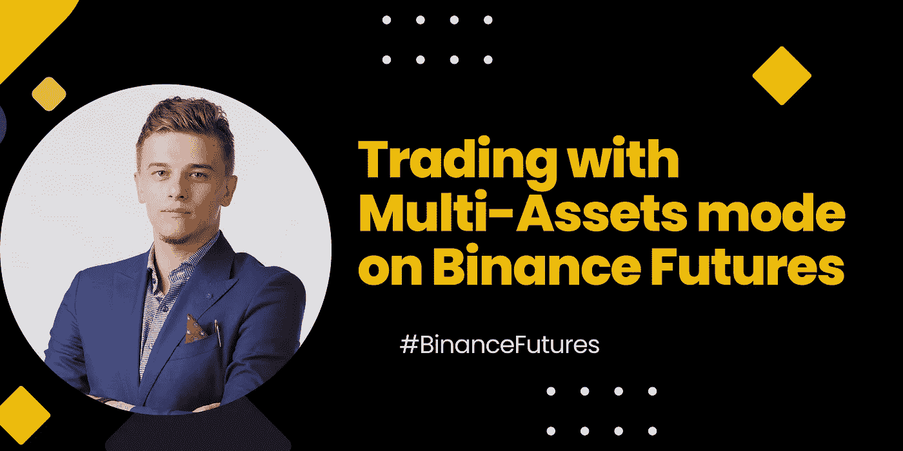

币安期货为高级交易者提供了一个分散投资组合的机会，而不需要压低他们的资产。

通过访问数百个加密-加密交易对，***期货提供了一个平台，交易者可以在币安期货生态系统内轻松管理风险。***

*****目录*****

***∘[**什么是多资产模式？**](#084b) ***∘***[***利用多资产模式交易币安期货的好处***](#82af) ***∘***[***利用多资产模式交易 BUSD-M 期货的好处***](#f07c) ***∘******

## ***什么是多资产模式？***

***多资产模式是一个新的交易属性，让用户能够交易不同的加密期货合约，同时使用 USDT 或 BUSD 作为担保。***

***早些时候，交易者只允许以单一资产模式交易，因此别无选择，只能将投资组合的重要部分分配到特定的稳定货币(USDT)中。***

***在多资产模式下，从一个合同中获得的利润可以用作另一个合同的保证金。***

***在交易 usdⓢ-m 合约时，多资产节点带来的同步性吸引了渴望对冲其投资组合头寸的交易者。***

***多资产模式提供了一个灵活的交易选择，有几个以前无法实现的优势。***

## ***利用多资产模式交易币安期货的好处***

1.  ***多资产模式交易使用户能够分享 *BUSD 保证金合同*和*USDT 保证金合同*的保证金，以建立多样化的交易体验。***
2.  ***交易员在申请 BUSD 保证金合约时可以享受小额费用。***
3.  ***交易者利用多资产模式对冲投降，抓住套利机会，从而保护自己免受清算。***

## ***币安期货多资产模式交易 BUSD-M 期货的优势***

***BUSD 保证金期货提供了一种波动性较小的线性期货产品，在 BUSD 进行抵押和结算。这一点给了交易者一种安全感，因为稳定的硬币是抵御波动的屏障。***

******让我们来探讨一下在币安期货上用多资产模式交易 BUSD-M 的一些好处:******

1.  ***当在多资产模式下交易 busdⓢ-m 合约时，交易者节省了成本。对于 BUSD 持有者来说，这很方便，因为他们在交易 busdⓢ-m 合约时费用较低。***

***2.在多资产模式下，用户可以交易 usdtⓢ-m 合约而无需转换成美元，因此当机会出现时，他们可以灵活地在 busdⓢ-m 和 usdtⓢ-m 合约中建立头寸。***

***3.当在多资产模式下交易时，交易者有机会在一个基础密码上进行两个不同方向的交易，因为他们可以在 BUSD 或 USDT 交易。***

***例如，如果一个交易者监督 BTC/BUSD 可能由于 BTC 价格下跌而遭受损失，他们能够做空 BTC/USDT 合约以防止可能的损失。***

## ***如何在桌面和移动设备上访问多资产模式***

******要访问桌面上的多资产模式，请遵循以下步骤:******

1.  ***登录您的 [***币安***](https://accounts.binance.com/en/register?ref=431277160) 账户，导航至衍生品下的 under 期货。***

***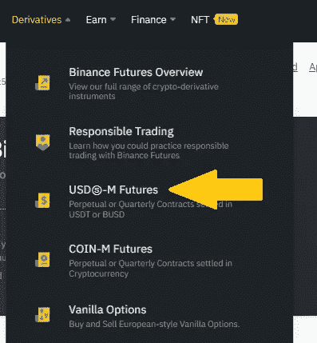***

***2.该链接将重定向到币安期货页面。***

***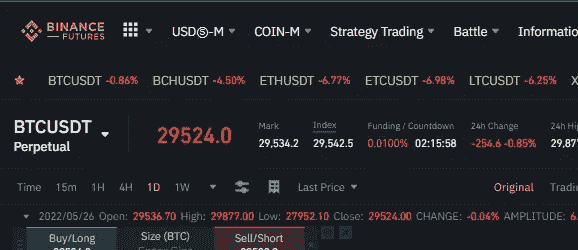***

***3.现在，点击页面右上角的*“双线”*选项卡，选择“首选项”，如下图所示。***

***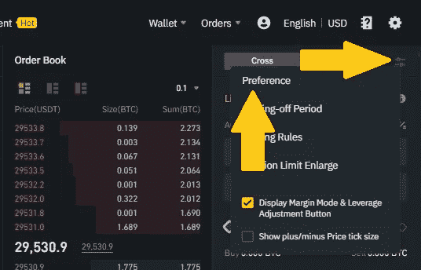***

***4.点击*偏好*，弹出一个标签。选择*“资产模式”*选项，选择*“多资产模式”*。***

***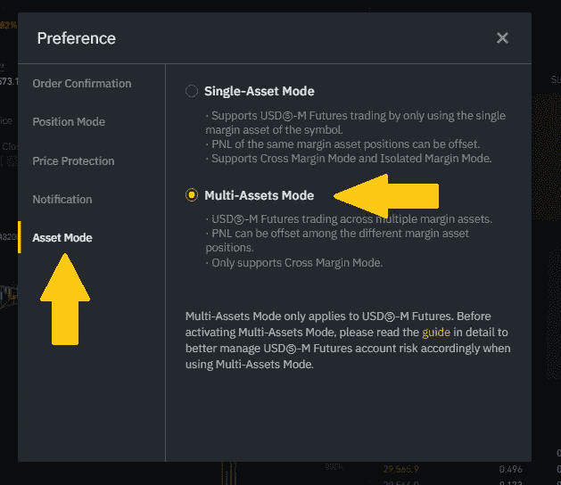***

******要在您的币安手机应用程序上访问多资产模式，请遵循以下步骤:******

1.  ***在手机上登录你的币安应用程序，切换到专业版。***

***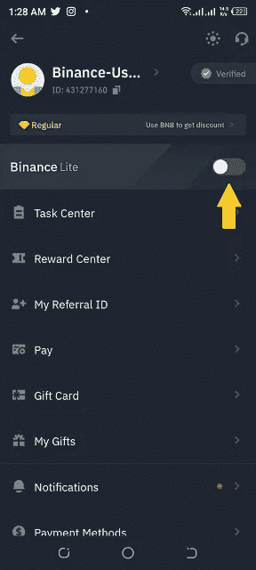***

***2.在首页点击*“更多”*。***

***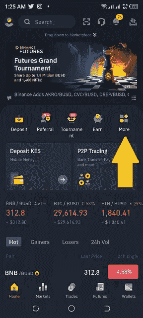***

***3.然后你将向下滚动到*“期货”*。***

***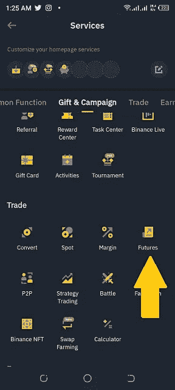***

***4.一旦你点击*期货*，你将被重定向到*“币安期货”*。点击页面右上角的三个点。***

***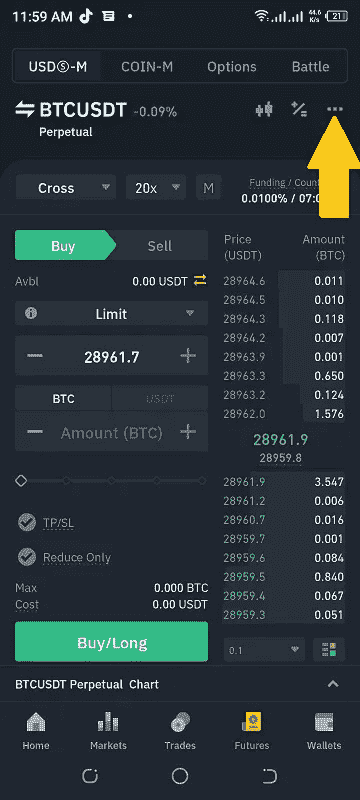***

***5.当你点击 3 个点时，识别出“*首选项*选项。***

***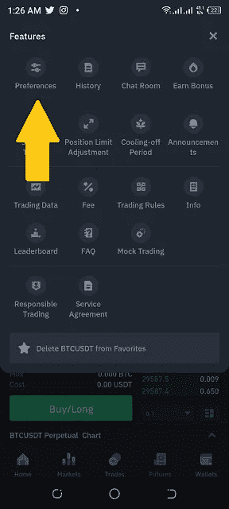***

***6.然后，您将导航到“*资产模式*”。***

***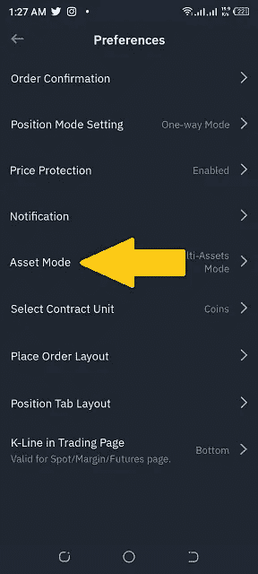***

***7.点击*资产模式*选项，选择*多资产模式*。***

***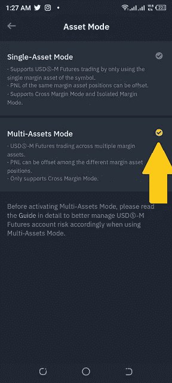***

***[***多资产模式> >***](https://www.binance.com/en/blog/futures/how-to-use-the-multiassets-mode-to-trade-busdm-futures-421499824684902672?ref=431277160) 阅读更多***

***如果您还没有开通您的币安账户，请从这里 [***开始> >***](https://accounts.binance.com/en/register?ref=431277160)***

******关联披露:*** *本帖包含关联链接。如果您使用这些链接购买一些东西，我们可能会赚取佣金，对您没有额外的费用。感谢*。***