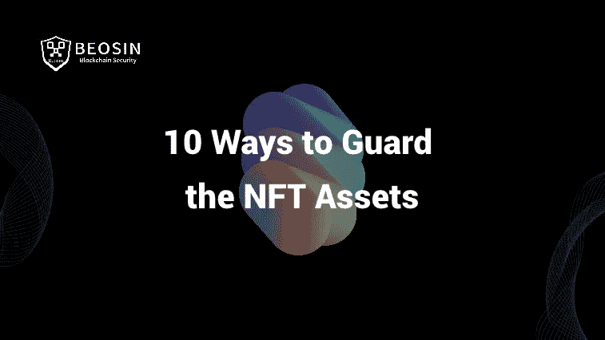
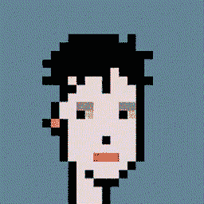
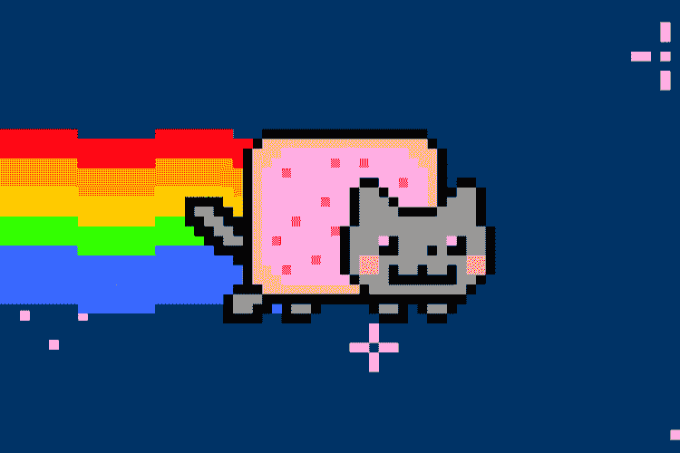
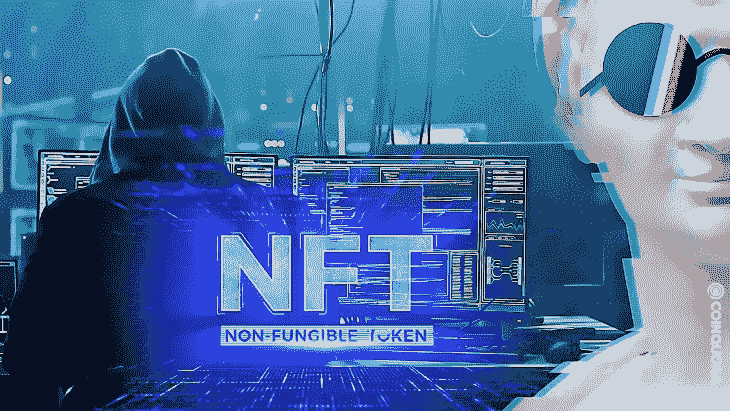

# Beosin:教您如何保护 NFT 资产的 10 种方法

> 原文：<https://medium.com/coinmonks/beosin-10-ways-to-teach-you-how-to-guard-the-nft-assets-99e320b509e4?source=collection_archive---------63----------------------->

作为 2021 年柯林斯字典的年度词汇，NFT 在 2022 年继续快速发展。最近，杰克·多西第一条推特的 NFT 版在 Opensea 上被出价 4800 万美元。尽管 NFT 很受欢迎并且发展迅速，但诈骗或攻击等隐藏的风险仍然不可忽视。我们之前的博客“损失超过 100 万美元”。周杰伦的《无聊的猿猴 NFT 被不和谐的网络钓鱼攻击偷走——贝辛的分析》也解决了 NFT 领域频繁发生的网络钓鱼攻击。在这个博客中，我们将讨论对 NFT 的攻击类型，并给出一些如何保护你的 NFT 的建议。

**为什么 NFT 安全事件频发？**

2022 年 1 月中旬，一个用户在 OpenSea 上发现了一个安全漏洞。用户能够以不到 1%的价格购买 NFT 资产，如百无聊赖的猿游艇俱乐部(BAYC)的资产，对发起人造成了严重损害。

2022 年 2 月，一名冒充 NFT 交易平台 OpenSea 的黑客发送了网络钓鱼电子邮件，以欺骗用户签署错误的智能合同，并向黑客的钱包发送加密资产。结果，受影响的用户总共被盗约 170 万美元。

此外，在过去一周内，至少有 35 个 NFT 被盗，攻击者通过破坏多个推特账户和推特链接到网络钓鱼网站来劫持 NFT。被盗的 NFT 包括无聊猿、变异猿和无聊猿狗舍俱乐部 NFT，价值超过 90 万美元。

随着 NFT 的繁荣和价值的上升，许多人会将他们的个人作品上传到 NFT 平台进行投资和拍卖。考虑到这一点，恶意个人将使用各种手段攻击生态系统的弱点，窃取他人的 NFT 资产，甚至密码货币，这导致了大量各类 NFT 安全事件。

**NFT 及相关平台攻击类型**

大多数攻击都是针对用户和 NFT 平台的，可以分为以下三类。

**01-网络钓鱼攻击**

黑客通过电子邮件、短信或不和发送链接，以欺骗用户点击虚假网站的网址。假网站的布局与真正的加密钱包网站相同，假平台会弹出一条交易消息，要求受害者连接到钱包并签名确认交易，但实际上是将资产转移到黑客的账户。

**02—NFT 平台安全漏洞**

由于开发阶段安全考虑不足导致的漏洞，有许多 NFT 平台可能是黑客的主要目标。例如，黑客可以上传包含恶意代码的艺术品，在没有双重认证的情况下损害账户，或者以低价交易 NFT，并利用设计缺陷转售以牟利。

**03 —假冒或侵权的 NFT 艺术品**

大多数 NFT 艺术品都是图像，NFTs 的流行吸引了抄袭者“窃取”图像并在其他平台上出售。NFT 所有者的权利不明确且难以执行，给那些购买假冒或侵权非专利产品的人造成了精神痛苦和金钱损失。

**如何保护你的 NFT？**

Beosin 建议用户或管理员采取以下安全措施来保护 NFT:

1.不要点击来自未知发件人的电子邮件、短信或社交媒体中的任何链接或附件。

2.使用浏览器的书签存储 NFT 平台的网址。

3.避免使用别人发的链接登录平台。

4.启用多因素身份验证。

5.不要向第三方透露你钱包的私人钥匙。

6.建立一个临时钱包，只存储适量的加密货币用于交易。

7.在签署任何智能合同之前，仔细核实所有信息，并了解条款和潜在风险。

8.检查授予的访问您的 NFT 的权限，并撤销过去出于不确定目的的批准。

9.购买 NFT 前进行充分的研究。核实设计师身份，查看 NFT 信息的完整性(如用户评论、过往交易、是否为原创作品等。).

10.如果平台有清除侵权 NFTs 的机制，用户可以向相应的系统管理员查询。

如果您需要任何区块链安全服务，请联系我们:

[**网站**](https://beosin.com/) [**邮箱**](http://contact@beosin.com/) [**官方推特**](https://twitter.com/Beosin_com) [**预警**](https://twitter.com/BeosinAlert) [**电报**](https://t.me/beosin)**[**LinkedIn**](https://www.linkedin.com/company/beosin)**

> **加入 Coinmonks [电报频道](https://t.me/coincodecap)和 [Youtube 频道](https://www.youtube.com/c/coinmonks/videos)了解加密交易和投资**

# **另外，阅读**

*   **[3 商业评论](/coinmonks/3commas-review-an-excellent-crypto-trading-bot-2020-1313a58bec92) | [Pionex 评论](https://coincodecap.com/pionex-review-exchange-with-crypto-trading-bot) | [Coinrule 评论](/coinmonks/coinrule-review-2021-a-beginner-friendly-crypto-trading-bot-daf0504848ba)**
*   **[莱杰 vs n rave](/coinmonks/ledger-vs-ngrave-zero-7e40f0c1d694)|[莱杰 nano s vs x](/coinmonks/ledger-nano-s-vs-x-battery-hardware-price-storage-59a6663fe3b0) | [币安评论](/coinmonks/binance-review-ee10d3bf3b6e)**
*   **[Bybit Exchange 审查](/coinmonks/bybit-exchange-review-dbd570019b71) | [Bityard 审查](https://coincodecap.com/bityard-reivew) | [Jet-Bot 审查](https://coincodecap.com/jet-bot-review)**
*   **[3 commas vs crypto hopper](/coinmonks/3commas-vs-pionex-vs-cryptohopper-best-crypto-bot-6a98d2baa203)|[赚取加密利息](/coinmonks/earn-crypto-interest-b10b810fdda3)**
*   **最好的比特币[硬件钱包](/coinmonks/hardware-wallets-dfa1211730c6) | [BitBox02 回顾](/coinmonks/bitbox02-review-your-swiss-bitcoin-hardware-wallet-c36c88fff29)**
*   **[BlockFi vs 摄氏度](/coinmonks/blockfi-vs-celsius-vs-hodlnaut-8a1cc8c26630) | [Hodlnaut 审核](/coinmonks/hodlnaut-review-best-way-to-hodl-is-to-earn-interest-on-your-bitcoin-6658a8c19edf) | [KuCoin 审核](https://coincodecap.com/kucoin-review)**