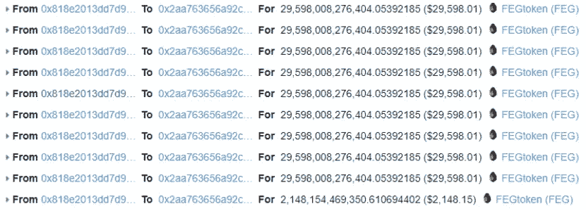

# Beosin 对 FEGtoken Flashloan 攻击的详细分析:BNB 损失 3280 美元，ETH 损失 144 美元

> 原文：<https://medium.com/coinmonks/beosins-detailed-analysis-of-fegtoken-flashloan-attack-3-280-bnb-and-144-eth-lost-758d972ac65b?source=collection_archive---------8----------------------->

2022 年 5 月 16 日，Beosin EagleEye 监测到，FEGtoken 在以太坊和 BNB 链上的 FEGexPRO 合同被 flashloan 攻击利用了约 3280 BNB 和 144 ETH。Beosin 安全团队分析了该事件，结果如下所示。

**费托肯简介**

FEGtoken 项目由以太坊和 BNB 链上的通货紧缩令牌 FEG 和 FEGex 多链分散交易所组成。官方网站:【https://fegtoken.com 

**相关信息**

该攻击包含多个交易，其中一些如下所示。

事务哈希:

0x 77 cf 448 ce af8 f 66 e 06d 1537 ef 83218725670 d3a 509583 ea0d 161533 FDA 56 c 063(BNB 连锁)

0x1e 769 a 59 a 5 a 9 da bec 0 CB 7 f 21 a3 e 346 f 55 AE 1972 bb 18 AE 5 eeacdaa 0 BC 3424 Abd 2(以太坊)

黑客地址:

0x73b 359 D5 da 488 e B2 e 97990619976 F2 f 004 e 9 ff 7c

黑客合同:

0x9a 843 bb 125 a3 c 03 f 496 CB 44653741 F2 cef 82 f 445

受害者合同:

0x 818 e 2013 DD 7d 9 BF 4547 AAA BF 6b 617 c 1262578 BC 7(BNB 链)

0 xf 2 BDA 964 EC 2d 2 fcb 1610 c 886 ed 4831 BF 58 f 64948(以太坊)

**开发流程**

以太坊和 BNB 链的开发流程是一样的，下面的分析是基于 BNB 链。

1.黑客调用攻击契约(0x9a84…. f445)到来自 DVM 合约(0xd534… .0dd7)的 flashloan 915.84 WBNB，然后将 116.81 WBNB 转换成 115.65 fWBNB，为后续的攻击做准备。

2.黑客利用攻击契约创建了 10 个契约。

3.然后，黑客将赎回的 fWBNB 令牌与 FEGexPRO 合约(0x818e…8bc7)绑定。

4.然后黑客反复调用 *depositInternal* 和 *swapToSwap* 函数，让 FEGexPRO 契约批准 fBNB 给之前部署的其他契约。

5.然后使用其他攻击契约调用 *transferFrom* 函数，将 FEGexPRO 契约中的所有 fBNBs 转移到攻击契约(0x9a 84…f445)。

6.接下来从 LP 交易对合约(0x2aa7)借入 31，217，683，882，286.007211154 FEG 代币和 423 WBNB... 6c14)。

7.重复步骤 3、4、5，从 FEGexPRO 契约中窃取大量 FEG 代币到攻击契约中。

8.然后归还 flashloan，将获得的 WBNB 转移到攻击契约中，完成这次攻击。

9.使用相同的方法进行了 50 多次相同的攻击，总利润约为 144 ETH 和 3280 BNB。

**漏洞分析**

该攻击主要利用了 FEGexPRO 契约的*swaptosopp*函数中的路径地址可以被控制，并且契约中没有验证路径地址的有效性这一漏洞。由于在更新 *depositInternal* 函数中的用户余额时，合同依赖于合同中的当前令牌余额，因此攻击者能够传入恶意路径地址，并且当调用*swaptosopp*函数时，合同中的令牌余额不会改变，从而允许攻击者重复重置 FEGexPRO 合同中攻击合同记录的令牌数量，从而允许 FEGexPRO 合同重复批准其令牌给攻击者控制的多个恶意合同。

**资金追踪**

截至本文撰写之时，被盗资金仍在攻击者的地址(0x73b3…. ff7c)而不被转出。

**总结**

针对这一事件，Beosin 安全团队建议:

1.在开发项目时，应注意与其他合同交互时可能存在的安全风险，尽量避免将关键参数设置为用户可控。如果业务需求是这样的，则需要严格判断用户输入的参数是否有风险。

2.项目上线前，强烈建议选择专业的安全审计公司进行全面的安全审计，规避安全风险。

# 更大的

[***1。LUNA 崩溃和 DeFi“出逃”后对 Web3 有什么影响？***](/coinmonks/what-is-the-impact-on-web3-after-lunas-crash-and-defi-fled-b80334e00aba)

[***2。在 Web 3.0 热潮下，如何保证 NFT 的安全？***](/@Beosin_com/how-to-ensure-the-security-of-nft-under-the-web-3-0-boom-beosin-vaas-has-provided-with-a-solution-50697ccd4f56)

[***3。DEUS Finance 遭遇今年第二次闪贷攻击:Beosin 详细分析***](/@Beosin_com/deus-finance-suffered-its-second-flashloan-attack-this-year-beosins-detailed-analysis-5032be0ec4f2)

[***4。Beosin 已完成加密乐高算法***](/@Beosin_com/beosin-has-completed-security-audit-service-of-crypto-lego-alg-no-critical-high-or-medium-risk-b656849e9334) 的安全审计服务

[***5。LUNA 崩溃和 DeFi“出逃”后对 Web3 有什么影响？*T38**](/coinmonks/what-is-the-impact-on-web3-after-lunas-crash-and-defi-fled-b80334e00aba)

[***6。〖重述 VaaS 关于如何在使用 Beosin VaaS***](/@Beosin_com/recap-ama-about-how-to-keep-your-smart-contract-secure-during-development-with-beosin-vaas-f7ecd2dc27a) 进行开发的过程中保证智能合同的安全

# 接触

如果您需要任何区块链安全服务，请联系我们:

[**网站**](https://beosin.com/) [**邮箱**](http://contact@beosin.com/) [**官方推特**](https://twitter.com/Beosin_com) [**预警**](https://twitter.com/BeosinAlert) [**电报**](https://t.me/beosin)**[**LinkedIn**](https://www.linkedin.com/company/beosin)**