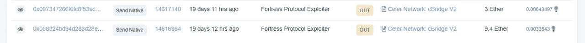
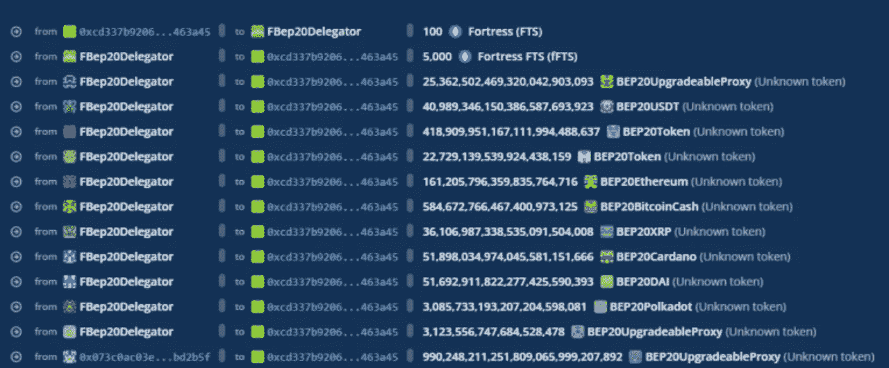
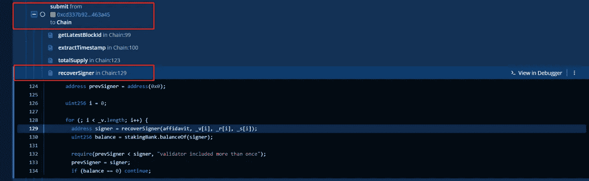
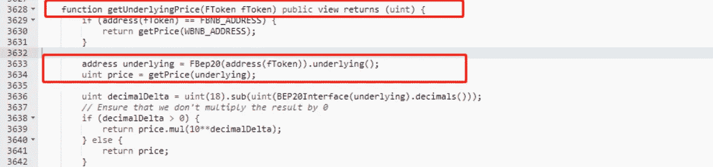
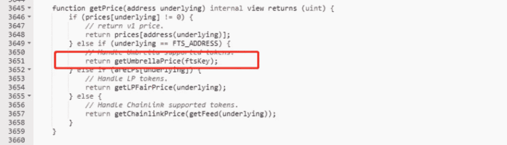
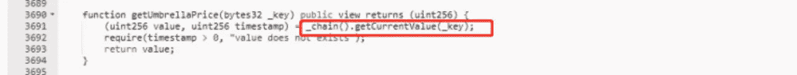
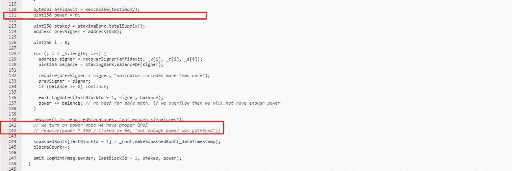
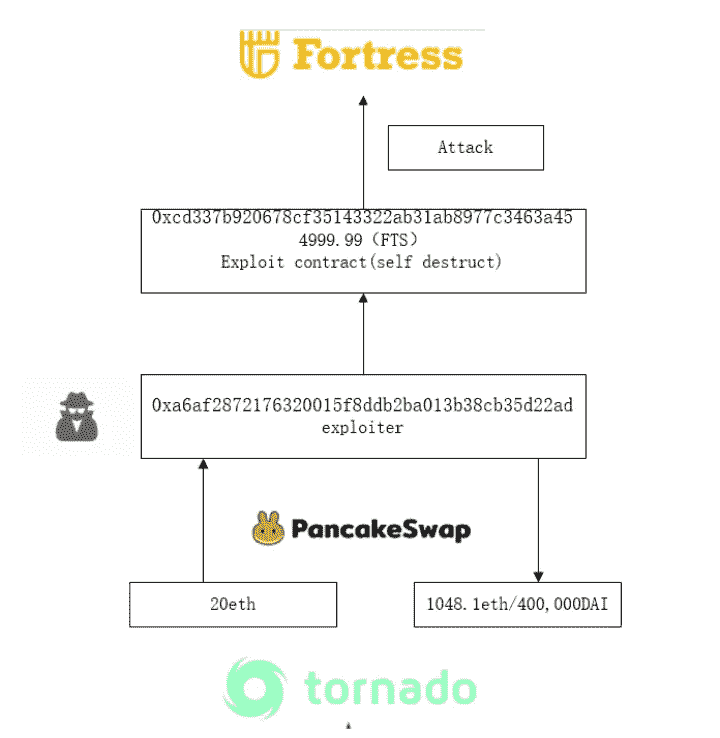

# Beosin 对 Fortress 的甲骨文操纵攻击的详细分析

> 原文：<https://medium.com/coinmonks/beosins-detailed-analysis-of-fortress-s-oracle-manipulation-attack-7c41555d445d?source=collection_archive---------21----------------------->

2022 年 5 月 9 日，据 Beosin EagleEye 报道，FortressPriceOracle 的链式合约被一个 Oracle 操纵攻击利用了约 1028.1 ETH 和 40 万 DAi。Beosin 安全团队分析了该事件，结果如下所示。

# **要塞简介**

Fortress Credit and Lending(Fortress)是一个算法货币市场和合成稳定硬币协议，旨在为用户提供安全可靠的信贷和贷款。官方网站:【https://fortress.loans/ 

# **相关信息**

事务哈希:

0x13d 19809 b 19 AC 512 da 6d 6d 110764 caee 75 e 2157 ea 62 CB 70937 c 8d 9471 afcb 061 BF

黑客地址:

0 xa 6 af 2872176320015 F8 DDB 2 ba 013 b 38 CB 35d 22 ad

黑客合同:

0xcd 337 b 920678 cf 35143322 ab 31 ab 8977 c 3463 a 45

受害者合同:

0x 00 fcf 33 BFA 9 E3 ff 791 B2 b 819 ab 2446861 a 318285

# **开发流程**

1.  攻击者从 Tornado.cash 提取 20ETH，将 12.4ETH 存入 Celer network，然后转入攻击合同。

2.攻击者利用部署的契约提交恶意价格，使 FTS 值极高，然后利用 FTS 增加的值从 FBep20Delelgator 中换出所有令牌。

3.攻击者在发起攻击时提交 FTS 价格的变化，此时 Oracle 调用链中的函数来获取价格。

4.Chain 用于 dpos 权限验证的 submit 函数被注释，power 的值= 0。只要签名通过，任何地址都可以成功提交并修改价格。

5.攻击者最终将窃取的资金换成 ETH。

# **漏洞分析**

这种攻击主要利用了 Oracle 获取的数据源链不验证权力的漏洞，从而操纵抵押品价格。

# **资金追踪**

在撰写本文时，攻击契约已经自毁。被盗的 1048.1 ETH 和 40 万 DAI 被存入了龙卷风现金。

# **总结**

针对这一事件，Beosin 安全团队建议:

1.验证 Oracle 获得的价格数据的来源非常重要。建议使用 TWAP。

2.项目上线前，强烈建议选择专业的安全审计公司进行全面的安全审计，规避安全风险。

# 更大的

[***1。VaaS —自动检测工具，让您的智能合约在 Web3.0 中安全***](/@Beosin_com/vaas-automatic-detection-tool-make-your-smart-contract-secure-in-web3-0-c3431f5c6ff)

[***2。在 Web 3.0 热潮下，如何保证 NFT 的安全？***](/@Beosin_com/how-to-ensure-the-security-of-nft-under-the-web-3-0-boom-beosin-vaas-has-provided-with-a-solution-50697ccd4f56)

[***3。DEUS Finance 遭遇今年第二次闪贷攻击:Beosin 详细分析***](/@Beosin_com/deus-finance-suffered-its-second-flashloan-attack-this-year-beosins-detailed-analysis-5032be0ec4f2)

[***4。Beosin 已完成加密乐高算法***](/@Beosin_com/beosin-has-completed-security-audit-service-of-crypto-lego-alg-no-critical-high-or-medium-risk-b656849e9334) 的安全审计服务

[***5。Beosin 已完成 PancakeSwap***](/@Beosin_com/beosin-has-completed-security-audit-service-of-masterchefv2-and-cake-pool-contracts-in-pancakeswap-4dafa0aa6068)master chef v2 和蛋糕池合同的安全审计服务

[***6。「重述」AMA 关于如何在使用 Beosin VaaS***](/@Beosin_com/recap-ama-about-how-to-keep-your-smart-contract-secure-during-development-with-beosin-vaas-f7ecd2dc27a) 开发期间保护您的智能合约的安全

# 接触

如果您需要任何区块链安全服务，请联系我们:

[**网站**](https://beosin.com/) [**邮箱**](http://contact@beosin.com/) [**官方推特**](https://twitter.com/Beosin_com) [**预警**](https://twitter.com/BeosinAlert) [**电报**](https://t.me/beosin)**[**LinkedIn**](https://www.linkedin.com/company/beosin)**

> **加入 Coinmonks [电报频道](https://t.me/coincodecap)和 [Youtube 频道](https://www.youtube.com/c/coinmonks/videos)了解加密交易和投资**

# **另外，阅读**

*   **[OKEx vs KuCoin](https://coincodecap.com/okex-kucoin) | [摄氏替代度](https://coincodecap.com/celsius-alternatives) | [如何购买 VeChain](https://coincodecap.com/buy-vechain)**
*   **[币安期货交易](https://coincodecap.com/binance-futures-trading)|[3 commas vs Mudrex vs eToro](https://coincodecap.com/mudrex-3commas-etoro)**
*   **[如何购买 Monero](https://coincodecap.com/buy-monero) | [IDEX 评论](https://coincodecap.com/idex-review) | [BitKan 交易机器人](https://coincodecap.com/bitkan-trading-bot)**
*   **[CoinDCX 评论](/coinmonks/coindcx-review-8444db3621a2) | [加密保证金交易交易所](https://coincodecap.com/crypto-margin-trading-exchanges)**
*   **[红狗赌场评论](https://coincodecap.com/red-dog-casino-review) | [Swyftx 评论](https://coincodecap.com/swyftx-review) | [CoinGate 评论](https://coincodecap.com/coingate-review)**
*   **[Bookmap 评论](https://coincodecap.com/bookmap-review-2021-best-trading-software) | [美国 5 大最佳加密交易所](https://coincodecap.com/crypto-exchange-usa)**