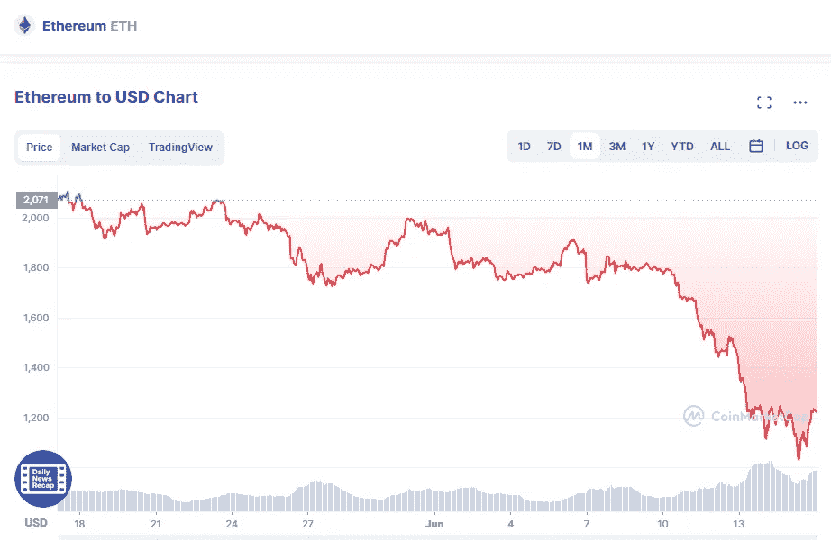

# 6 月 16 日购买最佳 2 加密

> 原文：<https://medium.com/coinmonks/best-2-crypto-buy-in-16th-of-june-46b8f40e5cdb?source=collection_archive---------36----------------------->

# 以太坊

Source photo [Ethereum price today, ETH to USD live, marketcap and chart | CoinMarketCap](https://coinmarketcap.com/currencies/ethereum/)

谈到智能合约，以太坊占了上风。这是第一个可编程的区块链，现在占所有智能合同的一半以上。

由于以太坊的广泛使用，它面临着巨大的扩展挑战，但它目前正在努力解决这些问题。这是通过从工作证明方法转换到…