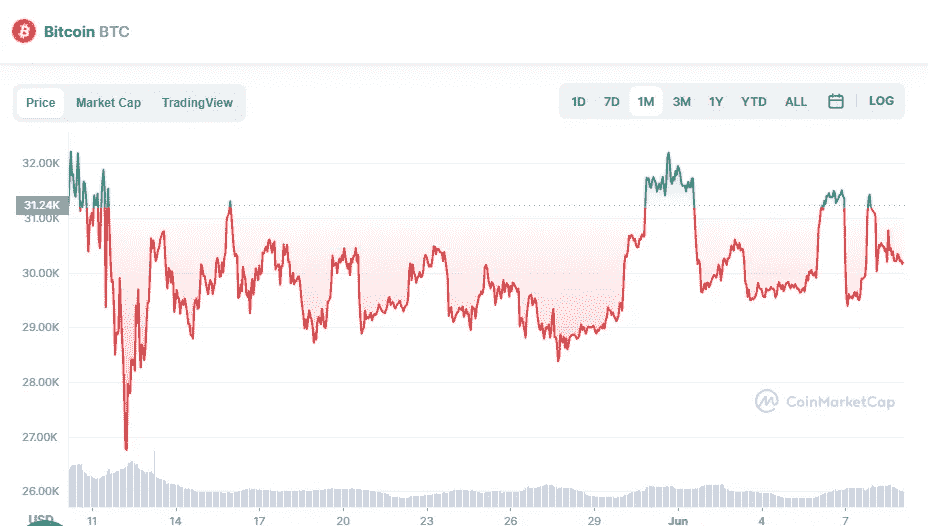

# 今天最值得购买的两种加密货币

> 原文：<https://medium.com/coinmonks/best-2-cryptocurrencies-to-buy-today-b573a261898e?source=collection_archive---------26----------------------->

# 比特币(BTC)

比特币市场由加密货币主导。

Source photo [Bitcoin price today, BTC to USD live, marketcap and chart | CoinMarketCap](https://coinmarketcap.com/currencies/bitcoin/)

BTC 现在的交易价格是每枚 30194 美元。这比上个月下降了 2.12%。

虽然比特币的价值已经下降，但它仍然是世界上最好的投资之一。中非共和国最近的一次采用更增加了它的机会…